# 概率论与数理统计

## 第一章 概率的基本概念


补充：

在概率论中，**对立事件**和**互斥事件**是不同的概念：

1. **对立事件**（或称为“逆事件”）指的是两个互斥事件，其中必有一个且仅有一个发生。如果事件 A 和事件 B 是对立事件，那么 A ∪ B 为全集，且 A ∩ B 为空集。简而言之，对立事件是指两者不可能同时发生
2. **互斥事件**（也称为“互不相容事件”）是指不可能同时发生的两个事件。例如，如果事件 A 和事件 B 的交集为空，那么 A 和 B 就是互斥事件。互斥事件强调的是两者不会同时发生

总结一下：

- 对立事件是两个互斥事件中必有一个发生的特殊情况。
- 互斥事件是不可能同时发生的事件。


文特图不能直观的表示独立性，独立性是数学上的定义，强调的是概率的乘积关系。同样的，文特图也表示不了三个事件，两两独立却不是相互独立。


ABC三个事件相互独立，需要满足四个等式：

1. P(AB) = P(A)P(B)
2. P(AC) = P(A)P(C)
3. P(CB) = P(C)P(B)
4. P(ABC) = P(A)P(B)P(C)

举一个例子，说明事件两两间独立，却不满足三个事件相互独立：一枚完美硬币，抛出后两面的出现概率是完全一致的。下面三个事件：

- A：第一次抛得正面
- B：第二次抛得正面
- C：两次抛得同一面

抛两次所有可能有HH、HW、WH、WW，每种概率分别为0.25。可以看到 P(A)=0.5, P(B)=0.5, P(C)=0.5,  P(AB)=P(BC)=P(AC)=0.25, 满足前面三个等式，但P(ABC)=0.25，不满足第四个式子。


五大概率公式：

1. 加法公式：P(A并B)=P(A)+P(B)-P(AB)
2. 减法公式：P(A-B) = P(A) - P(AB)
3. 乘法公式：P(AB)=P(A) x P(B|A)    (竖线不是或，是条件概率；或会用并集符号)
4. 全概率公式
5. 贝叶斯公式


## 第二章 随机变量及其分布

### 2.2 离散随机变量及其分布律


三种重要的离散随机变量的分布


泊松分布的数学期望和方差的推导还有点小技巧，这里展示出来：


泊松分布和二项分布的转换关系：


补充

几何分布：在独立的重复做一系列伯努利试验中，若每次试验成功的概率是p，则在第k次试验时才首次试验成功的概率服从几何分布，分布律为：

P{X=k} = p x (1-p)^(k-1)。   期望是 1/p,  方差是 (1-p) / (p*p)

超几何分布：如果N件产品里有M件次品，一次性拿出n件，其中有k件次品的概率服从超几何分布，分布律为：

P{X=k} = C(M, k) x C(N-M, n-k) / C(N, n)。 期望是 n*M/N，方差是np(1-p)

### 2.3 随机变量的分布函数


### 2.4 连续随机变量及其概率密度


三种重要的连续性随机分布：

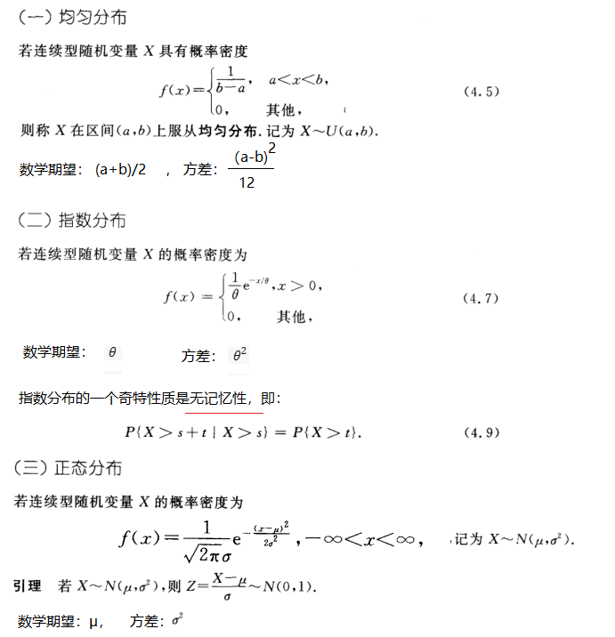

对于独立的正态分布的变量的和、差，有：


补充：

**相互独立**的多个正态分布的随机变量，他们的线性函数仍然服从正态分布。函数的数学期望与方差依据下面的性质可以方便计算：

- E(X+Y) = E(X)+E(Y)
- E(X-Y) = E(X) - E(Y)
- E(cX) = cE(X)
- D(cX) = c*c * D(X)
- D(X+Y) = D(X) + D(Y)
- D(X-Y) = D(X) - D(Y)

### 2.5 随机变量的函数的分布

已知一个随机变量的分布，求它作为自变量经函数变换后的因变量（也是一个随机变量）的分布


补充：连续随机变量，多用定义法；离散随机变量，简单加一列法：

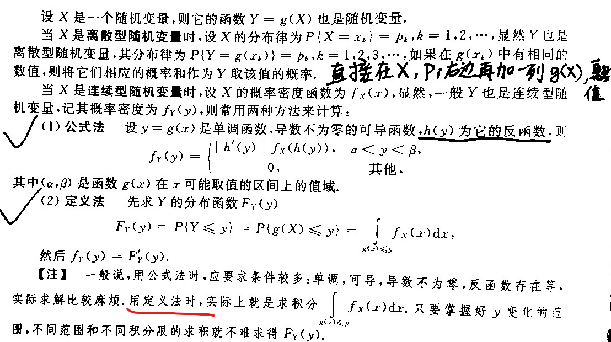


## 第三章 多维随机变量及其分布

### 3.1 二维随机变量


二维随机变量的函数的概率密度：

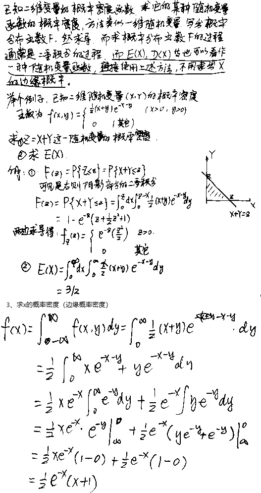

### 3.2 边缘分布


离散的二维随机变量求边缘分布律相对比较简单，连续的二维随机变量求边缘概率有一点小技巧：

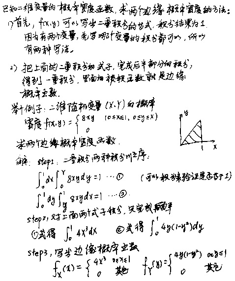

### 3.3 条件分布


### 3.4 相互独立的随机变量


### 3.5 两个随机变量的函数的分布


## 第四章、随机变量的数字特征

### 4.1 数学期望


上面这个定理还可以推广到多个变量g(X, Y)的情形：


数学期望的几个重要性质：


### 4.2 方差


他妈的，标准差又叫均方差，是方差的平方根。靠!

切比雪夫不等式：


### 4.3 协方差与相关系数


### 4.4 矩、协方差矩阵


## 第五章 大数定理与中心极限定理

### 5.1 大数定理


### 5.2 中心极限定理


我的理解：大数定理和中心极限定理，里面n充分大，我理解为不是说充分多的不同随机变量，而是理解为足够多的实验次数，里面的Xk是一次实验，而不是一个独立的变量。

简单的土话：

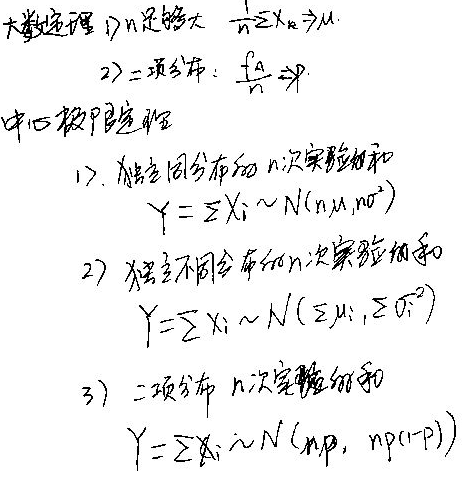

## 第六章 样本及抽样分布

### 6.1 随机样本


上面的式子感觉有点别扭，不直观，我实际上也没有太好的理解，看下面这个题目：

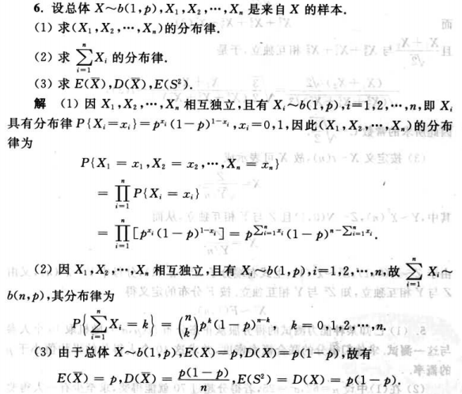

### 6.2 直方图和箱线图


### 6.3 抽样分布

#### 6.3.1 样本的适当函数


对于经验分布函数当n充分大的时候逼近总体的分布函数，这一点我平时也是这么干的，例如下面的代码，就是用卡方分布的一个抽样来画出卡方分布的概率密度函数，且我也知道要把n设置的比较大。这一点是符合常识的。

#### 6.3.2 样本函数（统计量）的分布


用一小段代码验证上面的2.2关于样本方差的函数符合卡方分布：

```mathematica
ClearAll["Global`*"];
dx = 4; (*总体的方差*)
ex = 1; (*总体的均值*)
n = 5; (*抽样的大小*)
sslist = {}; (*存放样本方差的值的列表*)
m = 10000; (*样本方差这个随机变量的个数*)
For[i = 0, i < m, i = i + 1,
 samples = RandomVariate[NormalDistribution[ex, dx^0.5], n]; (*生成n个样本*)

 
 x = Total[samples]/ n; (*计算n个样本的均值*)
 ss = Sum[(samp - x)^2, {samp, samples}]/(n - 1); (*计算一次样本方差值*)
 
 AppendTo[sslist, ss*(n - 1)/dx] (*追加到列表里*)
 ];

Histogram[sslist, {0.05}, "PDF"] (*按照列表，画出概率密度函数*)
Histogram[
 RandomVariate[ChiSquareDistribution[n - 1], 
  m ], {0.05}, "PDF"] (*画出自由度为n-1的卡方分布的概率密度函数*)
```

可以看到输出两个概率密度函数的图形是几乎一样的。

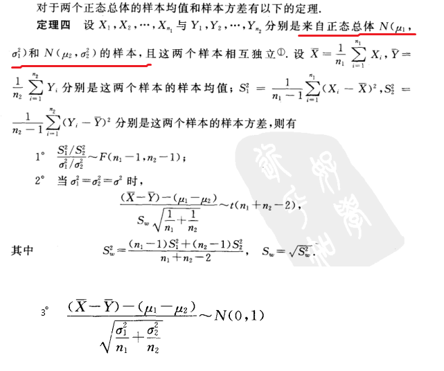

#### 6.3.3 三个重要的概率分布

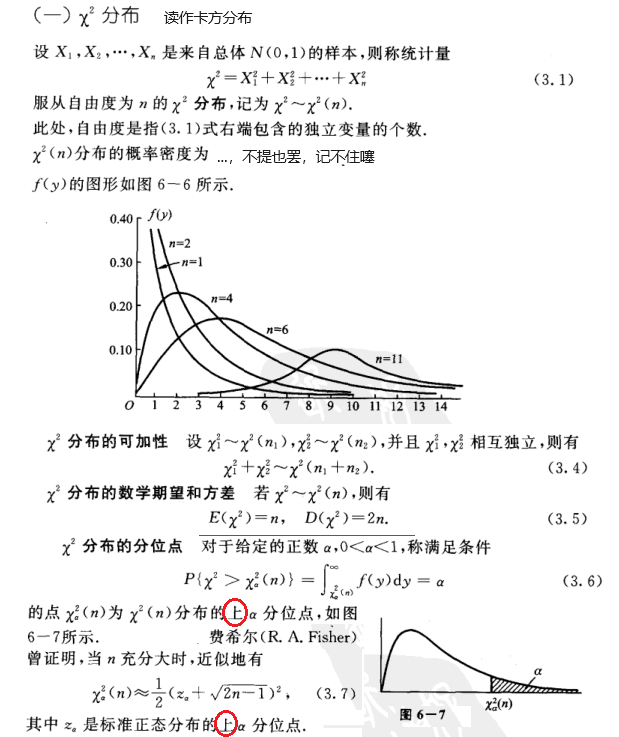


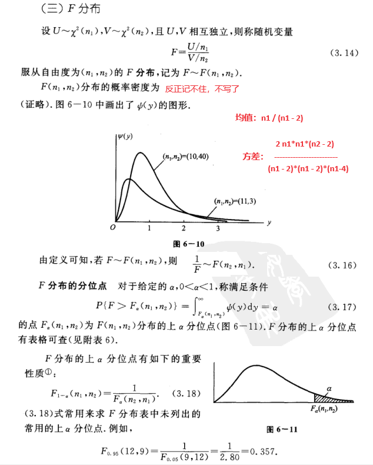

## 第七章 参数估计

### 7.1 点估计

#### 7.1.1 矩估计法


#### 7.1.2 最大似然估计法


一个总体，不管服从什么分布，只要它的均值和方差存在，那么有：


有时候很晕乎，搞不清楚点估计的实验次数n、样本和Σxi到底指哪个数据，例如下面这个习题，我一开始做就搞错了，把n搞成了13，样本和搞成了130.我草！

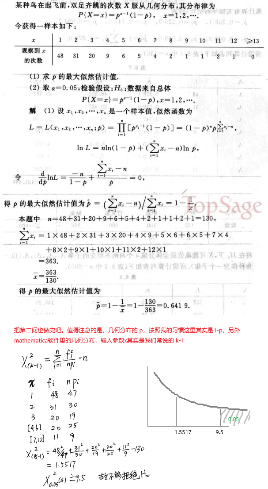

### 7.2 截尾样本的最大似然估计


### 7.3 估计量的评选标准

三个标准：

1. 无偏
2. 有效
3. 相合


### 7.4 区间估计


### 7.5 正态总体的均值和方差的区间估计

#### 7.5.1 一个总体的情况


#### 7.5.2 两个总体的情况


汇总成方便记忆的一个小便条：


### 7.6 (0-1)分布的总体的参数的区间估计


### 7.7  单侧置信区间

统计量和分布的使用还是那样，稍微转变一下：


## 第八章 假设检验

### 8.1 基本概念


**有时候单侧的假设检验不太好理解，可以尝试一个套路就是：**

1. 根据样本的均值的情况，得出一个直觉，设置一个违背的H0。例如样本均值明显大于特定的总体均值u0，那么H0：总体均值<u0
2. 设定H0,H1，并找到合适的检验统计量z
3. 这样想：如果要拒绝H0，也就是未知特征严重偏离H0的假设的情况下，那么基于样本数据的检验统计量会怎么样？ 例如是不是会特别大、或者特别小、或者绝对值特别大，从而进入了检验统计量所属分部的拒绝区域，也就是会发生小概率事件，小概率为α。
4. 计算z值，与α相关的随机变量的临界值做比较，如果确实发生了小概率事件，那说明H0被拒绝了。

**特别强调：不拒绝H0，不表示H0一定发生或者极大概率发生。不拒绝H0，意思是不能认为H0发生的概率极小。 不拒绝H0意味着：H0可能发生，也可能不发生，例如发生和不发生的概率是50%。**

举个例子吧：

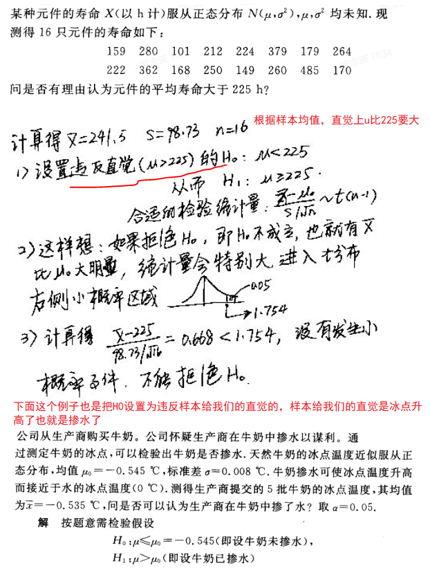

上题还有个理解方法：u的95%置信度下 u>198.31（单侧区间估计，估计u的下限）， 所以u不是95%的置信度的大于225，在198.31和225之间还有很大概率出现u，所以元件的平均寿命不是大于225。


### 8.2 正态分布总体的均值的假设检验


### 8.3 正态分布总体的方差的假设检验


不限于上面这些固定的讨论，有时候需要灵活应对：


### 8.4 置信区间和假设检验之间的关系

第一节的时候已经用我自己的土话理解了一下两者的关系。这里再用两个例子来说明吧：


### 8.5 样本容量的选择

略，数学一不考试，我就不学了

### 8.6 分布拟合校验


### 8.7 秩和校验

我是学渣我不学这节数学一不考的内容

### 8.8 假设检验的p值校检验法

