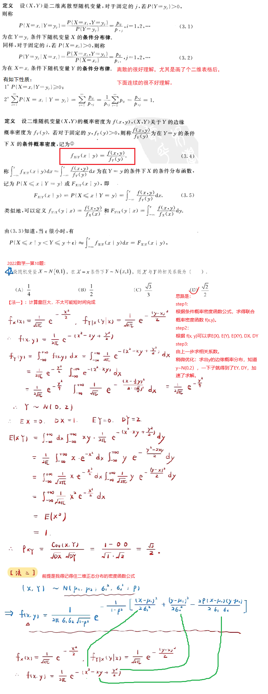
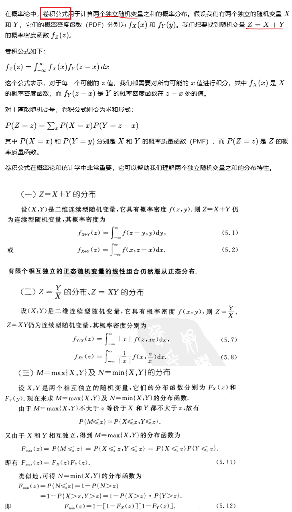
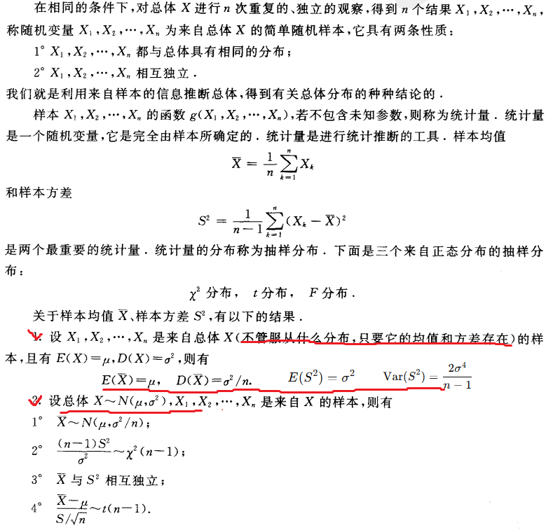

# 概率论与数理统计

## 第一章 概率的基本概念


## 第二章 随机变量及其分布

### 2.2 离散随机变量及其分布律


三种重要的离散随机变量的分布


泊松分布和二项分布的转换关系：


### 2.3 随机变量的分布函数


### 2.4 连续随机变量及其概率密度


三种重要的连续性随机分布：


对于独立的正态分布的变量的和、差，有：


### 2.5 随机变量的函数的分布

已知一个随机变量的分布，求它作为自变量经函数变换后的因变量（也是一个随机变量）的分布


## 第三章 多维随机变量及其分布

### 3.1 二维随机变量


### 3.2 边缘分布


### 3.3 条件分布



### 3.4 相互独立的随机变量


### 3.5 两个随机变量的函数的分布



## 第四章、随机变量的数字特征

### 4.1 数学期望


上面这个定理还可以推广到多个变量g(X, Y)的情形：


数学期望的几个重要性质：


### 4.2 方差


他妈的，标准差又叫均方差，是方差的平方根。靠!

切比雪夫不等式：


### 4.3 协方差与相关系数


### 4.4 矩、协方差矩阵


## 第五章 大数定理与中心极限定理

### 5.1 大数定理


### 5.2 中心极限定理


我的理解：大数定理和中心极限定理，里面n充分大，我理解为不是说充分多的不同随机变量，而是理解为足够多的实验次数，里面的Xk是一次实验，而不是一个独立的变量。

## 第六章 样本及抽样分布


### 6.3 抽样分布



用一小段代码验证上面的2.2关于样本方差的函数符合卡方分布：

```mathematica
ClearAll["Global`*"];
dx = 4; (*总体的方差*)
ex = 1; (*总体的均值*)
n = 5; (*抽样的大小*)
sslist = {}; (*存放样本方差的值的列表*)
m = 10000; (*样本方差这个随机变量的个数*)
For[i = 0, i < m, i = i + 1,
 samples = RandomVariate[NormalDistribution[ex, dx^0.5], n]; (*生成n个样本*)

 
 x = Total[samples]/ n; (*计算n个样本的均值*)
 ss = Sum[(samp - x)^2, {samp, samples}]/(n - 1); (*计算一次样本方差值*)
 
 AppendTo[sslist, ss*(n - 1)/dx] (*追加到列表里*)
 ];

Histogram[sslist, {0.05}, "PDF"] (*按照列表，画出概率密度函数*)
Histogram[
 RandomVariate[ChiSquareDistribution[n - 1], 
  m ], {0.05}, "PDF"] (*画出自由度为n-1的卡方分布的概率密度函数*)
```

