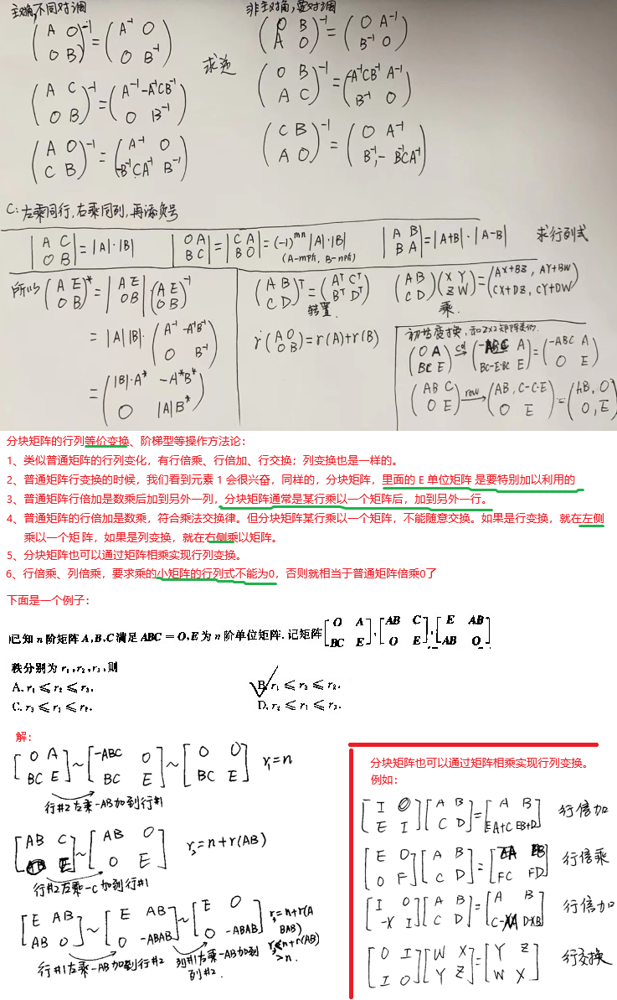

# 线性代数

## 第一章 线性方程组

### 1.1 线性方程组

### 1.2 行化简与阶梯型矩阵

什么是初等矩阵：

### 1.3 向量方程

### 1.4 矩阵方程

### 1.5 方程组的解集

### 1.6 线性方程组的应用

略

### 1.7 线性无关

### 1.8 线性变换介绍

### 1.9 线性变换的矩阵

### 1.10 商业和工程中的线性模型

略

## 第二章 矩阵代数

### 2.1 矩阵运算

比较简单，包括有

1. 加减乘、乘幂，乘又分为标量乘和矩阵乘法
2. 转置

### 2.2  矩阵的逆

### 2.3 可逆矩阵的性质

### 2.4 分块矩阵

我理解分块矩阵是为了适配计算机有限的内存、分而治之的加速方法，但我没有太掌握。

记录一条定理草草了事：

### 2.5 矩阵因式分解

#### 2.5.1 LU分解

一个霸蛮算的例子（第一列的a b d本来可以一开始就填上的，为原矩阵的第一列除以第一个元素值）

**LU分解的算法，如果遇到需要做行交换的场景，应该怎么操作？**

chatgpt说：记录每次行交换的顺序，在最后据此恢复原始矩阵的顺序

### 2.6 Leotief投入产出模型

我没有认真看这一节

### 2.7 计算机图形学中的应用

我没有认真看这一节

### 2.8 Rⁿ 子空间

### 2.9 维数和秩

## 第三章 行列式

### 3.1 行列式的定义

### 3.2 行列式的性质

### 3.3 克拉默法则、体积和线性变换

## 第四章 向量空间

### 4.1 - 4.6

本章的前面几节内容和第三章的7、8、9节的内容比较相似，只补充一些没有明确提到的内容：

### 4.7 坐标变换

