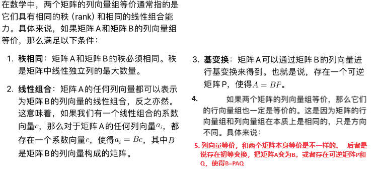
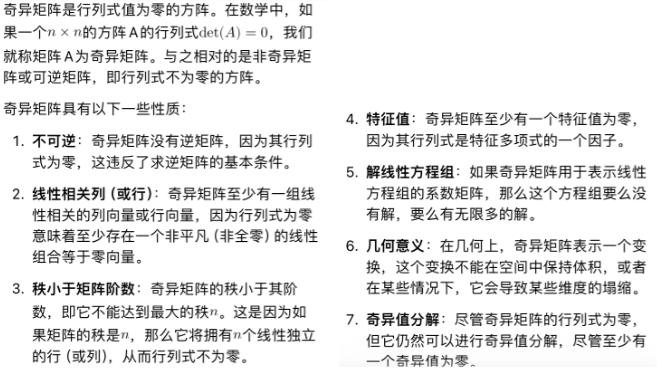
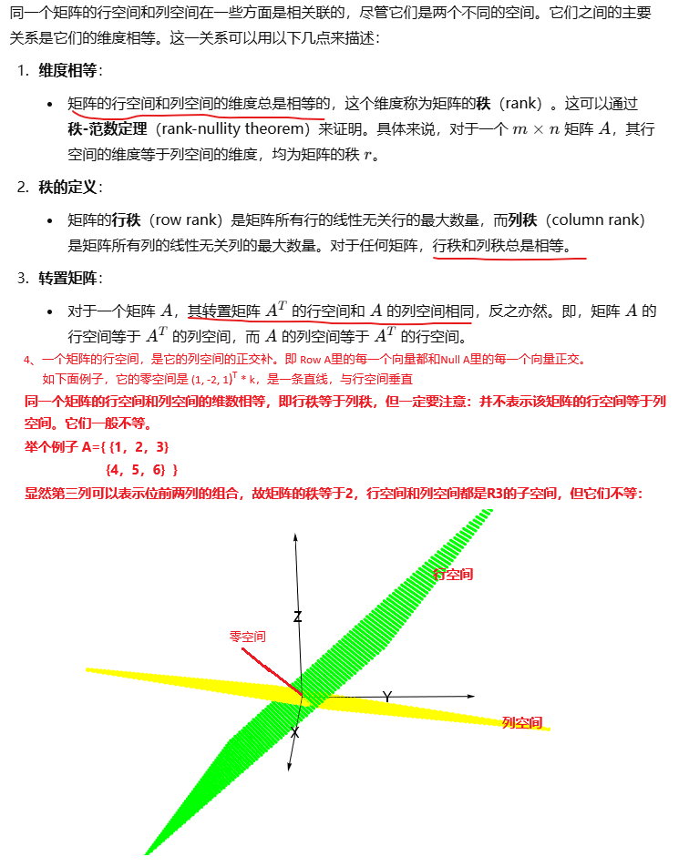
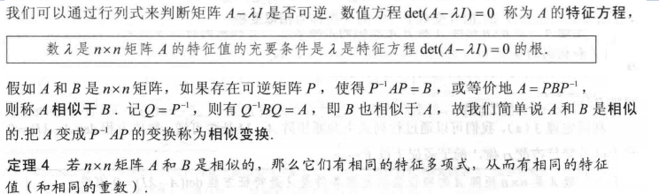
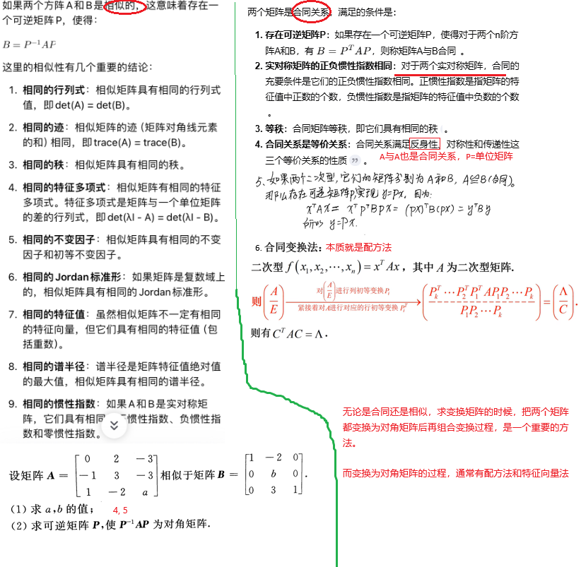
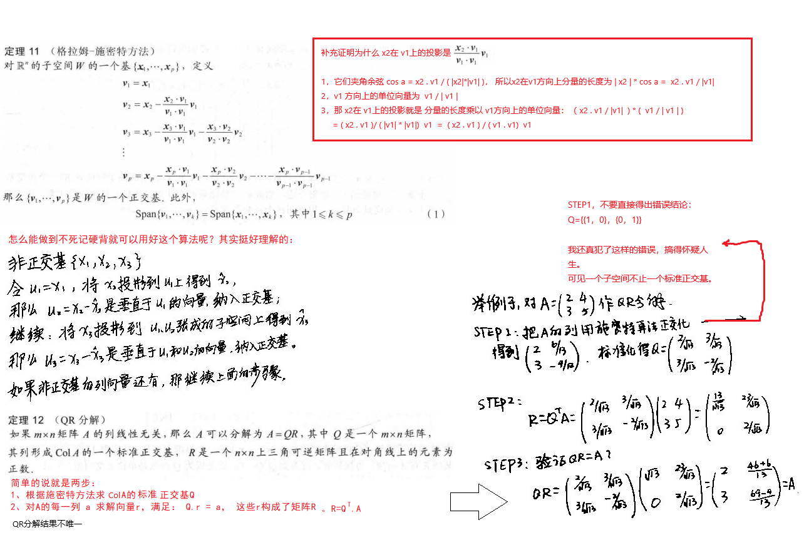
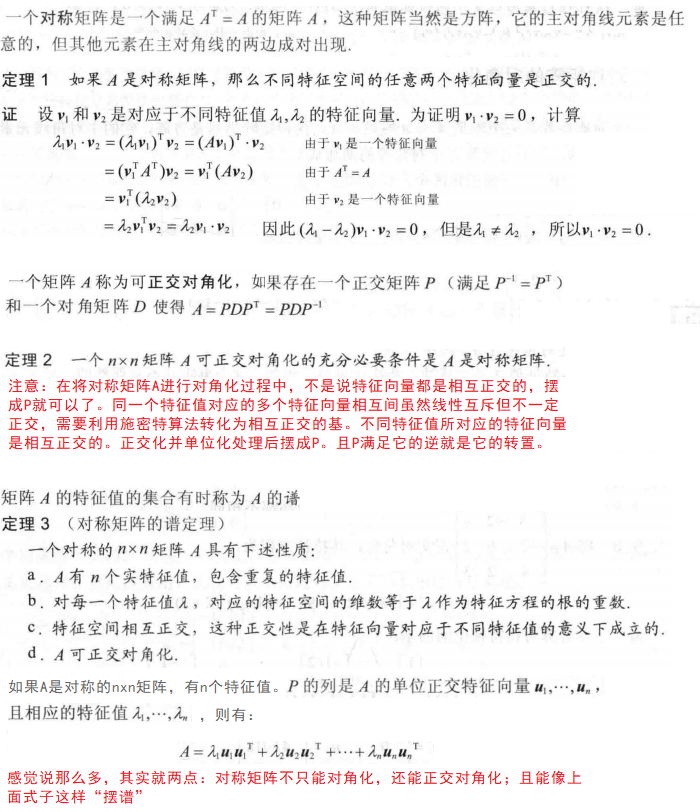
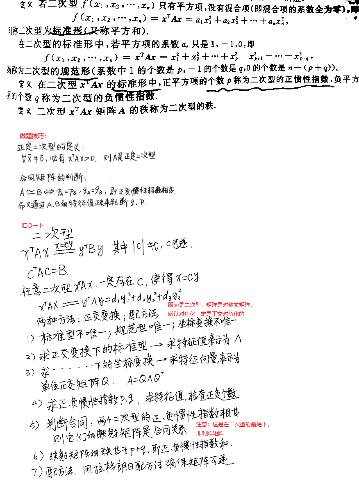

# 线性代数

## 第一章 线性方程组

### 1.1 线性方程组


### 1.2 行化简与阶梯型矩阵


什么是初等矩阵：


### 1.3 向量方程


### 1.4 矩阵方程


### 1.5 方程组的解集


### 1.6 线性方程组的应用

略

### 1.7 线性无关


### 1.8 线性变换介绍


### 1.9 线性变换的矩阵


### 1.10 商业和工程中的线性模型

略

## 第二章 矩阵代数

### 2.1 矩阵运算

比较简单，包括有

1. 加减乘、乘幂，乘又分为标量乘和矩阵乘法
2. 转置


### 2.2  矩阵的逆


### 2.3 可逆矩阵的性质


补充一个概念：伴随矩阵：


### 2.4 分块矩阵

我理解分块矩阵是为了适配计算机有限的内存、分而治之的加速方法。


### 2.5 矩阵因式分解

#### 2.5.1 LU分解


一个霸蛮算的例子（第一列的a b d本来可以一开始就填上的，为原矩阵的第一列除以第一个元素值）


**LU分解的算法，如果遇到需要做行交换的场景，应该怎么操作？**

chatgpt说：记录每次行交换的顺序，在最后据此恢复原始矩阵的顺序


### 2.6 Leotief投入产出模型

我没有认真看这一节

### 2.7 计算机图形学中的应用

我没有认真看这一节

### 2.8 Rⁿ 子空间


### 2.9 维数和秩




## 第三章 行列式

### 3.1 行列式的定义


两个概念注意区分：


奇异矩阵：



### 3.2 行列式的性质


### 3.3 克拉默法则、体积和线性变换


## 第四章 向量空间

### 4.1 - 4.6

本章的前面几节内容和第三章的7、8、9节的内容比较相似，只补充一些没有明确提到的内容：





### 4.7 坐标变换


修正一个我的一个误解：如果三个向量共面，他们中任何一个都可以用其他两个表示。这个是错误的：


### 4.8 向量空间在差分方程（不是微分方程）和马尔科夫链的应用

我没有看，看不太懂。应该不会考

## 第五章 特征值和特征向量

要特别注意，我会搞混淆特征值和行列式的求法：

1. 行列式确实通过行倍加将矩阵转化为阶梯型（三角矩阵）后就可以把三角矩阵的主对角线元素乘起来得到行列式
2. 特征值，不能使用上面的方法求得。只能解特征方程的方式。**但我多次混淆了，用行倍加的方式求得错误的特征值**
3. 之所以会有混淆，是因为有个有意思的特性：
   1. 三角矩阵，主对角线元素就是三角矩阵的特征值。
   2. 三角矩阵，主对角线元素的乘积，就是三角矩阵的行列式
   3. 对角矩阵，也是一种特殊的三角矩阵。

### 5.1 特征值和特征向量


求矩阵{{8,0},{0,2}}的特征向量，很容易得出特征向量是{0,0}的错误结论，要特别小心。仔细的去做，就会发现是{1,0 }和{0, 1}。 （这是Mathematica的表达方式）

有几个属性解题的时候用的比较多比较灵活，如果矩阵A的特征值存在的话：

- 特征值的和，等于对角元素和 ：Σ λi = Σ aii
- 矩阵的行列式，等于所有特征值的积：Πλ i = |A|
- λ + k 是A+k E 的特征值。E是单位矩阵。
- λ^m 是A^m的特征值。


### 5.2 特征方程



### 5.3 对角化

相似矩阵：


对角化：


补充考研书籍总结的方法：


矩阵相似是考的比较多的：



判断两个矩阵是否相似，是一个复杂的逐步建立信心的过程，专门澄清一下：

1. 首先比较特征值和重数，如果相同则继续判断下一条，如果不完全相同则不相似，结束。
2. 然后比较每个特征值对应的特征空间的维数，对，只是比对维数而不是特征向量本身。如果都相同，继续下一条。维数不同则不相似，结束。
3. 到这一步，特征值、每个特征值的重数、每个特征值对应的特征空间的维数都相同，他们可能相似。是的，可能。进一步的要比较两个矩阵的Jordan标准形。好像不考


如果两个矩阵A和B满足上述条件，是相似的，如何求P，使得A=PB(P逆) ?


判断n阶方阵A是否可以对角化，也就是与一个对角矩阵相似，有下面几个结论：

1. 如果A有n个互不相等的特征值，那么A一定可以对角化。这是充分不必要的条件。因为不相等的特征值的特征向量一定线性无关
2. 如果A有n个线性无关的特征向量，那么A一定可以对角化。这是充分必要条件。
3. 实对称矩阵，一定可以对角化。P矩阵还是正交的，它的转置等于它的逆


### 5.4 特征向量与线性变换 --5.7节

这几节我居然看不懂看不懂看不懂

### 5.8 特征值的迭代估计

土话就是:

把一个可对角化的方阵（存在特征值）不断的乘以一个向量，最终获得的向量满足：

1. 其方向，会趋近绝对值最大的特征值所对应的特征向量所在直线的方向。
2. 其大小，会趋近c1x lamda^k x v1


迭代估计特征值的办法：


上面的看不太懂，感觉没有那么复杂，就是不断的计算A的幂乘以x0  (x0要选择最大分量为1)， 当k比较大的时候，用 (A^k)x0 除以 (A^(k-1))x0，得到一个近似值就是A的特征值。附上Mathematica代码和输出：

```mathematica
ClearAll["Global`*"];  (*这个函数可诡异了，一定要这样写才是符合预期的，其他不带参数或者怎样的通通不对，日他妈的*)
A = {{6, 7}, {8, 5}};
x = {1, 0};
For[i = 0, i < 5, ++i, Print[A.x]; oldx = x; x = A.x;];
Print[N[LeastSquares[ Transpose[{oldx}], x]]];(* Transpose[{oldx}]  把向量转化为矩阵并转置，注意有个花括号。等式就是矩阵点乘向量等于一个向量*)

{13.0005}
```

手工计算A的特征值也可以发现是13和-2

疑惑点：x0满足最大分量是1也是ok的，例如{2,3}，可能只是为了让手工做上述计算的时候工作量小一点吧。

上面计算过程会迷惑懵懂的我：是不是所有的方阵都有这样的性质？  不断的乘一个向量，最后趋近于数乘这个向量？ 当然不是，只有存在特征值的方阵才可以。

例如A = {{0, -1}, {1, 0}};这个矩阵就没有特征值，不能用上面的方法求最大特征值，这个矩阵是把x进行90度旋转。

## 第六章 正交性和最小二乘法

### 6.1 内积、长度和正交性

这一节主要是向量的基本概念。最重要的概念是向量的内积（点积）。


### 6.2 正交集


正交集与线性无关集还不一样：

1. 正交集是元素两两正交
2. 线性无关集是整个集合线性无关。例如（1，0，0），（0，1，0），（1，1，0）构成的集合，他们两两线性无关，但是集合却不是线性无关集

有必要专门明确一下正交矩阵的概念：


### 6.3 正交投影


### 6.4 格拉姆-施密特方法（构造正交基的算法）

#### 6.4.1 施密特方法

#### 6.4.2 QR分解




QR分解的意义是什么？

其中一个意义是用来解线性方程组 Ax = b，降低计算复杂度。 (QR) x = b， Q (Rx) = b, Rx = Q^(-1). b,  Rx = Q^T.b

也就是说，因为Q是标准正交矩阵，它的逆存在且很容易求，就是Q的转置。直接乘以b，可以得到Rx的值；R又是上三角矩阵，所以很容易求得x。

其实上面的QR分解，求得Q后，可以直接用Q的转置乘以A得到R。

上面说的用来解线性方程Ax=b降低复杂度不成立吧，如果能够进行QR分解，那么A是可逆的，直接把A的逆求出来后用A的逆乘以b不是解方程组更简单？

那只能说用于下面的最小二乘问题了。

### 6.5 最小二乘问题


### 6.6 最小二乘的应用


### 6.7 6.8内积空间和及其应用

我理解内积空间是前面内积算子的进一步泛化，我先不学了

## 第七章 对称矩阵和二次型

### 7.1 对称矩阵

土话就是：对称矩阵不只能对角化，还能正交对角化，且能摆出一个特殊样式的“谱”。



### 7.2 二次型


补充：除了上面的正交法，还有配方法，他们两个方法求出的对角矩阵是不一样的，例如：


补充几个关于二次型的概念：



用Mathematica把上面例2的矩阵A正交对角化：

```mathematica
ClearAll["Global`*"];
A = {{5, -1/2, 0}, {-1/2, 3, 4}, {0, 4, 2}};
evals = N[Eigenvalues[A]];
evecs = N[Eigenvectors[A]];
Print["eigenvalues:", N[evals]];
Print["eigenvects:", N[evecs]];
wr = Wronskian[Transpose[evecs], x];
Print[If[wr == 0, "线性相关"; Exit[], "线性无关"]];
p = Orthogonalize[evecs];
d = DiagonalMatrix[evals];
Print["P:", Transpose[p]];
Print["check P的正交性：", p[[1]].p[[2]], p[[1]].p[[2]], p[[1]].p[[2]]];
Print["PDP^-1:", Transpose[p].d.p];

输出：
eigenvalues:{6.61866,4.92924,-1.5479}
eigenvects:{{-0.356673,1.15466,1.},{5.1744,0.732309,1.},{-0.0677297,-0.886974,1.}}
线性无关
P:{{-0.227385,0.972489,-0.050605},{0.736118,0.137632,-0.662713},{0.637516,0.187942,0.747162}}
check P的正交性：0.0.0.
PDP^-1:{{5.,-0.5,1.33227*10^-15},{-0.5,3.,4.},{1.33227*10^-15,4.,2.}}
```


### 7.3 条件优化

这一节的内容不是很直观，平时我比较少用到这样的优化问题。


### 7.4 奇异值分解


奇异值分解的算法：

首先要搞清楚：mxn的矩阵做奇异值分解，U的维度是mxm，D是mxn，V是nxn。U张成Rm，v张成Rn


[奇异值分解的实际用途](https://github.com/bisonliao/goodgoodstudy/blob/master/%E7%BA%BF%E6%80%A7%E4%BB%A3%E6%95%B0%E8%AF%BB%E4%B9%A6%E7%AC%94%E8%AE%B0.md#%E5%A5%87%E5%BC%82%E5%80%BC%E5%88%86%E8%A7%A3%E7%9A%84%E5%AE%9E%E9%99%85%E7%94%A8%E9%80%94)

1. 图像压缩
2. 主成分分析、数据降维
3. 对图像提炼特征，用于图像识别/比对


### 7.5 图像处理与统计学中的应用

#### 7.5.1 奇异值分解在图像压缩中的应用


有代码为证，也可见我上面链接中热巴美女图片压缩的例子。

```mathematica
ClearAll["Global`*"];
A = {{-18, 13, -4, 4}, {2, 19, -4, 12}, {-14, 11, -12, 8}, {-2, 21, 4, 8}};
{u, w, v} = SingularValueDecomposition[A];
Print["SingularValue:", u, w, v];

svdCompress[A_, qnum_] :=  Module[{u, w, v, result, m, n, i, j, u1, v1, q}, 
   {u, w, v} =  SingularValueDecomposition[A];
   m = Length[A];(*图片高*)
   n = Length[A[[1]]];(*图片宽*)
   Print["m:", m , ",n:", n];
   q = qnum;
   If[q > Min[m, n], q = Min[m, n], null];
   
   (*  m x n的0矩阵作为初始画布  *)
   result = Table[ConstantArray[0, n], {i, 1, m}];
   
   Print["datasize:", q*(m + n)];
   Print["singular values:", Table[w[[i, i]], {i, 1, q}]];
   Do[
    u1 = Table[{u[[j, i]]}, {j, 1, m}];(* m x 1 , 第i个特征值对应的u向量 *)
    v1 = {v[[;; , i]]}; (* 1 x n，第i个特征值对应的v向量 *)
    
    result = result + (u1.v1)*w[[i, i]];,  (* 
    u.v得到m x n的一个矩阵，是第i个特征值对应的分量*)
    {i, 1, q}(*这样的特征值取前面q个，后面的分量抛弃，实现压缩*)];
   
   result];
   
svdCompress[A, 1] (* 原矩阵的第一个近似值*)
svdCompress[A, 2] (* 原矩阵的第二个近似值，比第一个近似值更接近A*)
svdCompress[A, 3] (* 原矩阵的第三个近似值，完全等于A*)
```

另外一个学生身高和提供的采样数据：

```mathematica
ClearAll["Global`*"];
X = {{120, 125, 125, 135, 145}, {61, 60, 64, 68, 72}};
{U, w, V} = SingularValueDecomposition[X];
Print["u:", N[U]];
Print["w:", N[w]];
Print["v:", N[V]];

sum = ConstantArray[0, {2, 5}];
For[i = 1, i <= 2, ++i,
  Print["iteration###########################", i];
  Ucol = U[[;; , i]];  (*U的第i列*)
  Ucol = Transpose[{Ucol}]; (*把向量转化为矩阵 2X1*)
  Print["Ucol:", N[Ucol]];
  Vcol = V[[;; , i]];(*V的第i列*)
  Vcol = Transpose[Transpose[{Vcol}]]; (*把向量转化为矩阵  1X5*)
  
  Print["Vcol:", N[Vcol]];
  Print[N[Ucol.Vcol*w[[i, i]]]];
  sum = sum + Ucol.Vcol*w[[i, i]]
  ];
Print["\n\nsum:", N[sum]];

Print["uwv:", N[U.w.Transpose[V]]];

输出
u:{{0.894452, -0.447163}, {0.447163, 0.894452}}
w:{{325.756,0.,0.,0.,0.},{0.,2.82837,0.,0.,0.}}
v:{{0.413227,0.318926,-0.536528,-0.503626,-0.43131},{0.425583,-0.787815,-0.366627,0.0256629,0.251303},{0.431074,0.477159,0.,0.,0.765829},{0.464023,0.161139,0.,0.792445,-0.361591},{0.496971,-0.154881,0.760081,-0.343122,-0.183238}}
...
sum:{{120.,125.,125.,135.,145.},{61.,60.,64.,68.,72.}}
uwv:{{120.,125.,125.,135.,145.},{61.,60.,64.,68.,72.}}
```

输出：


#### 7.5.2 主成分分析


```mathematica
ClearAll["Global`*"];
X = {{120, 125, 125, 135, 145}, {61, 60, 64, 68, 72}};  (*学生身高和体重的采样数据，5个样本。X的第二行这个特征明显与第一行很相关*)
S = {{100, 47.5}, {47.5, 25}}; (*手工算出协方差矩阵*)
Print["eigenvalues:", Eigenvalues[S]];
U = Eigenvectors[S];
Y = U.X;(*会看到Y的第二行绝对值很小，可以忽略。第一行才是主成分*)
Print[U];
Print["Y:", Y];
Print[Transpose[U].Y];(*逆运算从Y恢复X*)

(*尝试忽略次要成分，看看恢复出来的X是什么样子*)
YY = {Y[[1, ;;]]};
YY = Join[YY, {{0, 0, 0, 0, 0}}];
Print[YY];
Print[Transpose[U].YY];
```

