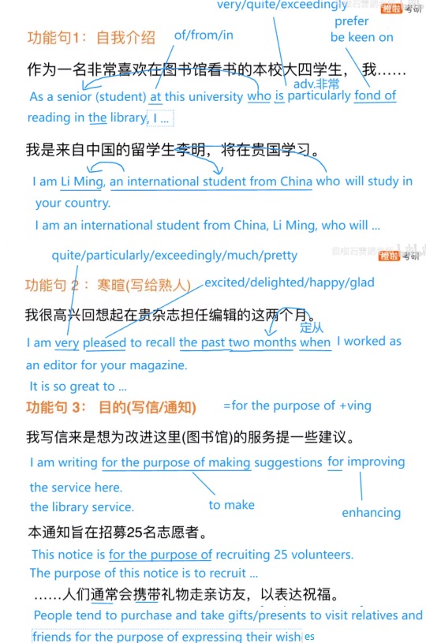

[B站教学](https://www.bilibili.com/video/BV1MY4y1K7VQ?spm_id_from=333.788.videopod.episodes&vd_source=2173cb93b451f2278a1c87becf3ef529&p=5)

### 2024英语一

#### 大作文

ChatGPT帮我润色后的文章：

The image on the left is a simple yet inspiring depiction of small parks within communities. Residents enjoy spending time in these nearby parks, engaging in activities such as running, flying kites, and practicing yoga. The chart on the right illustrates the steady growth of small community parks in Guangzhou over the past three years, with the number increasing from 406 in 2020 to 532 in 2021, and 670 in 2022.

Small community parks are essential for the well-being of citizens and serve as a symbol of urban civilization. People need not only food, clothing, and shelter, but also leisure time and spiritual enrichment. After a day’s work, citizens can stroll through these parks with their families, enjoying the soothing sounds of birds and the gentle breeze.

In modern society, people often spend long hours working and studying, which can be exhausting. Small community parks provide an opportunity for quick physical exercise, helping individuals to recharge and boost their creativity. The government is actively working to build more parks, improving the quality of life for its citizens. This initiative is crucial for the health and productivity of society as a whole.

#### 小作文

一个外国朋友email我寻求帮我，他需要完成一个课后作业，关于中国古代科学家的ppt课堂呈现。下面是AI帮我润色后的email：

Dear Paul,

I’m truly glad to receive your email. Your class assignment sounds fascinating and inspires me a lot. I hope I can offer some helpful advice.

Ancient China has a rich history spanning over 5,000 years, with many great scientists contributing to various fields, including mathematics, medicine, agriculture, architecture, and more. For your presentation, it might be a good idea to start with a brief overview of Chinese scientific achievements.

Then, you could focus on one or two specific fields to delve into more detail. For example, Chinese medicine is a vast field with its own system of knowledge and many renowned scientists such as Bian Que, Li Shizhen, and Hua Tuo. Each of these figures made significant contributions and has fascinating stories associated with their work.

You can find a wealth of information online, but compared to traditional search engines, AI tools like ChatGPT can be more convenient. You can ask specific questions, and the AI will respond as if it’s a knowledgeable friend in the field you’re researching.

Thank you for reaching out, and please feel free to contact me again if you have any further questions.

Best regards,
Li Ming

### 2024英语二

#### 小作文

要求写一封邮件给jack，关于去一个古镇做老房子保护的相关调研。要求给出计划并征求jack的意见。AI基于我的草稿润色如下：

**Dear Jack,**

I hope this email finds you well. I’m reaching out to share my proposed plan for our upcoming survey on the preservation of old houses in Fenghuang, a historic town in Hunan Province.

I suggest we begin our trip this Friday, which would give us the opportunity to meet with local residents in the old houses on Saturday, when they are likely to be free from work. Spending the weekend interacting with the community will allow us to collect valuable first-hand insights. On Monday, we can then visit the local cultural heritage department to gather more detailed information from the officials involved in the preservation efforts.

I’d love to hear your thoughts on this plan. Please feel free to share any suggestions or feedback you might have.

Best regards,
Li Ming

#### 大作文

AI润色如下：

The bar chart illustrates the key benefits gained by students who participated in a social practice course at a university. Nearly 1,000 students took part in the survey, and the results highlight four main areas of improvement. Among the participants, 84.8% reported that the course enhanced their practical skills, 91.3% gained substantial knowledge related to the subject, 32.6% noted an improvement in their collaboration skills, and 54.4% expressed that they enjoyed the experience.

Social practice and hands-on labor offer valuable, real-world insights into both nature and society, which is particularly important for university students. By engaging in these activities, students are able to see how the theoretical knowledge learned in the classroom can be applied in practical settings. This helps deepen their understanding of the subject matter and connects academic learning with real-life applications.

在英文中，以下是对常见图表类型的标准表述：

1. **柱状图** - **Bar chart** 或 **Bar graph**
   例句：The **bar chart** shows the comparison of sales over the past five years.
2. **饼图** - **Pie chart**
   例句：The **pie chart** illustrates the market share of different brands.
3. **折线图** - **Line chart** 或 **Line graph**
   例句：The **line chart** displays the trend in temperature over the last decade.
4. **表格** - **Table**
   例句：The **table** lists the number of students enrolled in each course.

### 2023 英语一

#### 小作文

写一篇招聘启事。AI帮我润色如下：

​                                                             **Now Hiring!**

We are seeking a part-time assistant for Prof. Smith's research project on campus sports activities.

**Job Duties:**

1. Assist in conducting a survey across various universities in Wuhan, gathering responses from at least 1,000 participants. (Note: You will not be responsible for designing the questionnaire.)
2. Prepare an analytical report based on the survey data, following Prof. Smith’s guidelines.

**Requirements:**

1. Must be a university student available to work for at least two full weekends in February.
2. Outgoing, energetic, passionate, and socially-oriented with strong teamwork skills.

**Compensation & Benefits:**

1. $50 per hour.
2. A certificate of participation in the social practice.

To apply, please send your resume to liming@gmail.com. We look forward to having you join our team!

Date: 21/12/2024

#### 大作文

考研英语要求我写一篇文章描述一张图片，图片上是龙舟比赛，很多观众很多龙舟竞渡。下面是AI润色后的文章：

**The Dragon Boat Festival: A Scene of Passion and Tradition**

This picture depicts a **vibrant** scene during the Dragon Boat Festival. A long river winds through the mountains, with hundreds of dragon boats racing across it. Athletes aboard the boats are fiercely competing, wielding their paddles with determination, while cheers and applause erupt from the spectators on the riverbank. "Great Dragon Boat, Great community," two elderly onlookers sigh with admiration.

The purpose of this festival originally was to commemorate Qu Yuan, one of China's greatest and most patriotic poets. Today, the Dragon Boat race has evolved into an international sport, enriching not only the spiritual lives of the Chinese people but also fostering cultural exchange worldwide. We should continue to promote our historical heritage and celebrate our patriotism.

### 2023英语二

#### 小作文

要求我写一篇email回复david，他就周日是去观看艺术展还是机器人展寻求我的意见和建议。AI润色的文章如下：

Dear David,

I hope this email finds you well. I’m glad you reached out to me for advice.

Based on information from a friend of mine who works in the relevant field, the art exhibition features a famous French painter who is truly talented and an emerging star in his domain. On the other hand, the robot exhibition mainly features second-tier manufacturers and is more of a sales event than a showcase of groundbreaking technology.

Given that you are a university student majoring in the history of Western art, I believe the art exhibition would be more valuable to you, even though I know you are also very interested in technology.

I believe the art exhibition could provide you with plenty of inspiration. That’s my suggestion, and I hope it’s helpful to you.

Best regards,
Li Ming

#### 大作文

要求就一张 中国居民健康素养水平过去十年趋势的折线图写一篇议论文。下面是AI润色后的文章：

**The Trend of Health Literacy Rate of Chinese Residents (2012-2021)**

The line chart presented is particularly worth paying attention to, as it illustrates the trend of the health literacy rate among Chinese residents from 2012 to 2021. Health literacy rate refers to the proportion of individuals who possess the basic ability to maintain their health by accessing and understanding both health-related information and services.

From the chart, it is evident that the health literacy rate in China has been steadily rising over the past decade, with a particularly sharp increase after 2016. The rate started at 8.8% in 2012, rose to 11.58% in 2016, and reached 25.4% in 2021.

This remarkable achievement reflects the hard work and contributions of residents, communities, and the government. For individuals, good health is essential for both daily life and work, while for society as a whole, health is a key factor in ensuring long-term prosperity. Therefore, it is crucial to continue strengthening health literacy to build a healthier and more prosperous future.

### 2022英语一

#### 小作文

写一封邮件，邀请British University的一位教授组队参加international innovation contest to be held at your university. 下面是AI润色后的邮件

**Subject:** Invitation to Participate in the International Innovation Contest

Dear Prof. Smith,

I hope this email finds you well. I am a student at Northwestern University and also serve as an assistant for the upcoming International Innovation Contest, which will be held in February 2025. **It is a great honor to reach out to you**.

The purpose of this email is to invite you to lead a team from British University to participate in this **prestigious** event.

The contest **made its debut** in March of last year, with teams from 25 countries, including prestigious institutions such as Cambridge University and Harvard University. This year, we anticipate the participation of over 36 teams from around the world. British University, **renowned** for its excellence in AI and Computer Science, would undoubtedly contribute to the competition in a meaningful way. **I am confident that** a team from your university would not only compete effectively but also achieve an outstanding ranking.

We would be honored to have your **esteemed institution represented at this event**, and we sincerely look forward to your participation.

Best regards,
Li Ming

#### 大作文

要求就一副图片写一篇议论文。图片是两个女孩在公告栏前讨论是否参加一个与他们专业无关的讲座。下面是AI润色后的全文：

**Subject: The Value of "Useless" Knowledge**

The picture below is particularly worth attention as it **highlights** two **contrasting** attitudes toward **what is often considered "useless" knowledge.**

In the image, two university students are **engaged** in a conversation in front of a bulletin board, which **features** a notice about an **upcoming** lecture. The girl on the left says, "This lecture is not relevant to our majors. **It’s a waste of time to attend**." On the other hand, the girl on the right **responds**, "I believe it will benefit us **in some way**, even if it seems irrelevant **at the moment**."

Their conversation **offers** us valuable **insights**. Often, knowledge or information that **appears** unrelated to our immediate goals can prove useful in the future. While it may not directly **contribute** to our objectives, it can subtly influence **the way** we think and approach problems. As an ancient Chinese proverb goes, "Reading books always benefits you." Therefore, what may **seem like** "useless" knowledge can be **incredibly** valuable **in the long run**.

另外一种功能句开头：

The picture, apparently, reminds us two contrasting attitudes towards what is often considered "useless" knowledge.

The picture, apparently, associates with two contrasting attitudes towards what is often considered "useless" knowledge.

### 2022 英语二

#### 小作文

写一篇email邀请学校里的交换生来参加校园美食节。AI润色如下：

**Subject:** Welcome to the Campus Food Festival

Dear International Students,

I hope this email finds you well. My name is LiMing, and I am a senior at this university, **as well as a volunteer** for the upcoming Campus Food Festival, which will take place on December 21, 2024. **It is my pleasure to** sincerely invite you to participate in this exciting event.

The **annual** Campus Food Festival, **established** in 2013, has become a cherished tradition. The festival **features** **not only** delicious food **but also** vibrant music and dancing. All students are welcome to join **for free**. Participants can **showcase** their culinary skills by preparing traditional dishes **representing** their hometowns, which can be **shared with others** or sold **during** the event.

We would be **thrilled** to have you **join us** and **contribute** to this wonderful celebration of culture and diversity. We look forward to seeing you there and hope everyone will enjoy the event!

Best regards,
LiMing

#### 大作文

要求就2018-2020年三年的快递包裹增长的柱状图写一篇议论文。AI润色后的文章如下：

**Subject: The Rapid Growth of Delivery Services in China**

The bar chart clearly **highlights** the **remarkable** increase in the number of packages delivered in China from 2018 to 2020.

**Over** the past two decades, e-commerce has **flourished** in China, becoming an **integral** part of people’s lives. Residents **have grown** **accustomed** to receiving **numerous** packages from **various** e-commerce platforms, such as JD, Taobao (TB), and Pinduoduo (PDD). During the **COVID-19** **pandemic**, **as** people **sought to minimize** face-to-face contact, the number of packages **surged dramatically**—from 51 billion in 2018 to 64 billion in 2019, reaching a staggering 83 billion in 2020. **Similarly**, package deliveries in rural areas **witnessed significant growth**, rising from 12 billion in 2018 to 15 billion in 2019 and **doubling to 30** billion in 2020.

While the **booming** e-commerce industry has **undoubtedly** **fostered** the economy during the pandemic, it has also **given rise to numerous challenges**. Environmental pollution caused by **excessive packaging waste** and the **strenuous** working conditions of delivery workers **are pressing concerns**. Fortunately, the government has begun implementing regulations to **address** these issues, promoting **sustainable** practices in this fast-growing sector.

### 2021年英语一

#### 小作文

考研英语要求我给一个外国大学毕业生写一封邮件提供一些建议，关于他想在中国找份工作。下面是AI润色后的文章

**Subject:** Advice on Finding a Job in China

Dear Tom,

I hope this email finds you well. **First of all, congratulations on your graduation!** It’s wonderful to hear that you **are planning to** find a job in China, and I’m glad you reached out to me for advice.

As a foreigner, **one of the easiest ways to start your career in China** is by teaching English at a school. **However**, you would need to **obtain** a teaching certificate first. You mentioned **earlier** that your dream is to become a computer science teacher in middle schools and **inspire** future scientists like Alan Turing. This is not only an **admirable** goal but also a **promising** career path.

**That said**, **it’s important to note that** computer science is not yet a core subject in most Chinese middle schools, as students in this stage **focus intensely on** preparing for university entrance exams, which do not currently include computer science as a tested subject. **Alternatively**, you might consider teaching computer science in primary schools, where students **tend to be** more enthusiastic about extracurricular subjects.

I hope these suggestions are helpful as you plan your next steps. **Best of luck in your job search**, and feel free to reach out if you have further questions!

Best regards,
LiMing

#### 大作文

要求就一张关于两父子对话的图片写一篇议论文。下面是AI润色后的文章

**Subject: Follow Your Heart**

This picture is particularly **thought-provoking** as it highlights an important life lesson about **staying true to oneself.**

In the picture, a boy and his father are having an inspiring conversation. The boy **laments**, "Dad, many of my classmates think it’s outdated and old-fashioned to learn Peking Opera. I feel ashamed." The father **wisely** responds, "But you love Peking Opera, right? It’s wonderful as long as you’re **passionate about** it. Just ignore others’ opinions."

**This exchange offers us much to reflect on.** **Too often**, we focus **excessively** on making the “right” choices according to societal standards, feeling **insecure or uncertain** when others disagree **with** or disapprove **of** our **decisions**. However, **blindly** following others **rather than** **our true passions** is rarely the right path. The key is to follow our hearts and have the courage to be ourselves.

Life is short, and we only get one chance to **live authentically**. **Embracing our uniqueness** and **pursuing what we truly love** allows us to live with meaning and **fulfillment**. So, be brave, be different, and most importantly, be yourself.

补充：

**Instead of and rather than** are both used to indicate a preference or choice between two options. However, instead of is more commonly used in everyday language and is considered more informal, while rather than is often used in more formal or academic writing. Additionally, instead of is typically used to suggest an alternative action or choice, while rather than is used to emphasize a preference or contrast between two options.

### 2021英语二

#### 小作文

要求写一封email，邀请jack这位国际交换生来参加一个线上会议。AI润色后的文章：

**Subject**: **Invitation** to the Club's Online Meeting

Dear Jack,

I hope this email finds you well. I am Li Ming, a junior at this university and an assistant for our motorcycle club. **I’m writing to invite** you to participate in an online meeting **scheduled for** 8:00 PM on December 25, 2024.

The meeting will **take place on** Zoom, a convenient **video conferencing app**. **During the session**, seven participants, including you, will discuss the schedule and route for our club’s annual trip around China. The **meeting access code** is **887867**.

If you have any creative ideas about the trip, **feel free to prepare them in advance**. Your input will **undoubtedly add great value to** our **discussion**. I sincerely hope you can join us and **share your expertise**.

**Looking forward to your reply.**

Best regards,
Li Ming

#### 大作文

要求就一张关于某城市居民体育锻炼方式的柱状图写一篇议论文。AI润色如下：

**Subject**: A Survey **on** Physical Exercise in Shenzhen

This bar chart is particularly thought-provoking, as it depicts how residents in Shenzhen **engage in** physical exercise.

The survey data **reveals diverse preferences** among Shenzhen residents. **A slight majority (54.3%) prefer exercising alone, nearly half (47.7%) enjoy working out with friends, around a quarter (23.9%) exercise with their families, and only 15.8% choose to participate in club team activities.**

As cities become more developed, their residents tend to **place greater emphasis on physical fitness**. Regular physical exercise is closely tied to a city's **vitality** and energy. **Beyond** **enhancing** personal health, engaging in physical activities **fosters** emotional well-being, **strengthens** friendships, and **deepens** family **bonds**.

### 2020 英语一

#### 小作文

要求以学生会名义写一篇英文通告，通知国际交换生来参加即将到来的唱歌比赛。AI润色如下：

Subject: **Calling** All Talented Singers!

Dear International Students,

We are **thrilled to announce** the upcoming Campus Singing Contest, which will be held from 6:00 PM to 10:00 PM on December 29, 2024, at the Dong Fang Hong Stadium. This is an exciting **event** open to all international students, and **participation is free of charge!**

You can **showcase your talent** **by performing solo or by forming a chorus team** (with a maximum of 20 members per team).

This contest is not only a fantastic platform to **express** your musical talents but also an excellent opportunity to meet new friends and **share a passion for music.** **To participate,** please scan the QR code below and complete your registration by December 1, 2024.

We **eagerly** look forward to your participation and **can’t wait to see you shine on stage!**

[QR code here]

Best regards,
The Student Union
November 12, 2024

#### 大作文

要求就一张图片写一篇议论文。图片中是两个小孩，一个立即着手完成家庭作业，另外一个则拖延到最后不得不做。AI润色如下：

**Subject**: Prioritize the Important  （我的初稿是 Important Things First）

This picture is thought-provoking, as it highlights **crucial** principles that can **guide us through life**.

In the image, a **diligent** girl begins her homework immediately after arriving home, **believing that completing important tasks early allows her to relax later.** **In** contrast, a playful boy postpones **repeatedly**, **putting off** his homework until late at night when he must finish it **hastily**.

The **contrasting** habits of these two children **offer valuable lessons.** First and foremost, we should prioritize important tasks. Too often, **we shy away from tackling challenging but essential tasks, preferring to delay them.** **However, beginning such tasks promptly, even if we cannot complete them at once, empowers us to confront and overcome difficulties with greater confidence.**

Additionally, setting clear deadlines is equally important. A deadline instills a sense of urgency and boosts productivity. It helps us **stay disciplined and resilient in pursuing our goals**, ensuring that delay does not **derail** our progress.

**By adopting these principles—prioritizing important tasks and setting deadlines—we can build better habits and achieve greater success in both work and life.**

### 2020 英语二

#### 小作文

要求写一篇邮件给学校里的国际交换生们，介绍下来的旅行去到的历史地点。AI润色如下：

**Subject**: A Journey to Explore History and Patriotism

Dear International Students,

I hope this email finds you well. I am Li Ming, a junior at this university and an assistant for our upcoming tour. **We are excited to invite** you to join us on a visit to the Qu Yuan Temple, a **renowned** historical site.

The Qu Yuan Temple, also known as *Qu Zi Ci* in Chinese, is located beside the **picturesque** Mi Luo River, where the patriotic poet Qu Yuan **tragically** ended his life by **drowning**. Qu Yuan, who lived over 2,500 years ago, **is celebrated for his profound contributions to** Chinese literature, including **masterpieces** such as *Li Sao*, *Tian Wen*, and *Chu Ci*.

**Feeling** hopeless about saving his motherland from danger, Qu Yuan chose to end his life to express his loyalty and despair. **To honor(commemorate也是合适的) his patriotism**, local people built the Qu Yuan Temple and began the tradition of Dragon Boat racing on the Mi Luo River every year **on May 5th of the Chinese lunar calendar.**

I am confident that this visit will be a meaningful experience, **offering you a chance to explore Chinese history and culture.** You will not only enjoy the scenic beauty of this historic site but also be inspired by Qu Yuan’s **unwavering love for his country and his literary legacy.**

Looking forward to having you join us!

Best regards,
Li Ming

#### 大作文

要求就一张饼图写一篇议论文，饼图描述了大学生使用手机阅读的各种目的。AI润色如下：

**Subject: A Survey on the Use of Mobile Phones Among University Students**

This pie chart is particularly thought-provoking as it highlights the **diverse** purposes **for which university students use their mobile phones.**

According to the data **presented in the chart,** a majority of students (59%) use mobile phones **for study purposes**. Over a fifth (21.3%) use them **for leisure or to kill time,** around 17% for accessing information, and only 2.2% for other purposes.

Mobile phones and the Internet have **revolutionized** our lives, **offering numerous conveniences** such as reading, shopping, socializing, and entertainment. However, several **concerning issues** have also emerged. Many young people are becoming **overly obsessed with** certain online activities, such as watching short videos and playing games. **Overindulgence** in these activities can harm both **physical and mental well-being**.

Therefore, it is crucial for students to **exercise self-discipline** and use mobile phones wisely. By **balancing their time and focusing on productive uses**, they can **harness** the benefits of technology while avoiding its **pitfalls**.

### 2019 英语一

#### 小作文

要求email回复一位本校国际学生询问的助学项目的问题。AI润色如下：

**Subject:** Re: Inquiry about the Aiding Rural Primary School Project

Dear Smith,

I hope this email finds you well. **Thank you for reaching out** with your questions about the "Aiding Rural Primary School" project. **I am delighted to provide you with more information.**

The "Aiding Rural Primary School" project **aims to support** primary schools and students in **underdeveloped** rural areas, primarily in Guizhou, Yunnan, and Qinghai provinces. It is open to all international students at our university who are **compassionate and enthusiastic about helping children in need.** **Contributions can be made in various forms,** such as donating clothes, stationery, or funds. **In addition to** material assistance, participants are encouraged to offer **emotional support** by writing **uplifting** letters to the children.

We would be thrilled to have you join us and contribute your talents and passion to this meaningful initiative. **Please feel free to contact** me if you have further questions or need assistance with getting involved.

Best regards,
Li Ming

#### 大作文

要求就一张有寓意的爬山的图片写一篇议论文，下面是AI润色文章：

**Subject: Persistence Leads to Success**

This drawing is particularly thought-provoking, as it **vividly illustrates** contrasting attitudes toward hardships.

In the picture, two young **climbers** are scaling a mountain. One, wearing glasses, sits heavily on the ground halfway up and sighs, "I’m exhausted, and I quit." In stark contrast, the other boy, **full of determination**, encourages him, saying, "Come on, we should take a short rest and keep climbing to reach the **summit**."

This scene **mirrors** a common phenomenon in society where some people give up too easily when faced with setbacks. However, **perseverance** is the key to **overcoming challenges.** By staying **resilient** in the face of difficulties, we can gain strength, conquer obstacles, and eventually achieve success. At the same time, **physical fitness** plays an important role in **fostering** a strong will, as a healthy body **nurtures** mental **fortitude**（刚毅）. By **embracing** persistence, we can accomplish great achievements in both study and work, unlocking our full potential.

### 2019 英语二

#### 小作文

要求写一篇email，关于smith 教授交代的组织一次关于城市交通的辩论赛的主题/安排建议。

**Subject: Suggestions on the Debate of City Traffic**
Dear Prof. Smith,

I hope this email finds you well. I’m excited to **take on the task** of organizing a debate on city traffic.

In my opinion, banning motorcycles would **make for** an excellent and **engaging** debate topic, as there are strong arguments on both sides. Factors such as economic development, environmental impact, public safety, and residents’ well-being must all be considered. I believe this will **spark** a lively discussion.

I suggest scheduling the debate for the weekend after our final exams, **allowing enough time for thorough preparation.**

Looking forward to your **feedback**.

Best regards,
Li Ming

#### 大作文

要求就一张关于本科生就业去向的柱状图写一篇论文

**Subject: Where Have the Undergraduates Gone?**

The column chart **presents** an **insightful comparison** of undergraduate employment destinations in 2013 and 2018.

According to the data, the majority of graduates still choose to **enter the workforce**, though this number has declined from 68.1% in 2013 to 60.7% in 2018. Meanwhile, an increasing number of undergraduates are **pursuing postgraduate studies**, with the **percentage** rising from 26.3% in 2013 to 34% in 2018. Interestingly, the proportion of undergraduates **starting their own businesses** has doubled, increasing from 13% in 2013 to 26% in 2018.

This chart reveals important trends. As society develops, there is a **growing demand** for **highly educated talent**, particularly in high-tech sectors. Additionally, new industries, especially in mobile internet, provide **abundant** opportunities for entrepreneurial ventures. Therefore, **going into employment** is no longer the only option for graduates. The future for today's undergraduates seems **full of exciting possibilities**.

### 2018 英语一

#### 小作文

要求给学校的国际交换专家们写一封邮件，邀请他们来参加毕业典礼，下面是AI润色后的文章

Subject: Invitation to the Graduation Ceremony

Dear **Esteemed** International Experts,

I hope this email finds you well. **I am writing with great honor to invite you** to attend our upcoming graduation ceremony, which will take place at 9:00 AM on December 17, 2024, at Dong Fang Hong Square.

The ceremony **is expected to last** approximately two hours and **will feature several exciting highlights,** including **the awarding of outstanding students** and teachers, the presentation of graduation certificates, and **group photo sessions**. **Additionally**, a special memory exhibition will be held at the back of the venue. **You are warmly encouraged to** contribute cherished photos or **memorabilia** that **capture our shared moments**, making this event even more meaningful.

We are truly excited to have you join us **in celebrating this special occasion**. Should you have any questions or need further details, please feel free to contact me at any time.

Warm regards,
Li Ming

#### 大作文

要求就一张学生选修课的图片写一篇文章，字数不超过200words。

**Subject: A Difficult Choice**

This picture vividly **captures the challenging moment of making choices**, particularly when it comes to selecting **extracurricular courses**. In the image, a university student is seen sitting in front of a computer, **hesitating between two types of** courses for the new semester. On one hand, some courses are creative and engaging but come with significant challenges. On the other hand, there are easier and less inspiring options that guarantee higher grades **with minimal effort**.

In my view, students should **prioritize** courses that genuinely interest them, even if they are more **demanding**. As the saying goes, "Interest is the best teacher." **Tackling challenging tasks** not only fosters deeper thinking but also broadens **perspectives** and builds discipline. Choosing the harder path may be daunting at first, but **the long-term rewards** of growth and fulfillment far outweigh the temporary struggle.

Life is full of choices, and **embracing challenges with confidence and determination** often leads to the most meaningful experiences.

### 2018 英语二

#### 小作文

要求给Smith教授写一封邮件，因故取消原定的拜访

**Subject: Cancellation of Visit**

Dear Prof. Smith,

I hope this email finds you well. **I am writing to sincerely apologize for** canceling my visit originally scheduled for this weekend. Unfortunately, my grandmother has unexpectedly passed away, and I must attend her funeral.

In Chinese culture, the passing of a close relative is a deeply significant event, and as her beloved grandson, it is my duty to bid her farewell.

Meeting with you and engaging in a meaningful discussion is an **invaluable** opportunity for me. I deeply regret this cancellation and hope to **reschedule our meeting**. Would it be possible to arrange a new appointment in mid-December **at your convenience**? **Please let me know your available times.**

Thank you for your understanding, and I look forward to your response.

Best regards,
Li Ming

#### 大作文

要求就一副餐厅选择考虑的因素的饼图写一篇议论文

**Subject: Dining Factors That Consumers Value**

The pie chart highlights the diverse factors consumers consider when choosing restaurants for dinner, including food style, service, environment, price, and others.

According to the chart, over one-third of customers (36.3%) **prioritize** food style, **followed by** 26.8% who **value** service quality and 23.8% who **focus on** the dining environment. Surprisingly, only 8.4% **view** food price as the most **critical** factor, while 4.7% **consider** other factors.

These preferences **reflect** broader trends in the food industry. In China, cuisine is a **cornerstone** of culture, with diverse regional and ethnic food styles attracting diners. Stylish restaurants and food delivery apps make dining more convenient, yet they also raise concerns about food quality and safety. Issues like **overuse of additives and substandard ingredients** have led many consumers to prepare **meals** at home or seek high-quality products from trusted sources.

To sustain the booming food industry, it is **imperative** for the government to **enforce stricter regulations and ensure food safety.** By **addressing** these challenges, the dining experience can be both enjoyable and trustworthy for consumers.

### 2017 英语一

#### 小作文

要求给初来乍到的Cook教授写一封邮件，介绍一下本市的景点。

**Subject:** Welcome to Shenzhen – A Tour Guide for Prof. Cook

**Dear Prof. Cook,**

I hope this email finds you well. Welcome to Shenzhen, and thank you for visiting our university. **Your presence as a renowned professor is truly inspiring and meaningful for us.**

Shenzhen is a vibrant city with **a variety of** attractions to explore, and **it would be my pleasure to accompany you at your convenience**. Like your hometown in Australia, Shenzhen boasts a stunning coastline with **spectacular** views. We can stroll along the beach, feel the refreshing sea breeze, and enjoy freshly caught seafood. The crystal-clear waters and blue skies are truly **breathtaking**.

There is a Chinese saying: *"Wise men enjoy mountains, while kind men love waters."* As someone both wise and kind, I believe you will appreciate the serene beauty of our mountains as well. We could **hike up** Lotus Hill, located in the heart of Shenzhen, where a panoramic view of the city’s modern skyline awaits.

In addition to these, Shenzhen offers many other attractions, such as lush parks with exotic plants, vibrant food streets, and elegant shopping malls. Please let me know which sites **interest you the most,** and I’ll be happy to arrange our visit.

Looking forward to your response. Feel free to reach out if you have any questions or preferences.

**Best regards,**
Li Ming

#### 大作文

**Subject:** "Having Books" vs. "Reading Books"

This picture is particularly thought-provoking as it vividly **contrasts** two different attitudes toward learning.

On the left side of the illustration, a "clever" boy reclines comfortably in an armchair, surrounded by a shelf filled with hundreds of books. To him, owning books **equates** to acquiring knowledge. In stark contrast, a diligent young man is shown engrossed in reading the eighth book on his plan to complete 20 books this year. His perseverance **exemplifies** a disciplined approach to learning.

This scenario **mirrors** a common phenomenon in real life: many people struggle to persist in challenging tasks, such as reading. They enthusiastically make ambitious resolutions at the beginning of each year but often fail to **follow through**. Tasks planned for today are frequently postponed to tomorrow, and they convince themselves that buying books alone brings wisdom and accomplishment.

However, success in life and work hinges on **self-discipline and consistent effort**. It requires setting clear goals, creating detailed plans, and, most importantly, **adhering** to them. As the saying goes, "Action speaks louder than words." Only through diligent practice can we transform potential knowledge into true understanding and achievement.

Let us embrace the spirit of the diligent reader and make consistent efforts toward self-improvement.

### 30个常用句型笔记

