## 4、串

KMP模式匹配算法

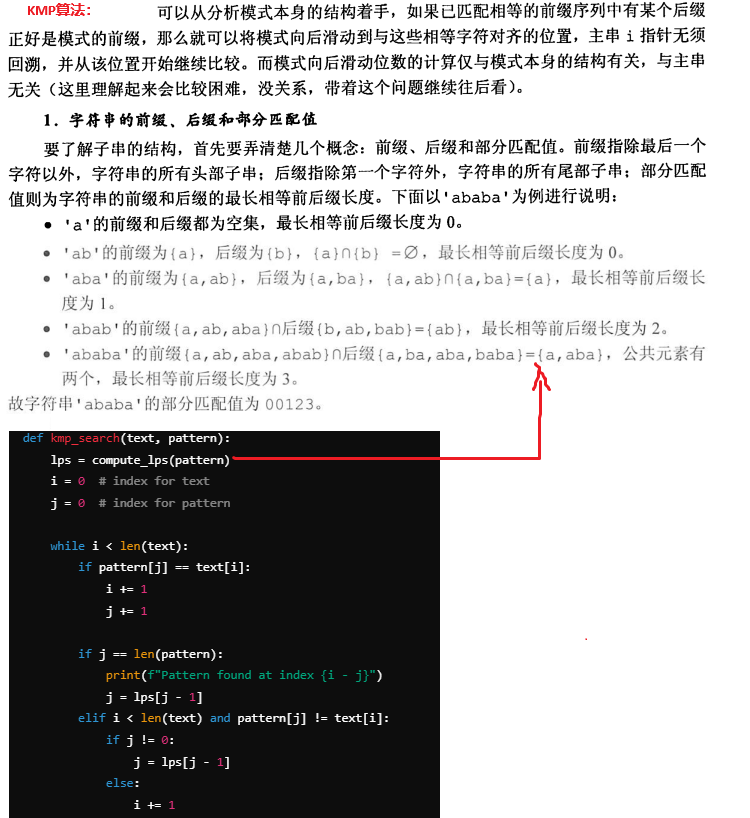

---------------------------------------------------------------

## 5、二叉树、树、森林

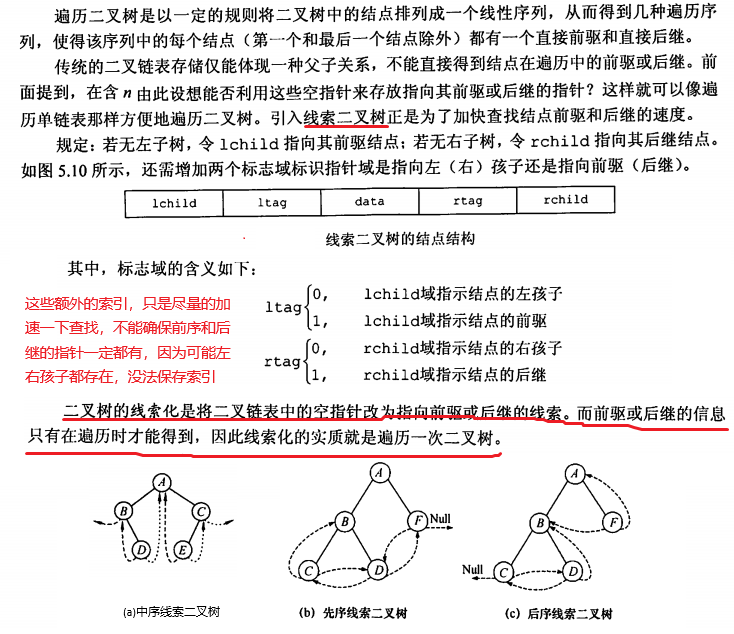

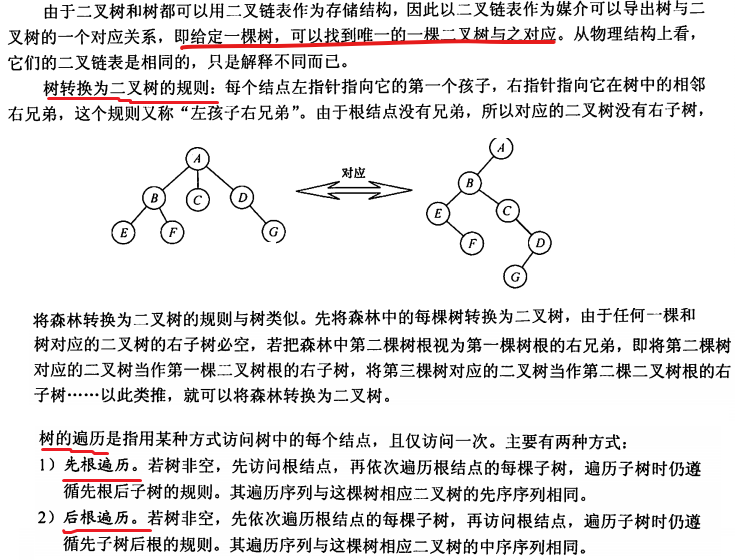

-------------------------------------------------------

## 6、图

### 6.1 图的表示

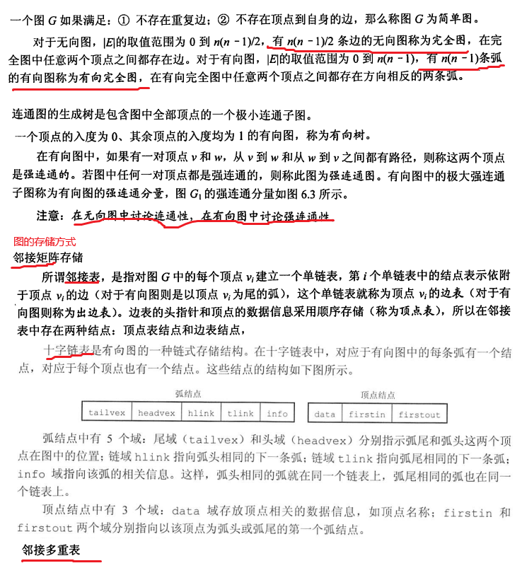

### 6.2 图的遍历

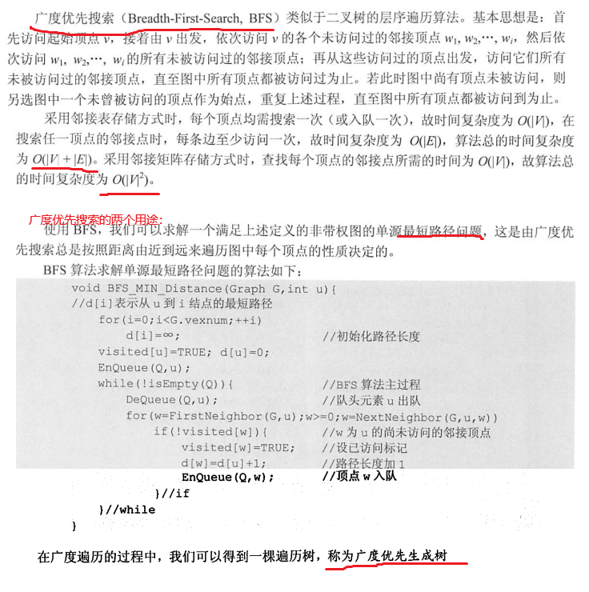

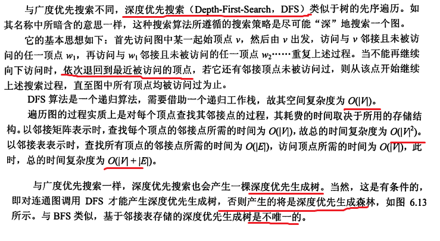

### 6.3 图的最小生成树

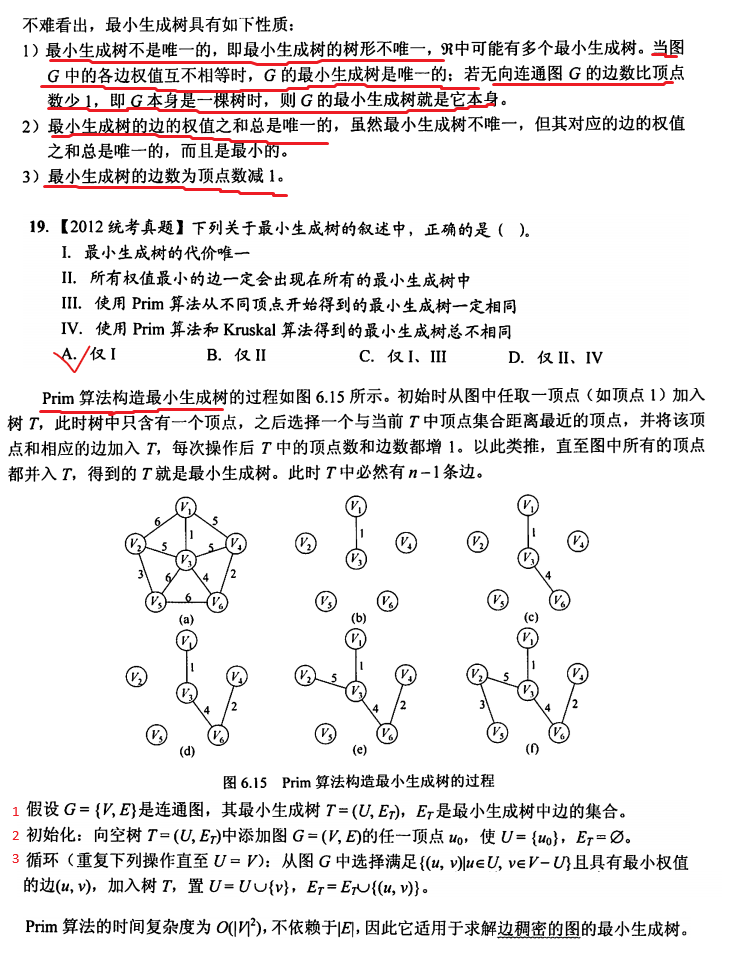

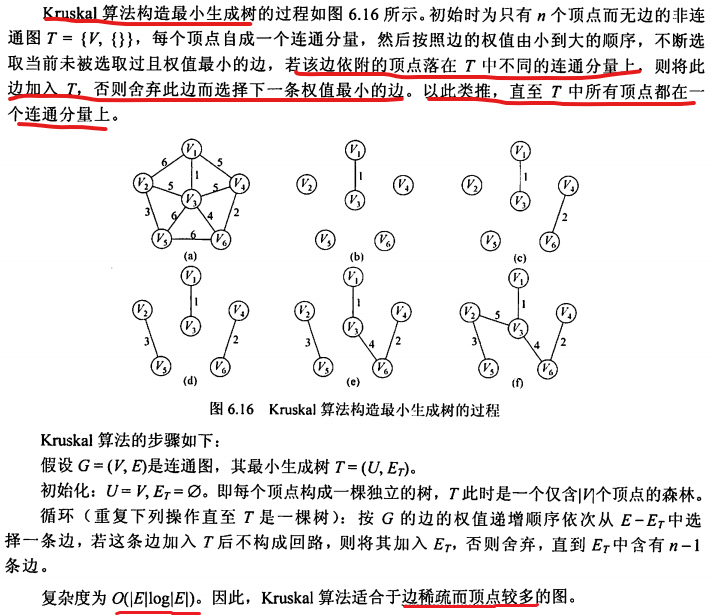

### 6.4 图的最短路径

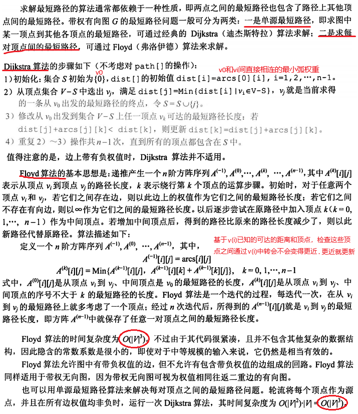

## 7、查找

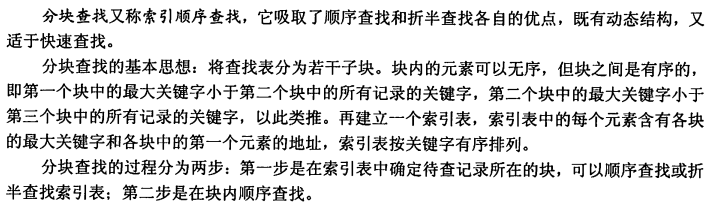

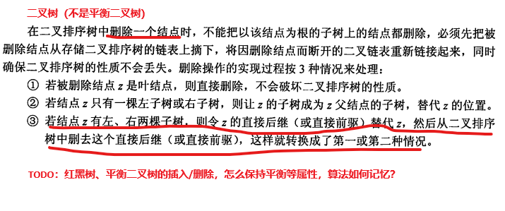

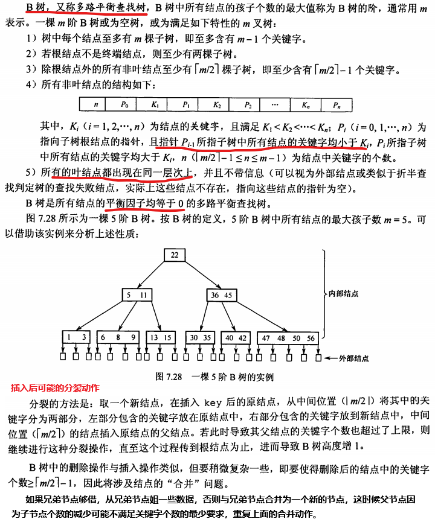

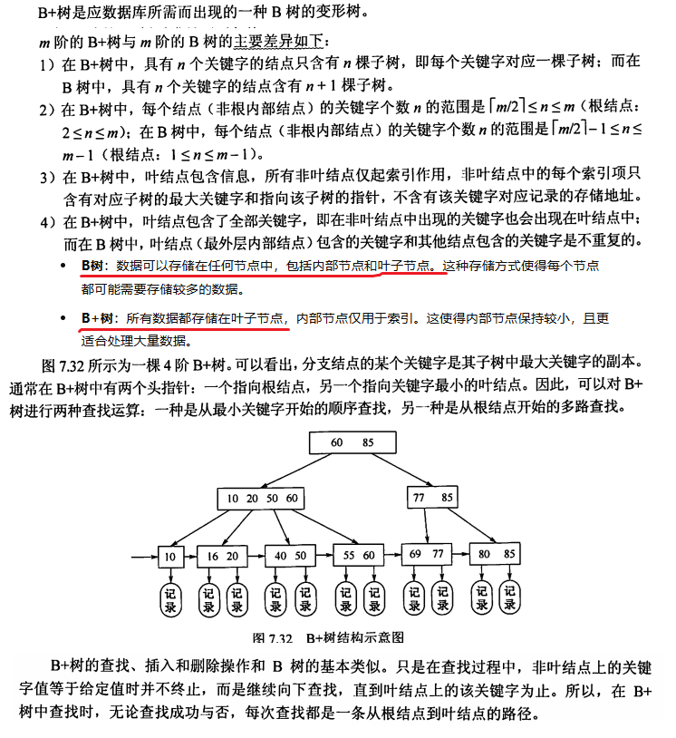

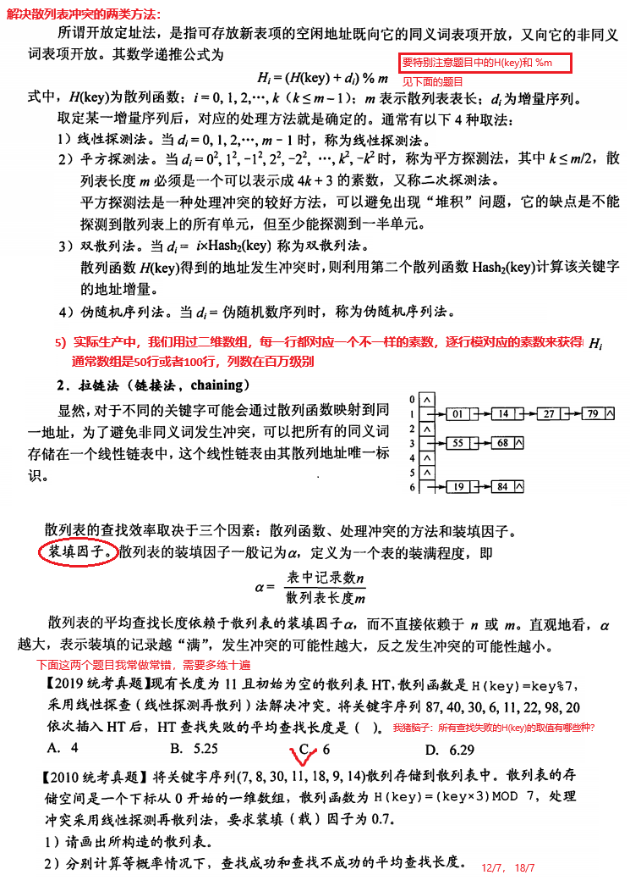