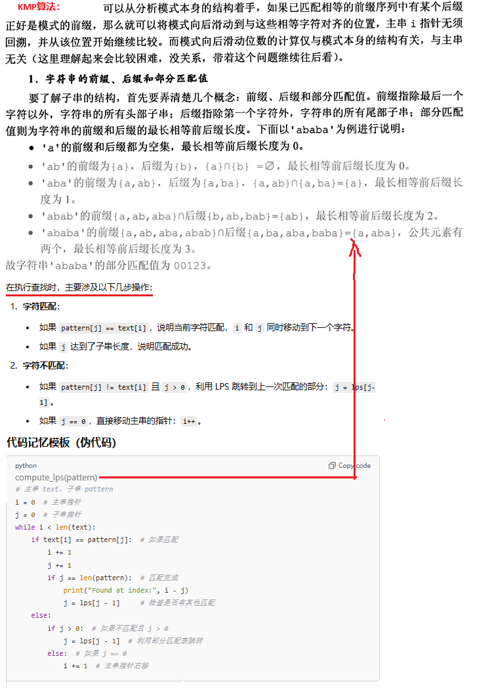
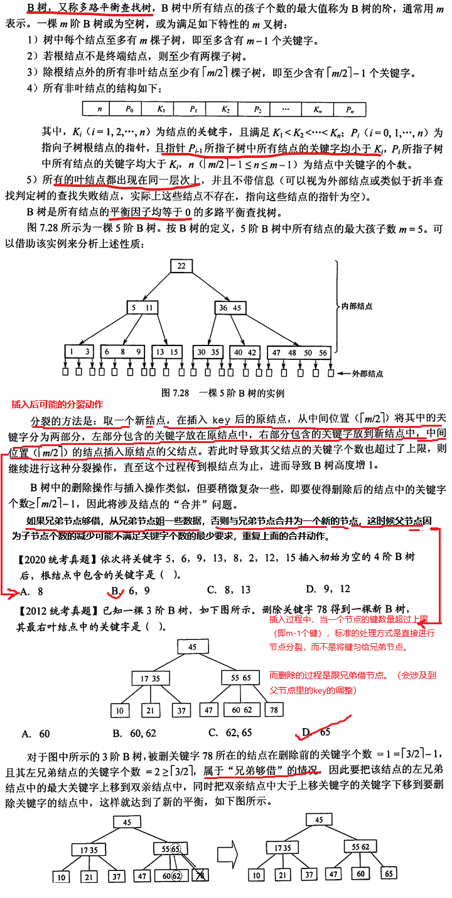

## 4、串

KMP模式匹配算法

---------------------------------------------------------------

## 5、二叉树、树、森林

-------------------------------------------------------

## 6、图

### 6.1 图的表示

### 6.2 图的遍历

### 6.3 图的最小生成树

### 6.4 图的最短路径

## 7、查找

