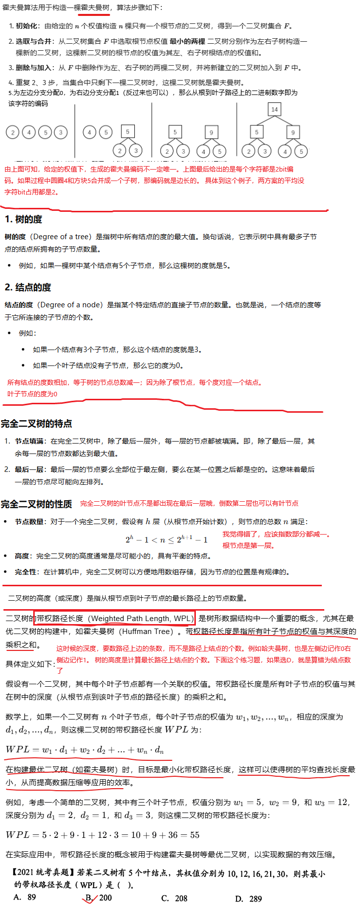
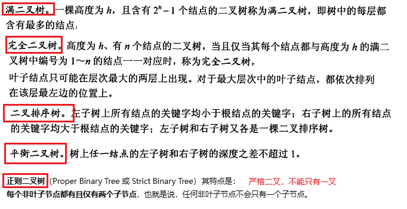
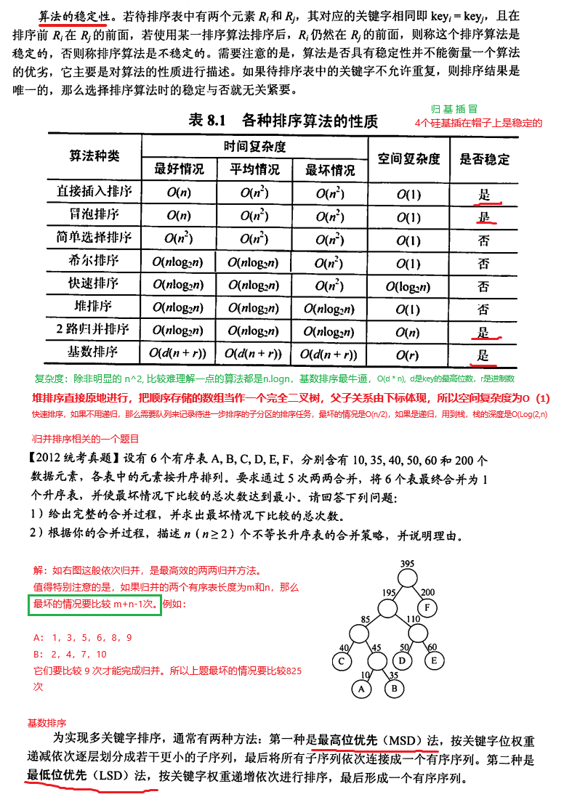
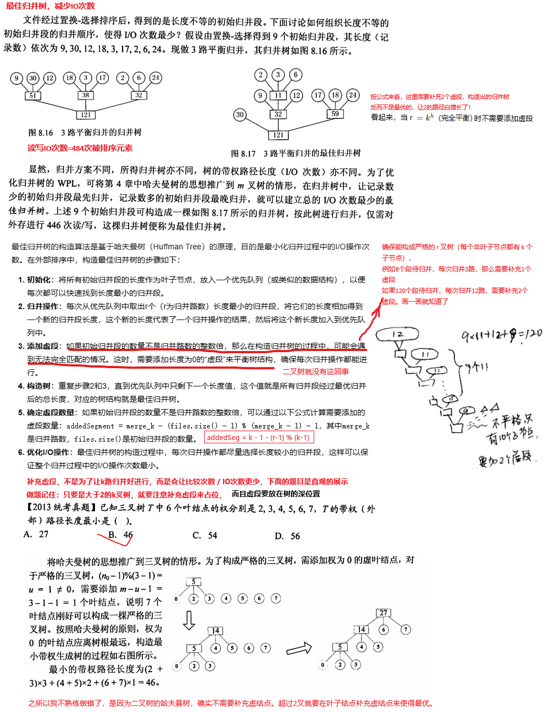

## 3、线性表


## 4、串

KMP模式匹配算法


---------------------------------------------------------------

## 5、二叉树、树、森林







-------------------------------------------------------

## 6、图

### 6.1 图的表示


**图的简单路径（Simple Path）**是指一条不包含重复顶点的路径。这意味着除了路径的起点和终点可能相同之外，路径中的任何顶点在路径序列中只出现一次。简单路径是图中连接两个顶点的一种方式，它不经过任何顶点两次或以上。

例如一个有向图，其顶点集为 {A, B, C, D}，边集为 {(A, B), (B, C), (C, A), (A, D), (D, B)}。从A出发经过C到D的路径是一条非简单路径。A直接到D的是简单路径。

**图的回路（Cycle）**是指一条路径，它从一个顶点开始，经过一系列其他顶点和边，最终又回到起始顶点。如果一个回路中没有重复的顶点（除了起始和结束顶点），则称为简单回路。如果回路中有重复的顶点，则称为非简单回路。

例如一个有向图，其顶点集为 {A, B, C, D}，边集为 {(A, B), (B, C), (C, A), (A, D), (D, B)}。从A出发经过D的回路是一条非简单回路。

简单回路是一条简单路径。

### 6.2 图的遍历


、

| 算法         | 时间复杂度                       | 功用1 | 功用2 |
| ------------ | --------------------------------- | ---- | ---- |
| 广度优先遍历(BFS) | 邻接矩阵下：O(\|V\|*\|V\|)  ，邻接表下： O(\|V\|+\|E\|) | 广度优先生成树 | 非带权图的最短路径 |
| 深度优先遍历(DFS) | 邻接矩阵下：O(\|V\|*\|V\|) ，邻接表下： O(\|V\|+\|E\|) | 深度优先生成树 | 拓扑排序 |
| Prim算法 | O(\|V\|*\|V\|)，适合边比较稠密的，因为与边数无关 | 最小生成树 |  |
| Kruskal算法 | O(\|E\|*log(\|E\|))，适合边比较稀疏的 | 最小生成树 |  |
| Dijstra算法 | O(\|V\|^3) | 单源的最短路径问题 |  |
| Floyd算法 | O(\|V\|^3) | 每对顶点间的最短路径 |  |
| kahn算法 | O(\|V\|+\|V\|) | 拓扑排序 |  |


### 6.3 图的最小生成树


### 6.4 图的最短路径


```shell
Input:
    n: 节点数
    dist: n x n 的邻接矩阵 (dist[i][j] 表示 i 到 j 的初始距离，若无直接路径则设置为 ∞，自己到自己为 0)

Output:
    dist: n x n 的最短路径矩阵 (dist[i][j] 是 i 到 j 的最短距离)

Algorithm:
1. 初始化：
   - 矩阵 dist[i][j] 的初始值为图的边权重，如果没有直接边，则为 ∞。
   - dist[i][i] = 0, 因为自己到自己的距离为 0。

2. 对每一个中间节点 k，从 1 到 n：
   - 对每一个起点 i，从 1 到 n：
       - 对每一个终点 j，从 1 到 n：
           - 更新 dist[i][j]：
             dist[i][j] = min(dist[i][j], dist[i][k] + dist[k][j])
#上面很暴力很好维护，但可以优化：对于当前节点k，它目前不能到达的点i和点j 之间的距离肯定不会被更新，所以不是需要检查每种(i, j)组合的
2. 对每一个中间节点 k，从 1 到 n：
   - 对每一个起点 i，从 1 到 n：
       - 如果 dist[i][k] 是 ∞，跳过这轮循环，因为 i 无法到达 k。
       - 对每一个终点 j，从 1 到 n：
           - 如果 dist[k][j] 是 ∞，跳过这轮循环，因为 k 无法到达 j。
           - 更新 dist[i][j]：
             dist[i][j] = min(dist[i][j], dist[i][k] + dist[k][j])

3. 返回最终的 dist 矩阵。

```


### 6.5 拓扑排序和关键路径


[b站视频](https://www.bilibili.com/video/BV1DD4y1h7ac/?spm_id_from=333.337.search-card.all.click&vd_source=2173cb93b451f2278a1c87becf3ef529)

## 7、查找

### 7.1 表查找


### 7.2 二叉树查找


### 7.3 B树和B+树


### 7.4 散列表


## 8 排序

[代码在这里](code/MySort.java)

### 8.1 内部排序





```java
    //希尔排序的实际代码
    public static void shellSort(Object[] array, Comparator<Object> comparator)
    {
        int n = array.length;
        for (int step = n / 2; step > 0; step = step / 2)
        {
            for (int i = 0; i < step; ++i) // step确定后，数组就被分成了step个子数组，对每个子数组做插入排序
            {
                insertSort4shell(array, comparator, i, step);//和一般的插入排序类似，只是一般的插入排序步长为1，这里步长为step
            }
        }
    }
```


### 8.2 外部排序




[内部排序的我的代码实现](code/MySort.java)