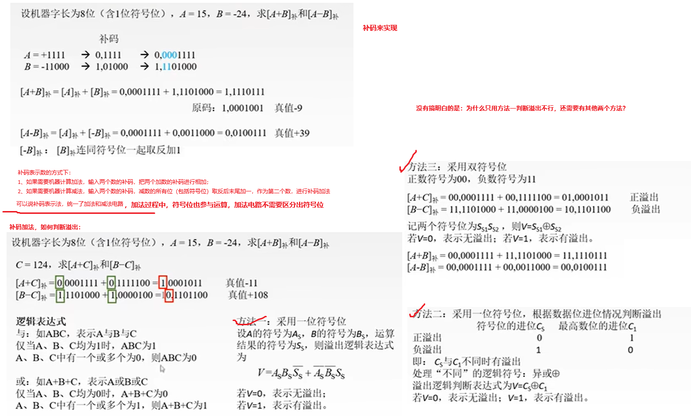
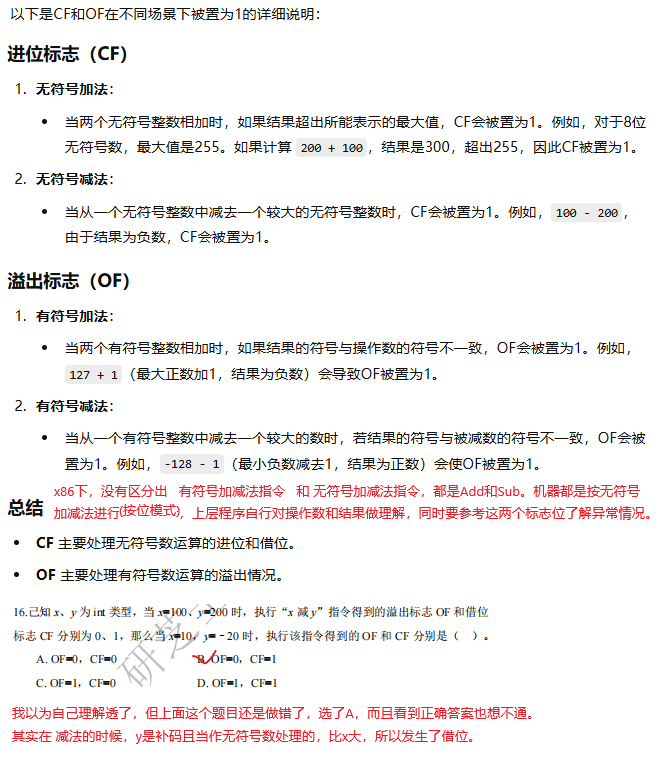
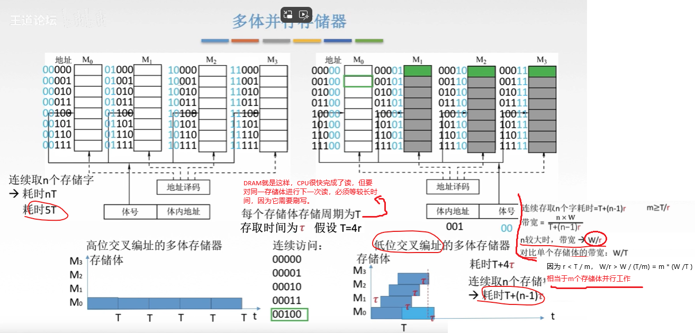
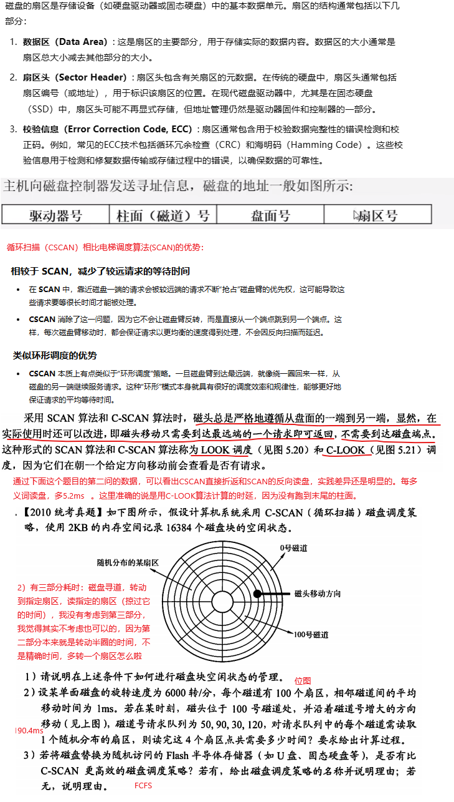
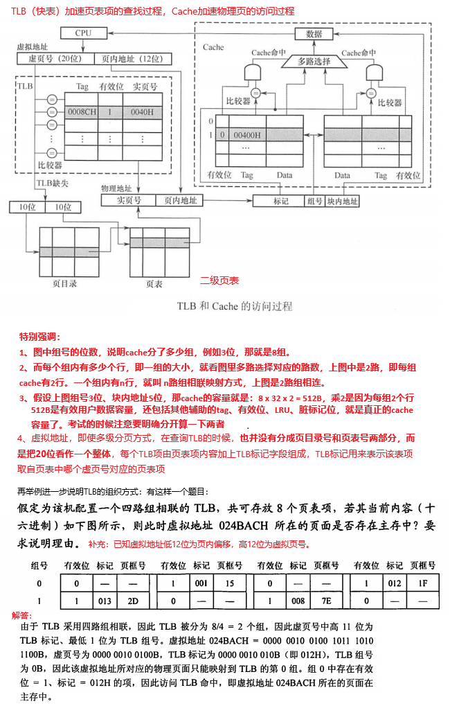
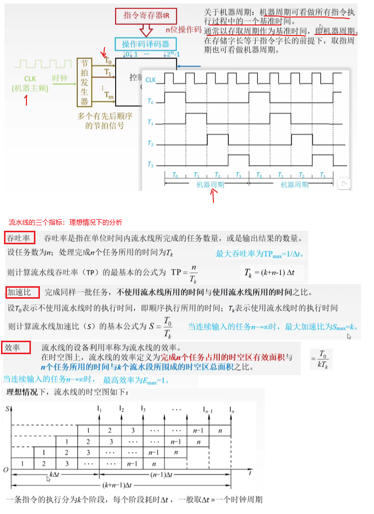

## 2 数据的表示与运算


### 2.1 校验码


### 2.2 加减乘除和溢出判断





从我做53/6这个题来看，我觉得王道给的方法是错的，应该改为：
1、如果减去y后，余数是正，那么商加一（不是上一），而且这时候不左移，继续尝试再减去y，如果余数还是正，商再加一，还不左移。
2、如果余数为负数，恢复余数（加上y），左移余数，商也左移。
3、停止的条件是余数小于y


**如果不能分解为1/(2^n)的和的形式，即使看起来特别“正常”的一个小数，也不能被double准确的表示，0.1 到 0.9 的 9 个小数中，只有 0.5 可以用浮点数准确表示！**例如0.1的二进制，是0.(00011）循环




**x86 CF和OF的碎碎念**

CF置一，是把操作数当作无符号数（都是原码，没有符号位），发生了下面的进位或者借位的事件：

1. 进行加的时候，和溢出了，表示不下来
2. 进行减的时候，被减数太小不够减，发生了借位

OF置一，是把操作数当作有符号数（都是补码，最高位是有符号位），发生了下面的溢出事件：

1. 正数基础上又加了一个正数（或者减了一个负数），跑到了数轴的右侧远远的地方，在表示范围以外
2. 负数的基础上又加了一个负数（或者见了一个正数），跑到了数轴的左侧远远的地方，在表示范围以外

x86 32位汇编指令并不区分操作数是否有符号，都是统一的`ADD`指令，减法也是统一的SUB指令。

他们的区别主要是CF位和OF位会相应的变化

1) CF=1，OF=0

**例子**：无符号加法，结果溢出。当作无符号数看，发生了加法进位；当作符号数看的话，是-1 的基础上加1，没有跑到数轴的有效范围以外

```nasm
assembly复制代码section .text
global _start

_start:
    mov eax, 0xFFFFFFFF  ; 最大无符号32位整数
    mov ebx, 1           ; 加1
    add eax, ebx         ; EAX将变为0，CF=1，OF=0
    ; CF=1（进位），OF=0（无符号加法）
```

2) CF=0，OF=1

**例子**：有符号加法，正数加正数溢出。 当作无符号数看，没有发生进位，最大可以有4亿多呢；当作符号数看的话，是最大有符号数 的基础上加1，跑到数轴的有效范围以外

```nasm
assembly复制代码section .text
global _start

_start:
    mov eax, 2147483647  ; 最大有符号32位整数
    mov ebx, 1           ; 加1
    add eax, ebx         ; EAX将变为-2147483648，CF=0，OF=1
    ; CF=0（没有进位），OF=1（有符号溢出）
```

3) CF=1，OF=1  

**例子**：无符号加法和有符号加法均发生溢出。当作无符号数看，发生了加法进位；当作符号数看的话，是-2^31 的基础上加-2^31，跑到数轴的有效范围以外

```nasm
assembly复制代码section .text
global _start

_start:
    mov eax, 0x80000000  ; -2^31, 无符号数就是2^31
    mov ebx, 0x80000000  ; 加上-2^31
    add eax, ebx         ; EAX将变为0xFFFFFFFE，CF=1，OF=0
    ; CF=1（进位），OF=0（没有符号溢出）
```

4) CF=0，OF=0

**例子**：正常的加法，无进位或溢出。

```nasm
assembly复制代码section .text
global _start

_start:
    mov eax, 10          ; 10
    mov ebx, 20          ; 20
    add eax, ebx         ; EAX将变为30，CF=0，OF=0
    ; CF=0（没有进位），OF=0（没有溢出）
```

## 3 、存储系统

这一章内容很多，需要直接全章通读复习材料


**3.3 以前的主存相关的部分，需要看复习资料全书，涉及较多的不太熟悉内容，没有誊抄**

在CPU和DRAM之间的地址总线通常不是分行地址和列地址的，而是一个完整的地址信号。DRAM的内部控制器负责将这个完整的地址信号翻译为行地址和列地址。让我们详细了解一下这一过程。

1. **地址总线的角色**：

   - **CPU到DRAM的地址传输**：CPU通过一个统一的地址总线将地址信号发送到DRAM。这个地址信号通常是一个完整的地址，它指向内存中的一个特定位置。这个地址总线的宽度取决于系统的地址空间，比如32位或64位。

2. **DRAM的内部地址解码**：
- **地址解码**：DRAM芯片内部包含一个地址解码器，用于将CPU发送的完整地址转换成行地址和列地址。这个过程涉及将地址信号拆分为两个部分：行地址和列地址。
  
3. **地址线安排的具体过程**：

   - **地址总线**：假设DRAM芯片有N个地址线，这些地址线从CPU接收一个N位的地址信号。例如，假设DRAM芯片有16位的地址总线，那么从CPU到DRAM传输的地址信号也是16位。
   - **地址解码**：DRAM芯片内部的地址解码器根据DRAM的组织结构将这16位地址信号分成行地址和列地址。假设DRAM芯片是8K x 8（即8192行，8列），那么地址解码器可能会将地址信号的前13位用于行地址，后3位用于列地址。

4. **数据访问：**
   - **行访问（Row Access）**：行地址信号用于选择和激活特定的存储行，将其数据加载到行缓冲区。
   - **列访问（Column Access）**：列地址信号用于选择特定的列，从行缓冲区中读取或写入数据。
   - **刷新：**由于读取一行会破坏信息，所以当该行不再需要时，必须将其写回。此外，为了防止由于电荷泄漏而导致的信息丢失（假设没有被读取或写入），每个比特必须定期“刷新”。




### 3.4 外部存储系统




### 3.5 高速缓存


### 3.6 虚拟存储存储器



### 3.7 总线传输


## 4 、指令系统


## 5 、中央处理器

#### 5.1 指令集


#### 5.2 流水线




关于5个阶段完成哪些操作，[这个视频](https://www.bilibili.com/video/BV12p4y1b7Zo?buvid=Y04E5D07EDD0AF304AAD9FCF53E33D74352D&from_spmid=main.ugc-video-detail.drama.0&is_story_h5=false&mid=Mp0IicNyWsjUY8SEXP6K7g%3D%3D&plat_id=116&share_from=ugc&share_medium=iphone&share_plat=ios&share_session_id=F82F77FB-6F56-448F-8241-A73858EA21F4&share_source=WEIXIN&share_tag=s_i&spmid=main.ugc-video-detail.0.0&timestamp=1730426267&unique_k=zyyGXTy&up_id=354767108&vd_source=2173cb93b451f2278a1c87becf3ef529)讲得比较清晰，且有权威性。总结一下：

1. IF阶段，比较好理解，取指就是取指咯
2. ID译码阶段， 会取得寄存器的值和指令里立即数的值，不会访问内存获得内存操作数的值
3. EX阶段，会计算内存操作数的地址，但也不会访问内存获得内存操作数的值；如果指令只涉及寄存器、立即数的运算，会在这一步完成运算
4. M阶段，涉及到内存访问的都会到这一步来做，包括读内存中的源操作数，把结果写回内存。我怀疑ADD 8(ESP), EAX这样的指令的执行也会在这一步才做。
5. WB阶段，真的就只是把结果写回寄存器或者做必要的寄存器更新，例如有些操作隐含更新ESP、ECX。和内存无关


#### 5.3 数据通路与控制指令


[可以参考的课件](https://www.bilibili.com/video/BV1BE411D7ii?spm_id_from=333.788.videopod.episodes&vd_source=2173cb93b451f2278a1c87becf3ef529&p=52)

