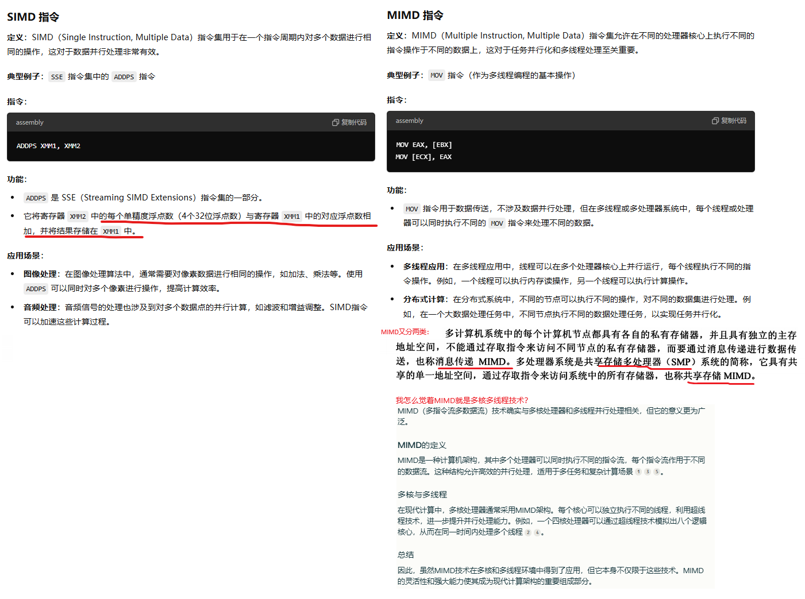
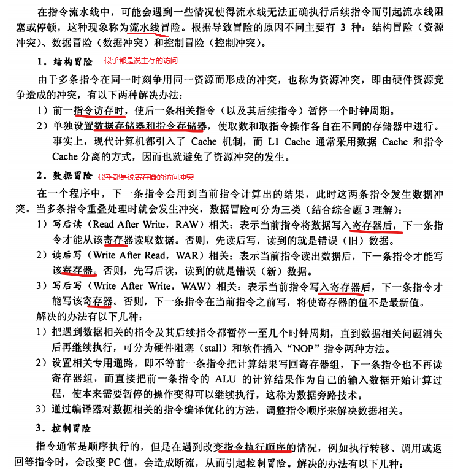

## 2 数据的表示与运算

### 2.1 校验码

### 2.2 加减乘除和溢出判断

从我做53/6这个题来看，我觉得王道给的方法是错的，应该改为：
1、如果减去y后，余数是正，那么商加一（不是上一），而且这时候不左移，继续尝试再减去y，如果余数还是正，商再加一，还不左移。
2、如果余数为负数，恢复余数（加上y），左移余数，商也左移。
3、停止的条件是余数小于y

**如果不能分解为1/(2^n)的和的形式，即使看起来特别“正常”的一个小数，也不能被double准确的表示，0.1 到 0.9 的 9 个小数中，只有 0.5 可以用浮点数准确表示！**例如0.1的二进制，是0.(00011）循环

## 3 、存储系统

这一章内容很多，需要直接全章通读复习材料

**3.3 以前的主存相关的部分，需要看复习资料全书，涉及较多的不太熟悉内容，没有誊抄**

在CPU和DRAM之间的地址总线通常不是分行地址和列地址的，而是一个完整的地址信号。DRAM的内部控制器负责将这个完整的地址信号翻译为行地址和列地址。让我们详细了解一下这一过程。

1. **地址总线的角色**：

   - **CPU到DRAM的地址传输**：CPU通过一个统一的地址总线将地址信号发送到DRAM。这个地址信号通常是一个完整的地址，它指向内存中的一个特定位置。这个地址总线的宽度取决于系统的地址空间，比如32位或64位。

2. **DRAM的内部地址解码**：

   - **地址解码**：DRAM芯片内部包含一个地址解码器，用于将CPU发送的完整地址转换成行地址和列地址。这个过程涉及将地址信号拆分为两个部分：行地址和列地址。

3. **地址线安排的具体过程**：

   - **地址总线**：假设DRAM芯片有N个地址线，这些地址线从CPU接收一个N位的地址信号。例如，假设DRAM芯片有16位的地址总线，那么从CPU到DRAM传输的地址信号也是16位。
   - **地址解码**：DRAM芯片内部的地址解码器根据DRAM的组织结构将这16位地址信号分成行地址和列地址。假设DRAM芯片是8K x 8（即8192行，8列），那么地址解码器可能会将地址信号的前13位用于行地址，后3位用于列地址。

4. ** 数据访问**：
   - **行访问（Row Access）**：行地址信号用于选择和激活特定的存储行，将其数据加载到行缓冲区。
   - **列访问（Column Access）**：列地址信号用于选择特定的列，从行缓冲区中读取或写入数据。
   - **刷新：**由于读取一行会破坏信息，所以当该行不再需要时，必须将其写回。此外，为了防止由于电荷泄漏而导致的信息丢失（假设没有被读取或写入），每个比特必须定期“刷新”。

### 3.4 外部存储系统

### 3.5 高速缓存

### 3.6 虚拟存储存储器

## 4 、指令系统

## 5 、中央处理器

