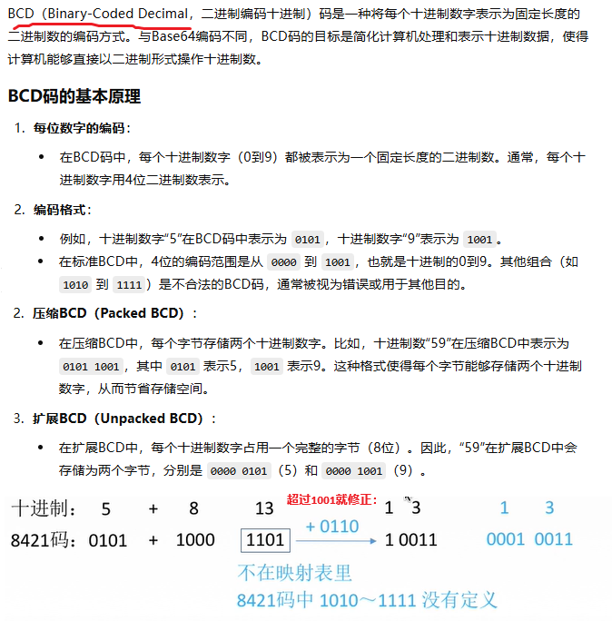
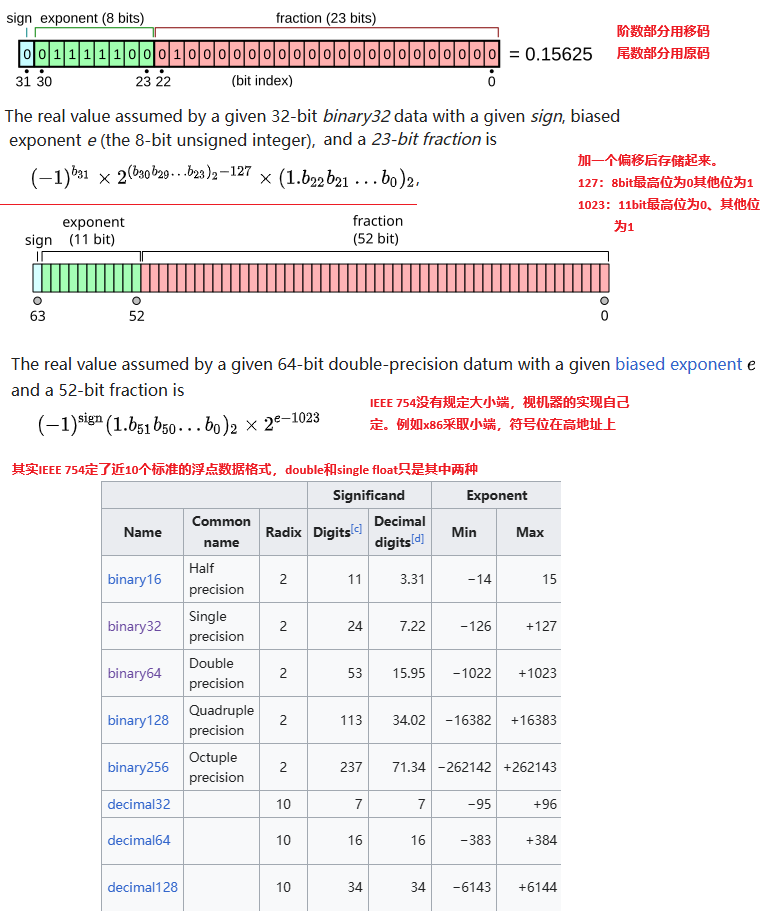

## 2 数据的表示与运算

**如果不能分解为1/(2^n)的和的形式，即使看起来特别“正常”的一个小数，也不能被double准确的表示，0.1 到 0.9 的 9 个小数中，只有 0.5 可以用浮点数准确表示！**例如0.1的二进制，是0.(00011）循环

## 3 、存储系统

这一章内容很多，需要直接全章通读复习材料

**3.3 以前的主存相关的部分，需要看复习资料全书，涉及较多的不太熟悉内容，没有誊抄**

### 3.4 外部存储系统

### 3.5 高速缓存

### 3.6 虚拟存储存储器

## 4 、指令系统

## 5 、中央处理器

