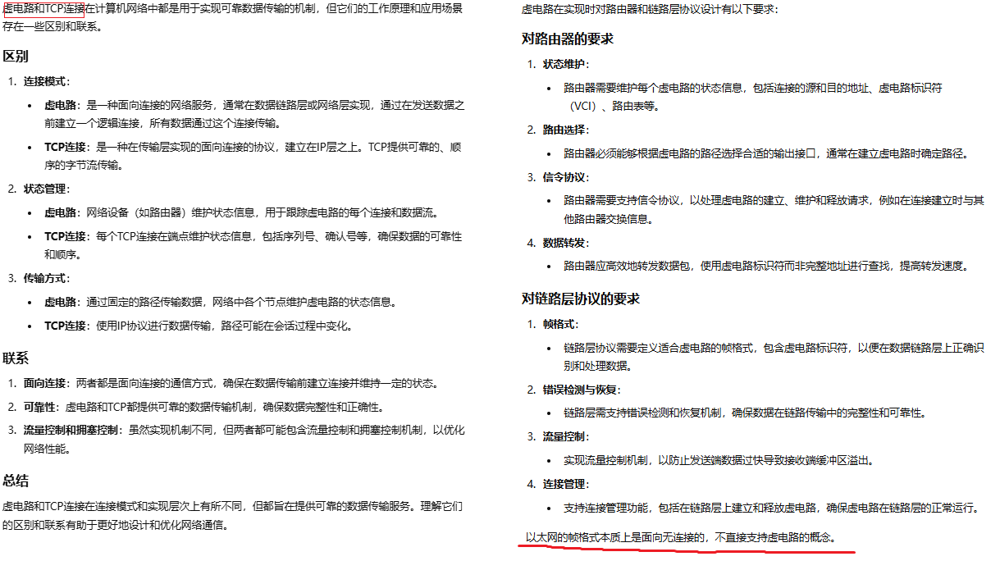
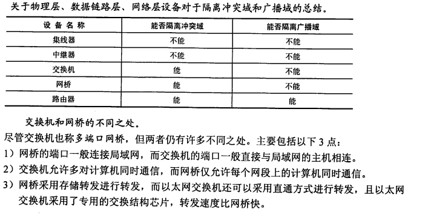
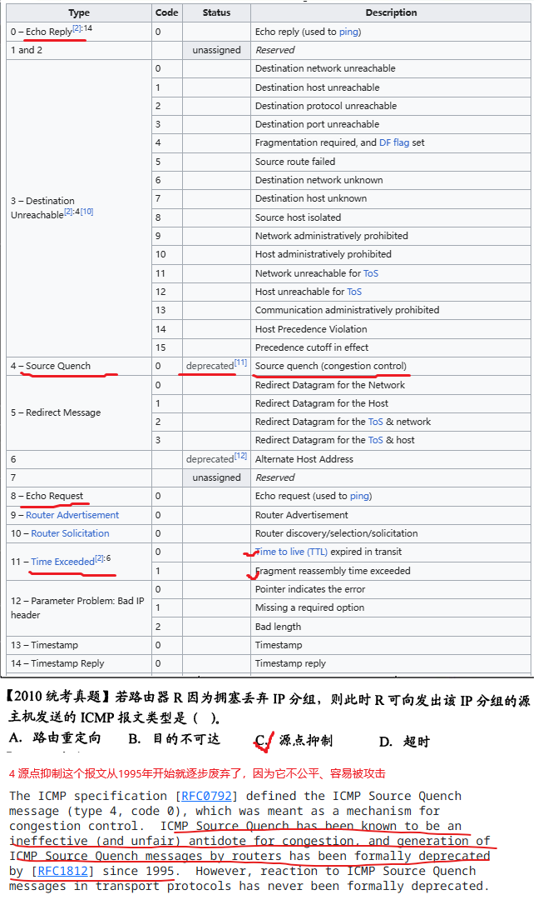
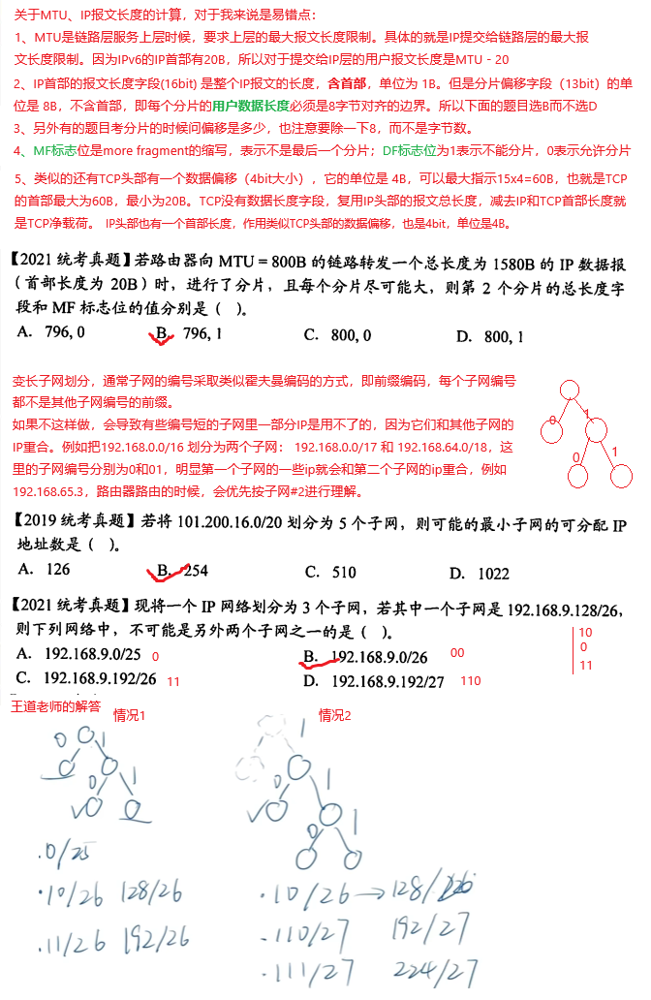
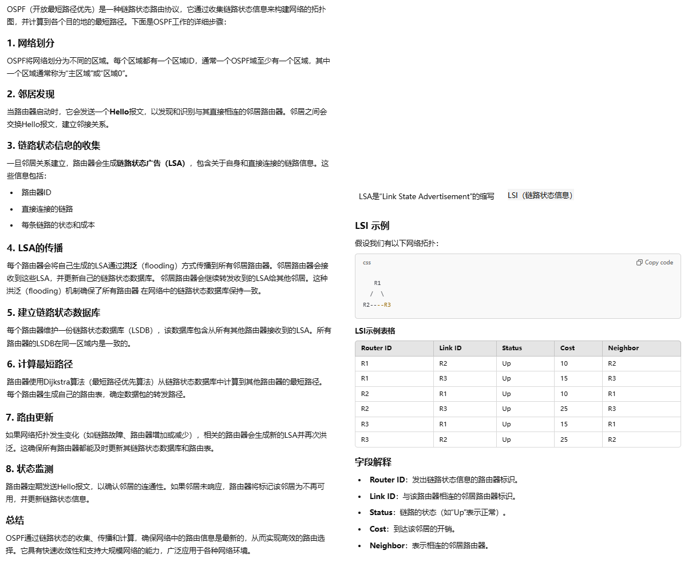
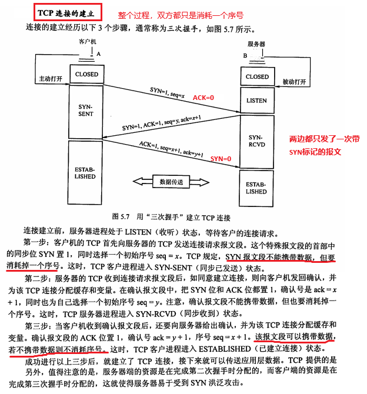
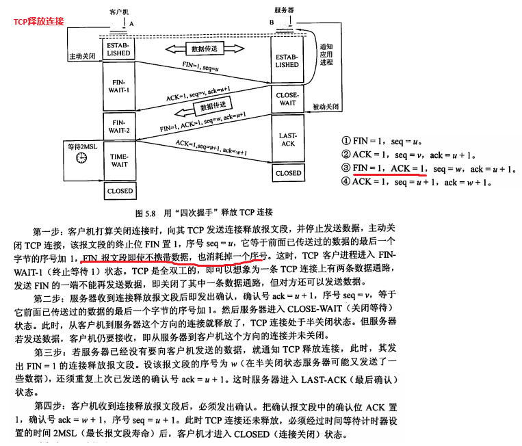
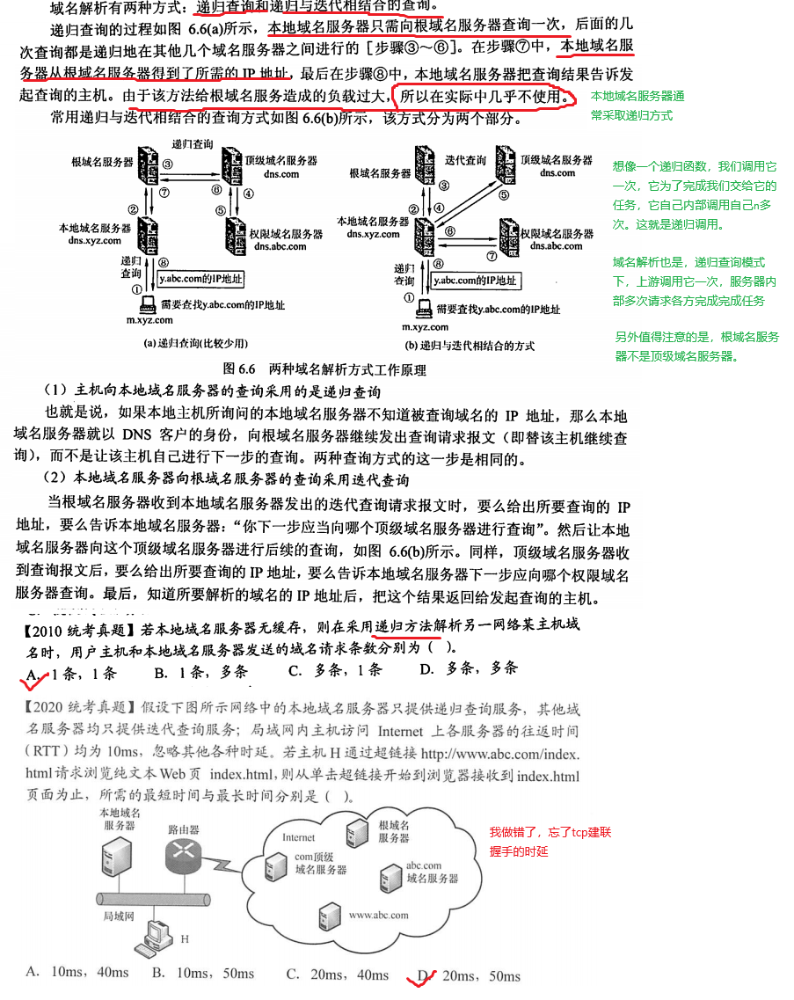
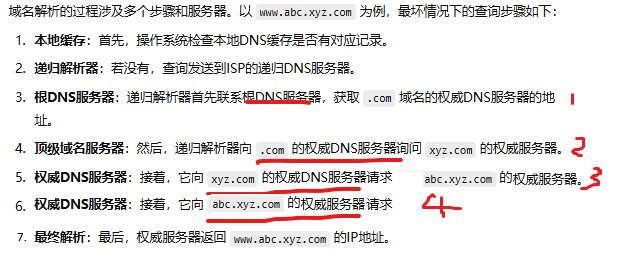

## 2、 计算机网络

### 2.1 物理层


| 编码类型     | 0，1表示                            | 中间是否归0                   | 浪费带宽否 | 抗干扰能力 | 自同步能力 |
| ------------ | ----------------------------------- | ----------------------------- | ---------- | ---------- | ---------- |
| NRZ          | 水平触发，高电平1，低电平0          | 不归0                         | 不浪费     | 弱         | 无         |
| RZ           | 水平触发，高电平1，低电平0          | 高电平中间归0                 | 浪费       | 弱         | 有         |
| NRZI         | 边缘触发，跳0，不跳1.与电平高低无关 | 不归0                         | 浪费一点   | 弱         | 无         |
| 曼彻斯特     | 水平触发，前半段高电平1，低电平0    | 不是归0，是中间反转到相反电平 | 浪费       | 强         | 有         |
| 差分曼彻斯特 | 边缘触发，跳0，不跳1.与电平高低无关 | 不是归0，是中间反转到相反电平 | 浪费       | 强         | 有         |





### 2.2 数据链路层

链路层可以提供无连接的、不确认的投递服务，也可以提供带确认的、面向连接的服务，具体取决于所使用的技术和协议。例如以太网（Ethernet）是一个典型的无连接链路层协议。点对点协议（PPP）是一种可以提供面向连接服务的链路层协议。在PPP中，可以在数据传输之前建立一个连接，这个连接确保了数据的顺序和错误检测。例如后面介绍的CSMA协议是带确认的无连接的服务。确认机制在链路层协议里其实是一个挺重要的机制。

所以链路层为网络层提供了：

1. 无确认无连接的服务
2. 有确认的无连接服务
3. 有确认的面向连接的服务

面向连接的一定有确认，所以不存在无确认的带连接的服务。


链路层也有些场景是带流量控制的，不是都像tcp/ip协议一样不依赖链路层的流量控制。例如WIFI的IEEE 802.11标准中的流量控制机制允许接入点（AP）或站点在接收缓冲区满时发送流量控制帧，指示发送方暂停发送数据。




### 2.3 网络层





几个长度字段的详情

|                   | 意义                                                         | 字段长度       | 长度单位 |
| ----------------- | ------------------------------------------------------------ | -------------- | -------- |
| MTU               | 上层提交给链路层的“用户数据”最大长度                         | 不在协议里体现 | 1 Byte   |
| IP头部的总长度    | IP报文的总长度，含首部                                       | 16bit          | 1 Byte   |
| IP头部的首部长度  | IP报文首部长度                                               | 4bit           | 4 Byte   |
| IP头部的片偏移    | IP分片，当前分片的用户数据在原IP报文的用户数据里的偏移，辅助以MF和DF 标记 | 13bit          | 8 Byte   |
| TCP头部的数据偏移 | TCP报文首部的长度，即用户数据开始的偏移                      | 4bit           | 4 Byte   |
|                   | TCP没有总长度，UDP没有首部长度（也没有数据偏移，首部固定）   |                |          |
| UDP头部的总长度   | UDP报文的总长度，含首部                                      | 16 bit         | 1 Byte   |


#### 2.3.3 RIP、OSFP和BGP路由协议

##### BGP


##### RIP


##### OSFP




### 2.4 传输层







### 2.5 应用层






SMTP（简单邮件传输协议）本身主要用于文本数据的传输，而不是直接传输二进制数据（如图片）。然而，二进制文件（例如图片）可以通过特定的编码方式嵌入到邮件中。SMTP邮件通常会结合MIME来处理非文本内容。MIME允许邮件携带多种类型的内容，包括二进制文件。**Base64编码**是最常用的编码方法，将二进制数据转换为ASCII字符。Base64编码会将每3个字节的二进制数据转换为4个ASCII字符。

下面是一个邮件结构示例：

```
From: sender@example.com
To: recipient@example.com
Subject: Here is an image
MIME-Version: 1.0
Content-Type: multipart/mixed; boundary="boundary_string"

--boundary_string
Content-Type: image/jpeg; name="example.jpg"
Content-Transfer-Encoding: base64
Content-Disposition: attachment; filename="example.jpg"

[Base64编码的图片数据]
--boundary_string--

```


