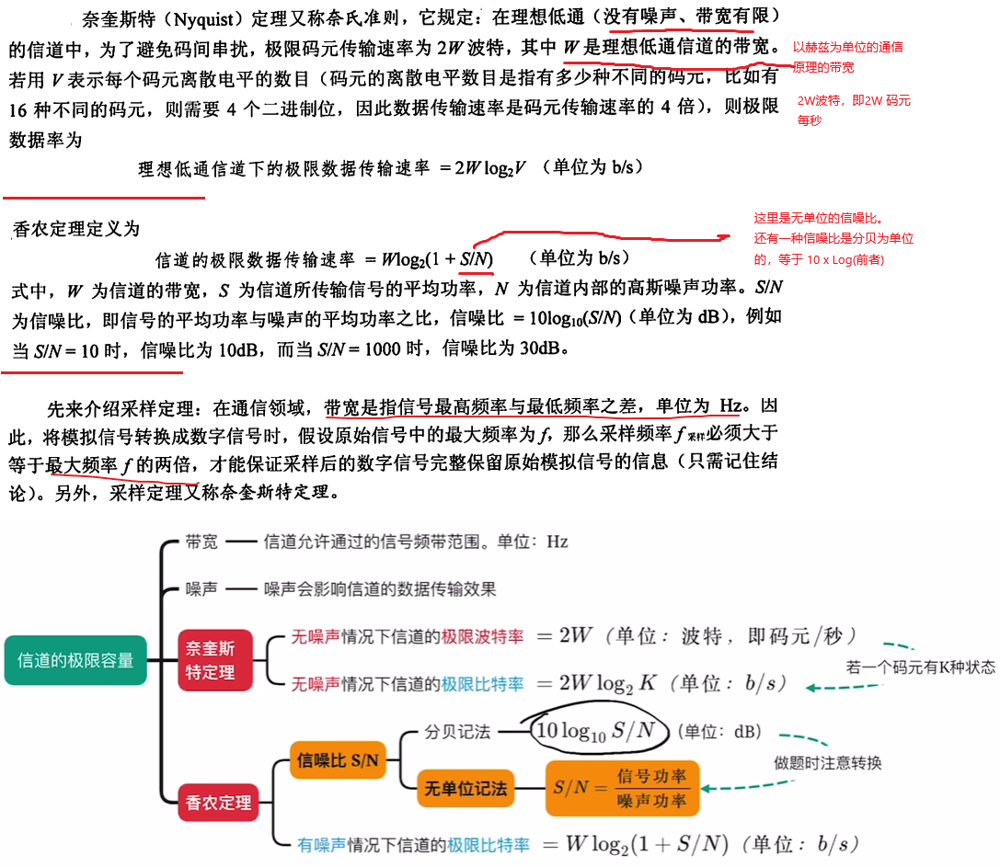
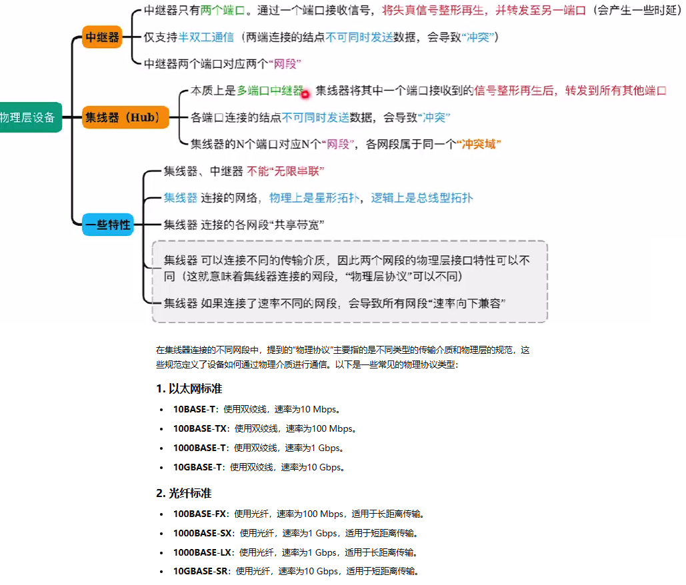
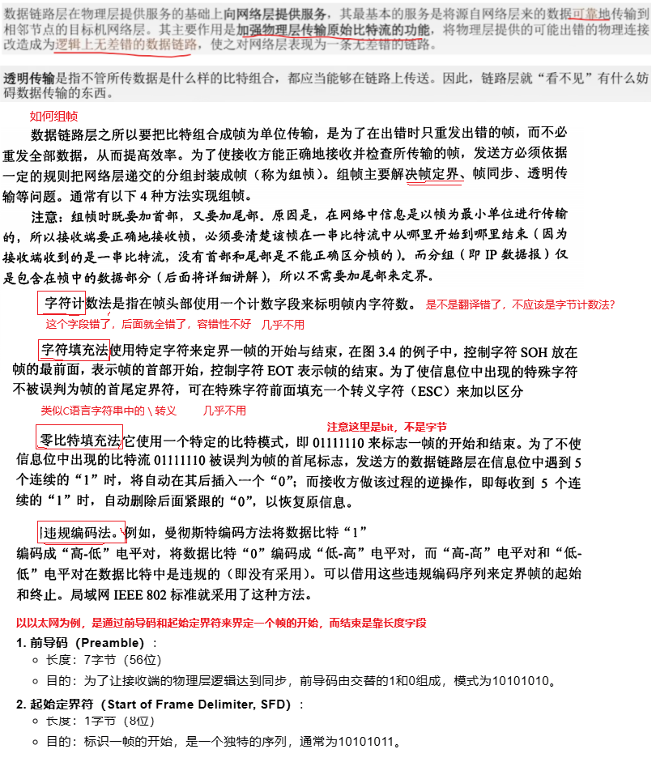
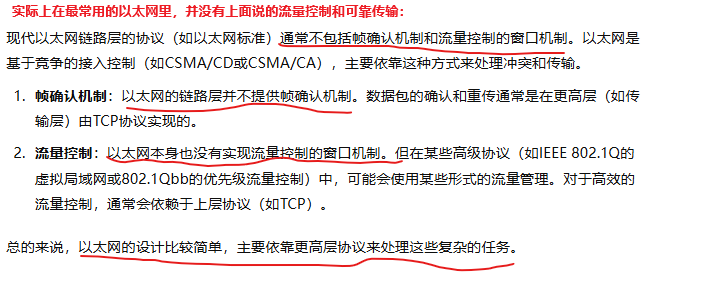
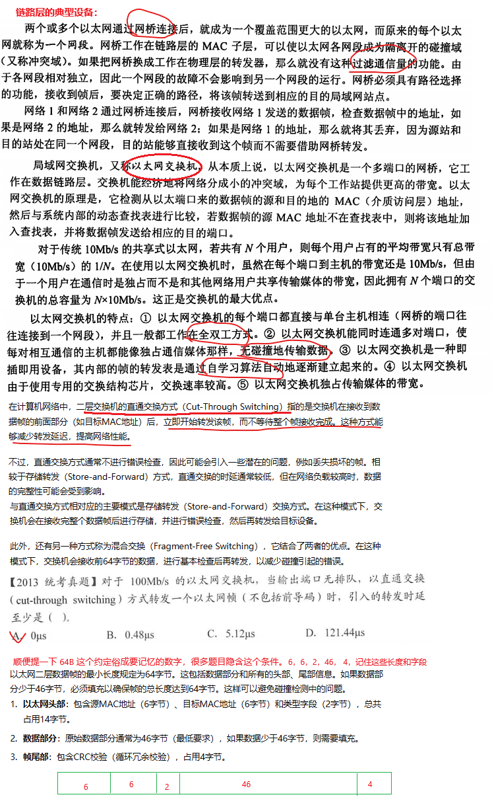

## 2、 计算机网络

### 2.1 物理层

### 2.2 数据链路层

链路层可以提供无连接的、不确认的投递服务，也可以提供带确认的、面向连接的服务，具体取决于所使用的技术和协议。例如以太网（Ethernet）是一个典型的无连接链路层协议。点对点协议（PPP）是一种可以提供面向连接服务的链路层协议。在PPP中，可以在数据传输之前建立一个连接，这个连接确保了数据的顺序和错误检测。例如后面介绍的CSMA协议是带确认的无连接的服务。确认机制在链路层协议里其实是一个挺重要的机制。

所以链路层为网络层提供了：

1. 无确认无连接的服务
2. 有确认的无连接服务
3. 有确认的面向连接的服务

面向连接的一定有确认，所以不存在无确认的带连接的服务。

链路层也有些场景是带流量控制的，不是都像tcp/ip协议一样不依赖链路层的流量控制。例如WIFI的IEEE 802.11标准中的流量控制机制允许接入点（AP）或站点在接收缓冲区满时发送流量控制帧，指示发送方暂停发送数据。

### 2.3 网络层

### 2.4 传输层

### 2.5 应用层

