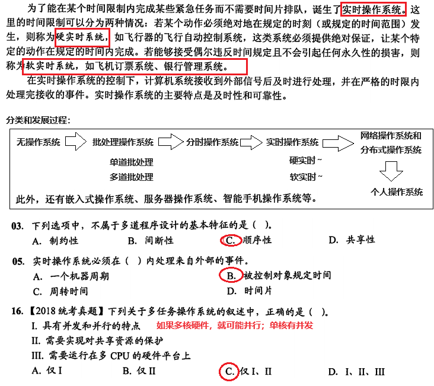
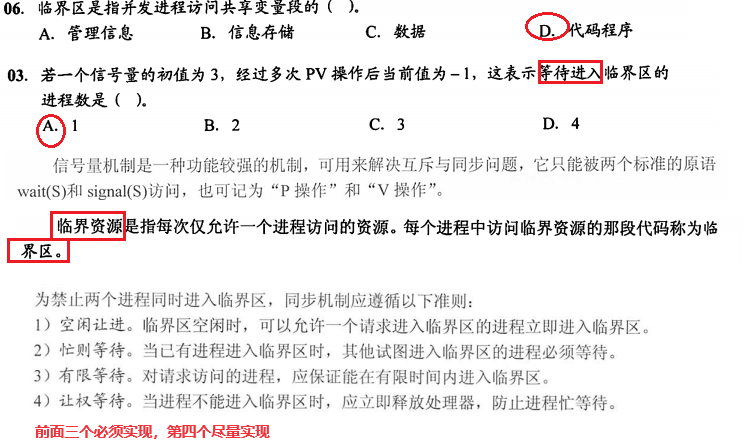
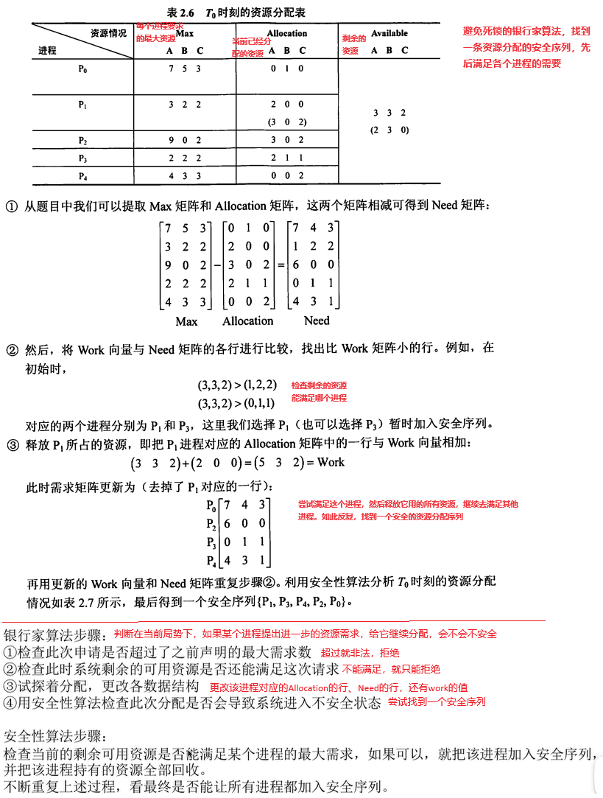
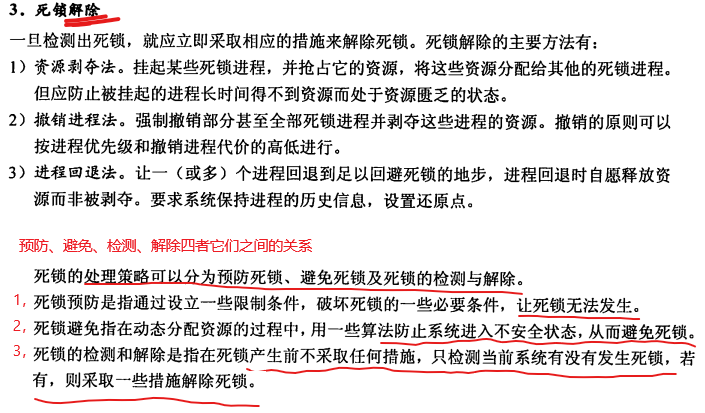
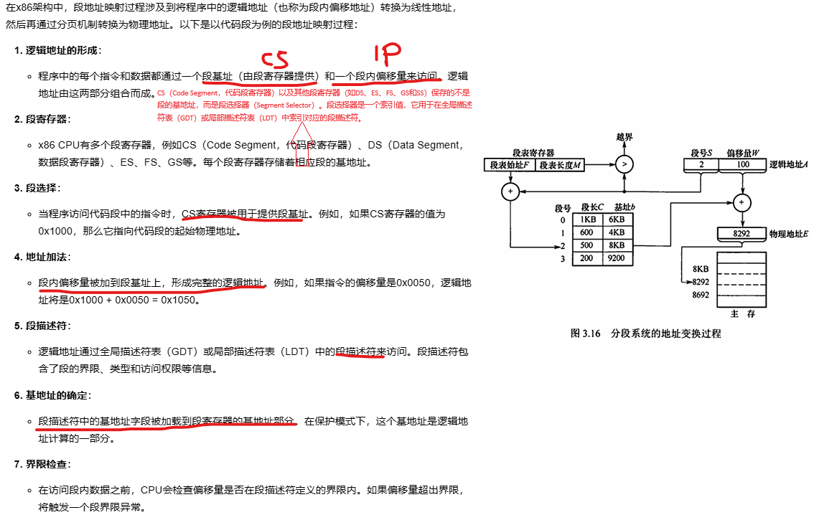
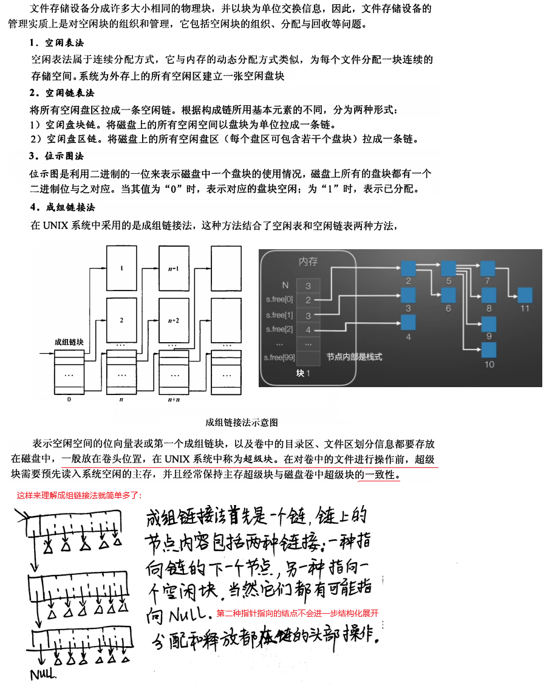
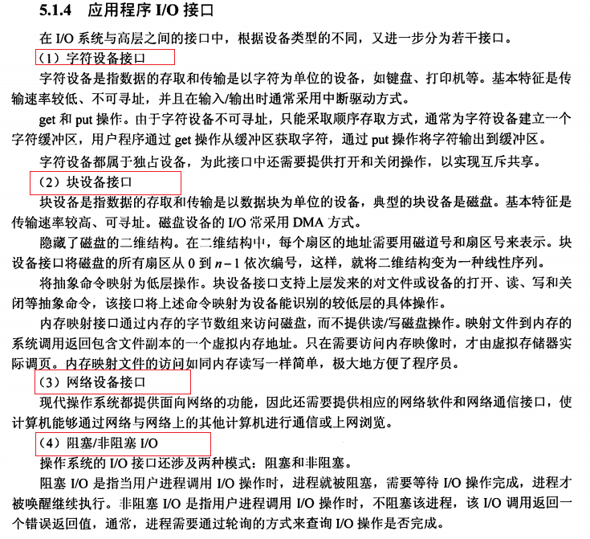
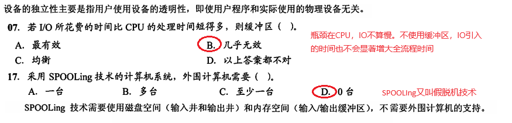
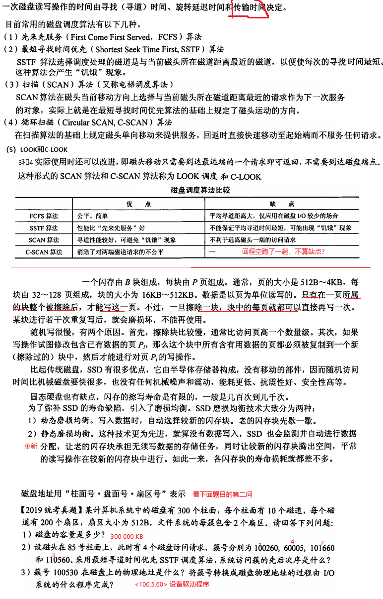
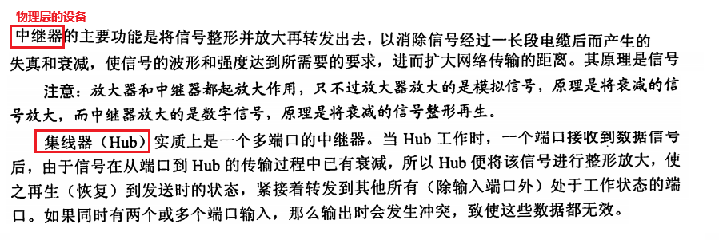

## 1、操作系统

### 1.1 基本概念

有些题目感觉很蠢，例如下面，XP未必就没有用分层式？但出题的人认为XP是宏内核，所以I不对；模块化OS未必就不考虑分层？

这就是中国教育的照本宣科与死记硬背。感受一下，然后记住考试模式就是要这样才能得分：

下面是x86上的中断和系统调用的处理细节：

### 1.2 进程与进程管理

#### 死锁

**事前预防死锁的方法：**

**避免死锁的资源分配算法**：银行家算法：

**检测和解除死锁**：

一些题目坐一坐：

### 1.3 内存管理

空闲块查找算法：

x86的段地址转换：

### 1.4 文件系统

### 1.5 IO管理

可以简单的理解为：

1. disk cache（又叫page cache）是文件系统里磁盘块和内存块之间一一固定映射，用于多次读（减少每次都要访问磁盘）和多次写（先都写到同一个内存page上，然后一次性刷写磁盘）的提速
2. buffer是每次实际做磁盘IO的时候，用到的不以块为单位的管道式缓存。
3. 可以认为buffer工作在page cache的下一层。从字面上理解也可以看出：page cache是数据在内存里的较为正式和长期的镜像，而buffer是比较临时的转瞬即逝的传输管道。

以一次文件读写操作来说明disk cache和buffer的区别和联系：

## 2、 计算机网络

### 2.1 物理层

### 2.2 数据链路层

链路层可以提供无连接的、不确认的投递服务，也可以提供带确认的、面向连接的服务，具体取决于所使用的技术和协议。例如以太网（Ethernet）是一个典型的无连接链路层协议。点对点协议（PPP）是一种可以提供面向连接服务的链路层协议。在PPP中，可以在数据传输之前建立一个连接，这个连接确保了数据的顺序和错误检测。

所以链路层为网络层提供了：

1. 无确认无连接的服务
2. 有确认的无连接服务
3. 有确认的面向连接的服务

面向连接的一定有确认，所以不存在无确认的带连接的服务。

链路层也有些场景是带流量控制的，不是都像tcp/ip协议一样不依赖链路层的流量控制。例如WIFI的IEEE 802.11标准中的流量控制机制允许接入点（AP）或站点在接收缓冲区满时发送流量控制帧，指示发送方暂停发送数据。

