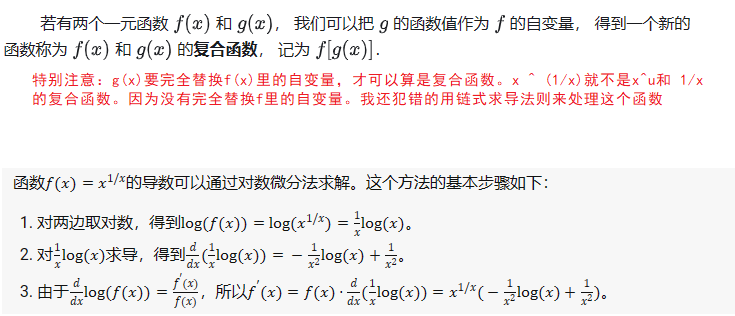
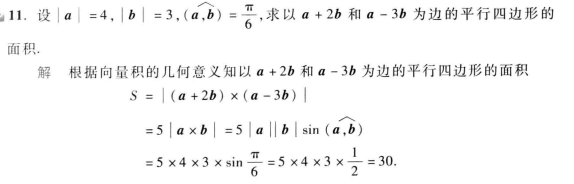
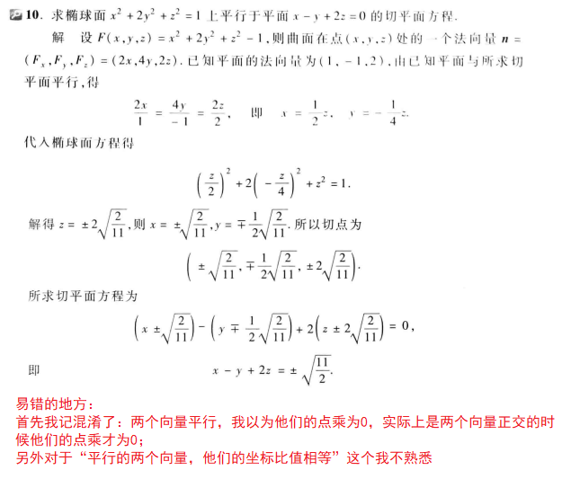

### 

-----------------

所以要注意，对于一元函数，可导是可微的充分必要条件。有一道习题我就做错了！

----------------

------------------

---------------

-----------------

------------------------------

----------------------------

