# 高数

## 第一章：函数、极限、连续性

### 1.1 函数

**基本初等函数：**

1. 幂函数
2. 指数函数
3. 对数函数
4. 三角函数
5. 反三角函数

**初等函数：**由基本函数经过有限次四则运算得到的函数，例如双曲函数就是有指数函数经过四则运算得到的

### 1.2 数列的极限

**自己的话说明什么是极限：**

1. 对于一个有极限收敛的数列，对一个任意小的整数d，总能找到一个大整数N，当项数下标大于N的时候，满足 数列项跟极限值A的距离小于d
2. 同样函数的极限：对于一个有极限的函数，对一个任意小的整数d，总能找到一个数N或者v，当x>N（x无穷大有极值的场景），或者x<N（x无穷小有极值的场景），或者x距离某个常数x0的距离小于v的时候（x趋近x0的场景）， 函数值跟极限值A的距离小于d

证明极限值的套路也是上面的思路

收敛数列的性质：

1. 唯一性：极限唯一
2. 有界性：数列有界
3. 保号性：存在N，当项数下标大于N的时候，所有的项的符号同极限值的符号
4. 子数列也收敛：如果一个数列收敛，那么它的任一子数列都收敛，且极限值同原数列

### 1.3 函数的极限

函数极限的性质：

1. 唯一性：
2. 局部有界：相比数列不同，函数的有界性限制在极限值的附近，而且函数在取极限值的那个点的定义可能无界
3. 局部保号性：相比数列不同，函数在取极限值的那个点的定义可能和极限值的符号相反（很贱）。所以实在x0的去心邻域（去掉了x0这个点）
4. 函数极限与数列极限的关系：如果函数极限存在，即lim{f(x), x->x0} = A存在，数列 { xn } 收敛与x0，那么 函数值数列 { f( xn ) }收敛于A

### 1.4 无穷小与无穷大

自己的话说出概念：

1. 无穷小就是函数极限为0
2. 无穷大就是函数趋近于无穷大
3. 无穷大无穷小的相互转换：f(x)趋近无穷小，那么 1/f(x) 就趋近无穷大（f(x)不等于0），反之亦然

### 1.5 极限的运算性质

性质：

1. 有限个无穷小的和是无穷小
2. 有界函数与无穷小的乘积是无穷小
3. 当x趋近x0时，f(x)极限为A，g(x)极限为B， 那么他们的四则运算后的函数的极限，是极限对应的四则运算。可以认为极限是线性的、可除的、可以常数次方的
4. 复合函数的极限运算：简单的说就是直接代入 ：）

### 1.6 极限存在准则，两个重要极限

极限存在的三个准则

1. 不论是数列还是函数，满足夹逼定理。自己的话来说夹逼定理：函数 f(x)  < g(x) < k(x)，  f(x)和k(x)都收敛于有限值A，那么g(x)也收敛于A
2. 单调有界，必有极限
3. 柯西极限存在准则：数列收敛的充要条件：当n足够大的时候，相邻的数项想挨多近挨多近

两个重要的极限：

1. lim {sin(x) / x, x->0} = 1，用单位圆几何面积可以证
2. lim { (1+x)^(1/x), x->0} = e,  无穷次计算利率的情况下年息就是e。 他的变形：lim { (1+1/x)^x,  x->无穷次} = e

### 1.7 无穷小的比较

几个等价无穷小：

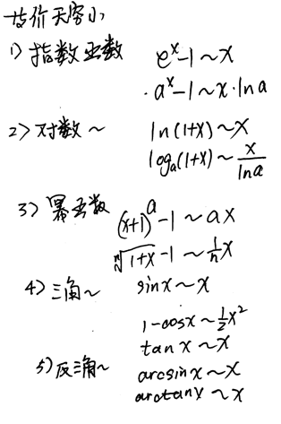

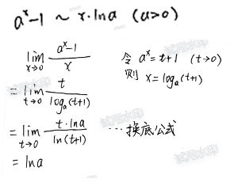

求极限的技巧有二：

1. 使用等价无穷小：把某些项直接替换为等价无穷小或者同阶无穷小，可以简化运算。
2. 换元法

下面是两个例子：

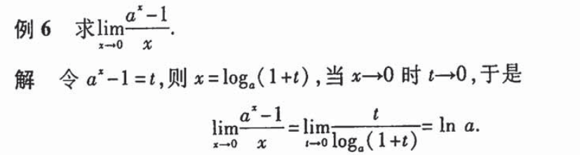

### 1.8 函数的连续性

自己的话说什么是函数连续性：

1. 就是当x->x0时，f(x) --> f(x0)，那么函数就在x0处连续。连续的定义基于前面的极限：该处的极限等于函数值本身，就是在该点连续
2. 如果在某个区间的每个点都连续，那么在该区间连续

在某点不连续的三种情况：

1. 在x0处没有定义，例如1/x在0点， 又例如 （x^2-1)/(x-1)在x=1处
2. 在x0处有定义，却极限不存在  例如sin(1/x)，可以在x=0处加上一个定义，但极限不存在
3. 在x0处有定义，极限也存在，但不相等，例如分段函数

函数的不连续点或者说间断点的类型：

1. 第一类间断点：左右极限都存在的情况下的间断点，例如有：
   1. 跳跃间断点：左右极限都存在，但不相等
   2. 可去间断点：左右极限都存在，且相等。通过补充/修改该位置的函数值，让函数变得连续。通常是一些奇怪的分段函数
2. 除了第一类以外的间断点，叫第二类，例如有：
   1. 无穷间断点，也就是函数值趋向无穷大
   2. 振荡间断点，例如sin(1/x)在x=0处

### 1.9 连续函数的运算

运算：

1. 连续函数的和差积商都连续
2. 如果f(x)连续且单调，那么其反函数也连续。（我觉得是充分非必要条件）
3. 连续的两个函数，复合起来也是连续的
4. 基本初等函数在它的定义域内连续，初等函数在其定义域内也连续

### 1.10 闭区间上连续函数的性质

在闭区间上连续的函数：

1. 有最大值最小值、有界
2. 满足零点定理和介质定理
3. 在该区间上一致连续

自己的话说说一致连续的定义：在某区间上一致连续的意思， 只要自变量的两个值挨的足够近，那么他们在该区间的任何位置的对应的函数值就能够满足指定的近。1/x在(0, 1]上就不是一致连续的，因为越靠近0，要满足函数值足够的近，对自变量的紧凑程度要求更高

## 第二章 导数与微分

### 2.1 导数的概念

自己的话说出来：导数就是在某个点，函数值的变化值 除以 自变量的变化值，对自变量的变化值求极限，该极限值就是函数在该点的导数。

可导必然连续，连续不一定可导。

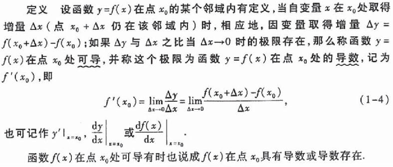

特别强调下在x0连续和可导两者的差异：

1. 判断连续的求极限操作，是判断 lim f(x)  = f(x0)  , x-->x0
2. 判断可导的求极限操作，是判断  lim f(x) / dx  ( x-->x0 )存在，分段函数需要左右两个方向都判断存在且相等，这里比判断连续的求极限操作 的式子多了dx做分母

### 2.2 求导法则

函数的和差积商的求导：

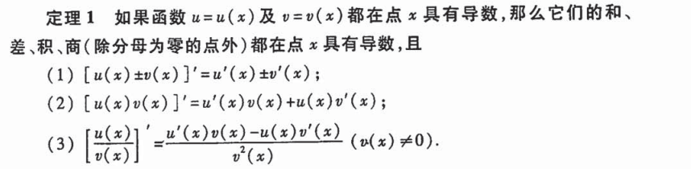

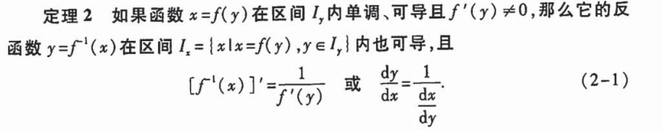

反函数的求导，有点费解，保留一个例子在这里，需要刻意练习：

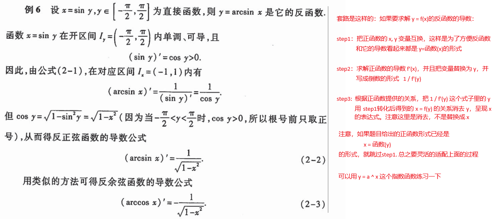

复合函数求导：

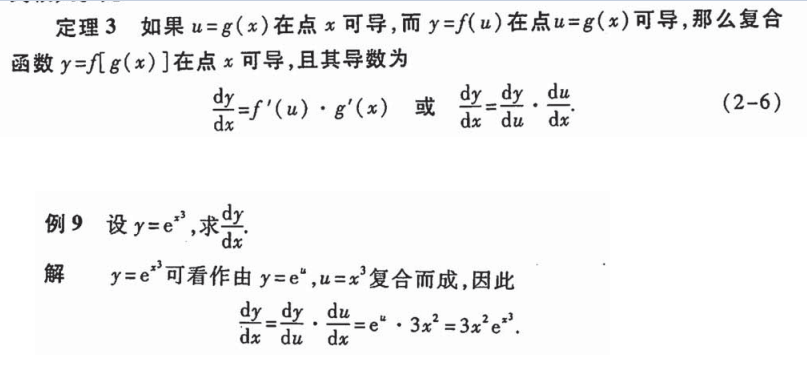

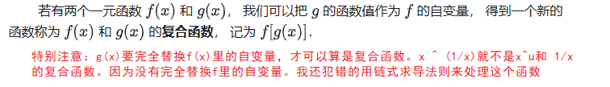

还有一个对数微分法求导：

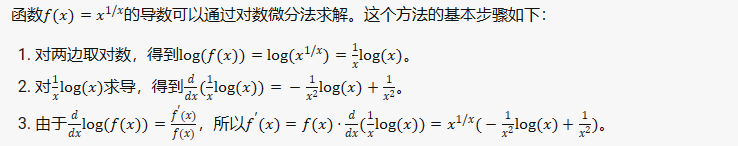

作死的背的基本初等函数求导公式：

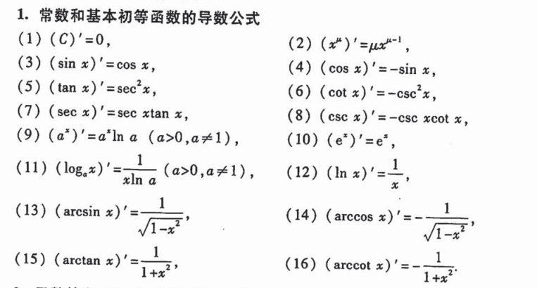

这里就不得不复习一下好久没用过的几个特殊三角函数了：

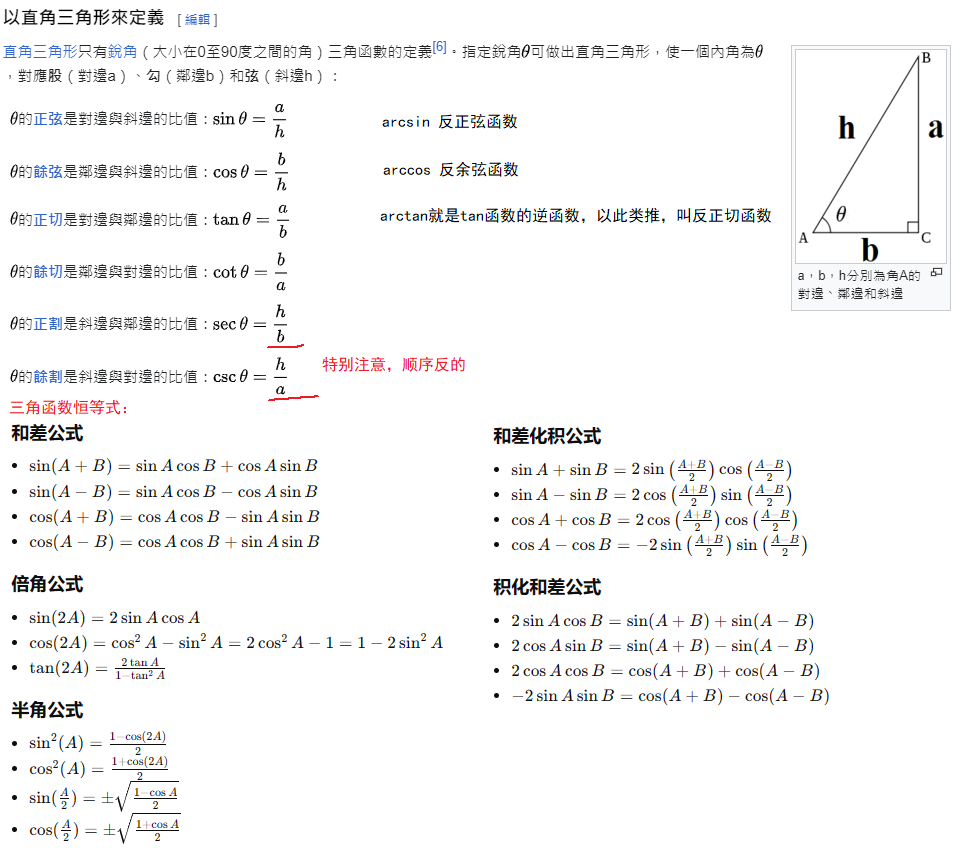

### 2.3 高阶导数

格老子背起来：

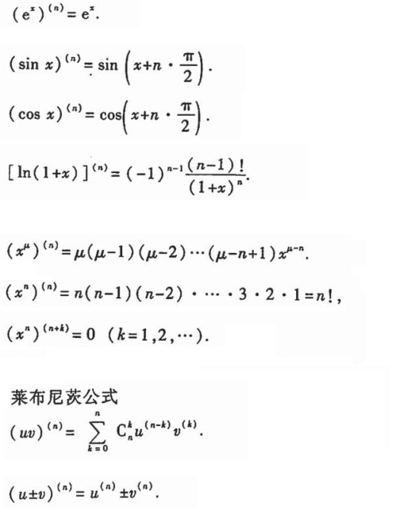

### 2.4 隐函数的求导

自己的话解释什么是隐函数：显函数是 因变量=自变量的表达式 的方式，等号右边没有因变量。隐函数就是因变量和自变量搅和在一坨的方程式，或者是参数方程的方式，例如x和y都表示为t的显函数。

不是所有的方程都是隐函数，必须满足：对一个自变量，方程解出来的因变量只有一个确定的值。有多个解就不是函数。

隐函数的求导没有什么特别的，举个例子吧：

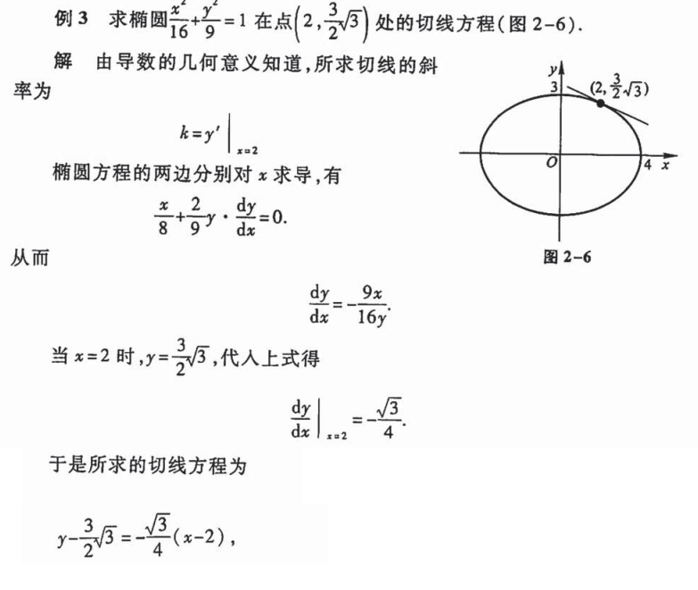

如果一定要说技巧，有时候先对等号两边做一些转换，可以让求导更简单，例如两边同时求对数：

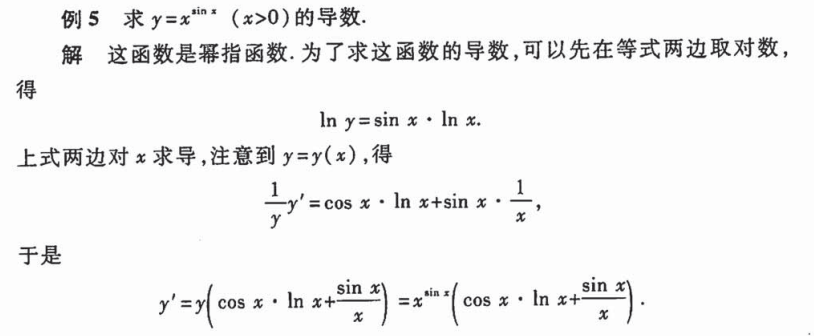

参数方程形式的隐函数求导方法：

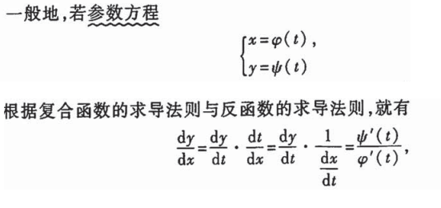

求高阶导要特别小心，这里有坑：不是对两个参数方程求导两次后相除，而是这样的，想不到吧：

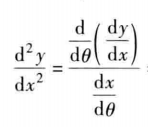

步骤就是：

1. 求 A = dy/dt，B= dx/dt，两者相除A / B 得到dy/dx (t的表达式)，记做 C
2. 求 D = dC / dt，D / B 得到二阶导

### 2.5 函数的微分

微分和可导似乎是相同的事情，导数描述的是函数在某一点处的变化率，即当自变量的增量趋近于零时，因变量的增量与自变量增量之比的极限。而微分则描述的是当自变量有一个无穷小的增量时，函数的增量的线性主部分。

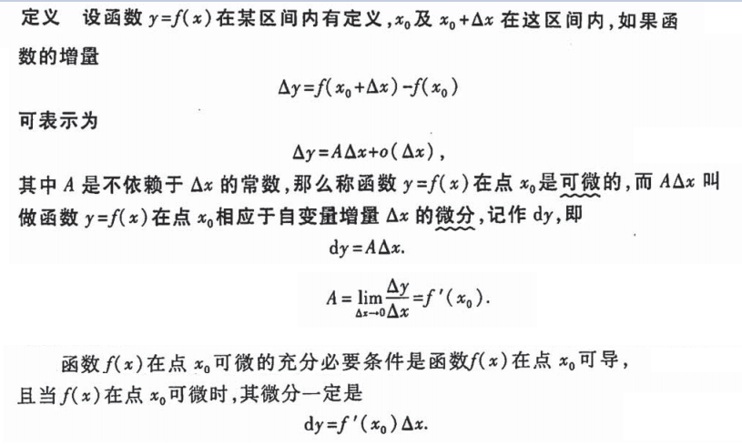

微分在实际应用里，可以用来估计因变量的变化值，因为微分的基本思想是用线性的A来代替非线性的delta y：

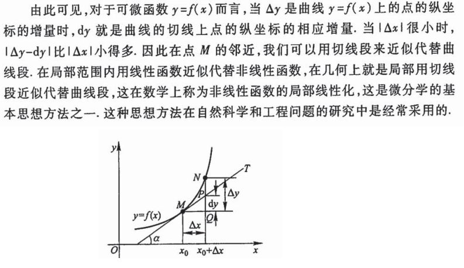

实际应用的举例：

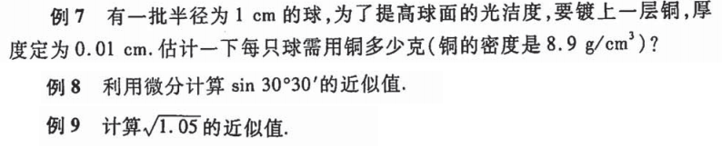

查了一下资料：可导和可微，在多元函数这里会有明显区分，可微要求更高，需要有一个切平面：

1. 可导指的是可偏导数。可偏导仅指多元函数沿着轴方向导数存在的意思，但不表示所有方向都存在导数，
2. 可微意味着曲面在可微点处可以存在一个与其相切的平面，每个方向（不只是数轴的方向）都可导。而可导就不存在这个特性了。

## 第三章、微分中值定理和导数的应用

### 3.1 微分中值定理

罗尔定理：

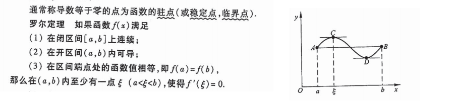

拉格朗日中值定理：

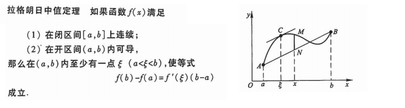

柯西中值定理

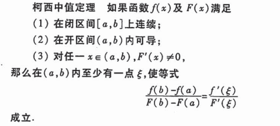

### 3.2 洛必达法则

对于求极限的时候遇到的0/0，或者无穷大 / 无穷大 的未定式，可以使用洛必达法则求极限。

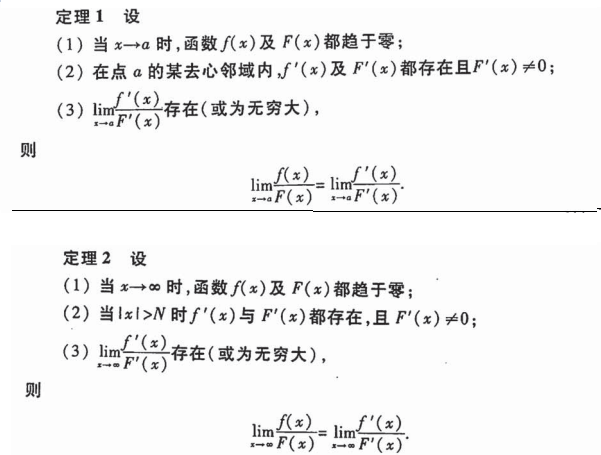

### 3.3 泰勒公式

一个复杂的函数，在某一个点的附近，可以用多项式来近似表达，方便快速计算。有点像 前面的等价无穷小：e^x 在0附近可以用 1+x表示，ln(x+1)在0附近可以用x表示。

格老子记陡：

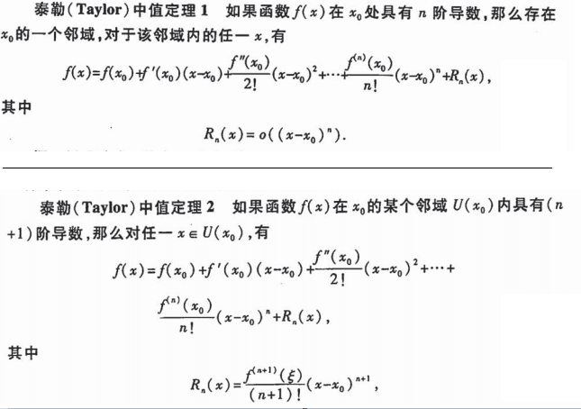

各项的系数是怎么推导出来的呢，用自己的话说说：

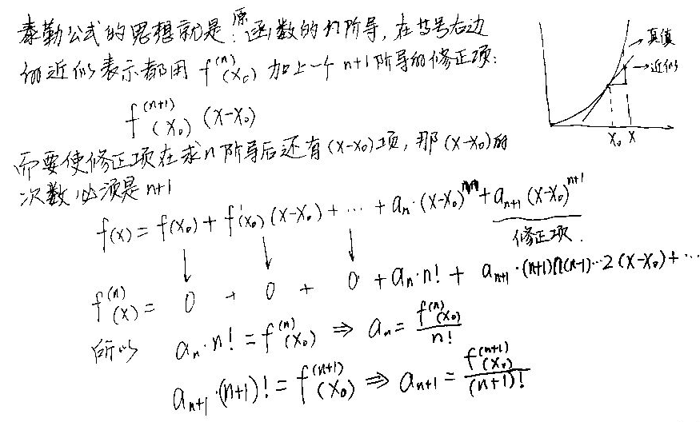

### 3.4 函数的单调性和曲线的凹凸性

这一节比较好理解：

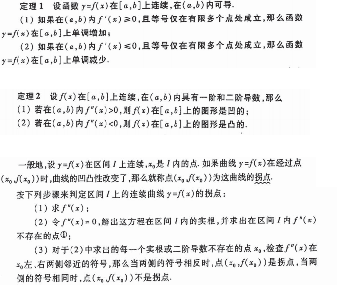

### 3.5 函数的极值和最值

这一节也比较好理解：

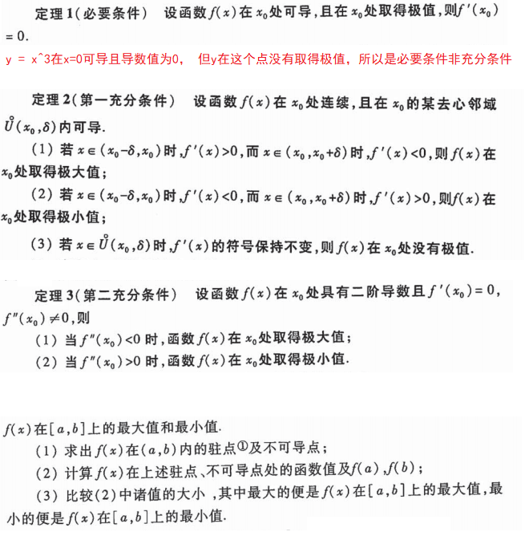

### 3.6 函数图形的描绘

其实就是上面的极值、最值、凹凸、单调性的一个应用，举个例子吧：

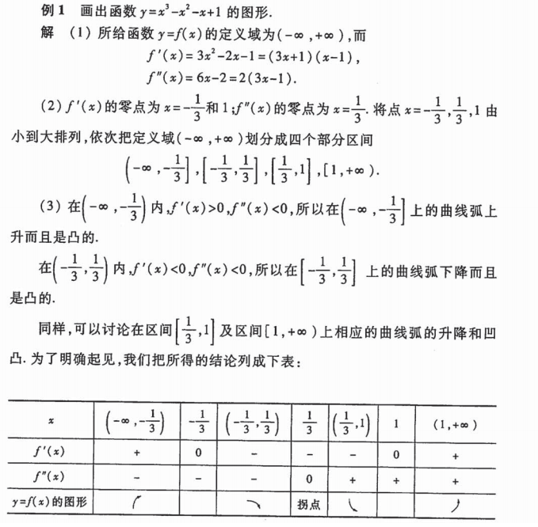

### 3.7 曲率

弧长微分公式：

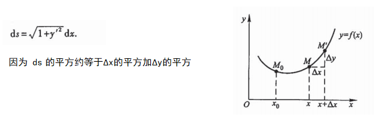

曲率就是  曲线长度的变化值 对 切线角度的变化值 的比值极限：

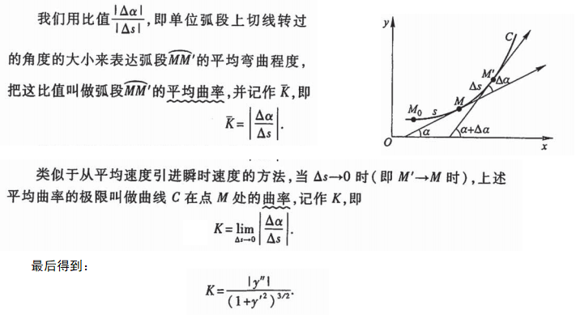

曲率越大，弯越急。

曲率圆和曲率半径：

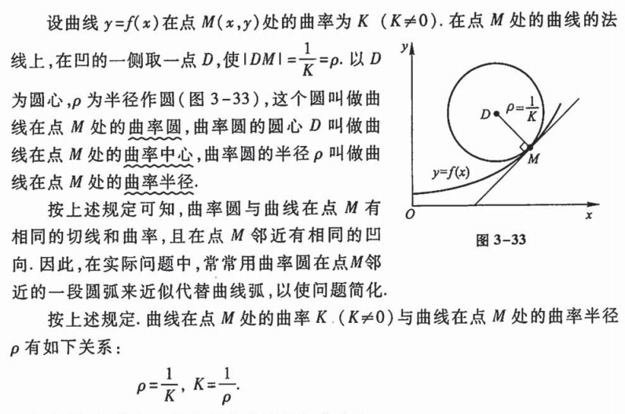

### 3.8 方程的近似解

有以下方法：

1. 二分法
2. 切线法
3. 割线法

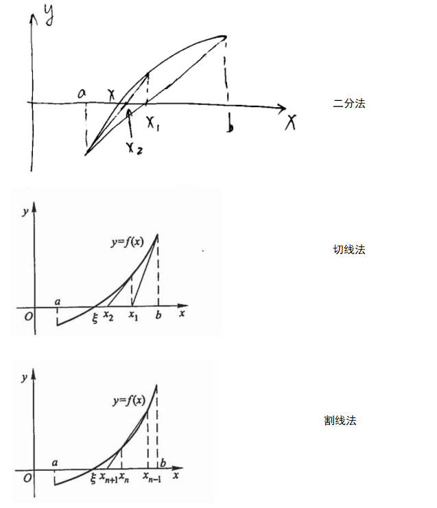

举个例子：

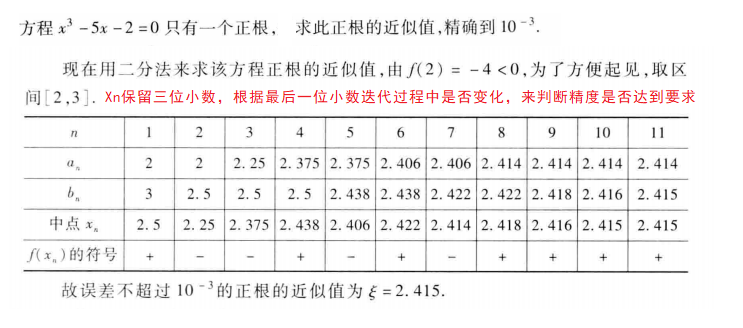