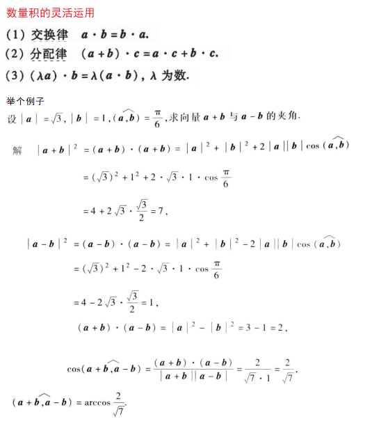
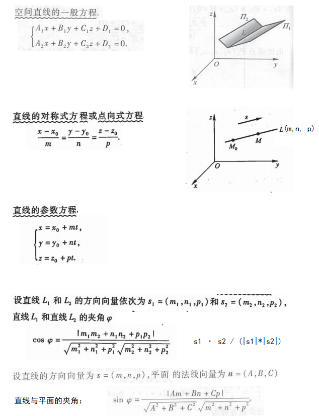
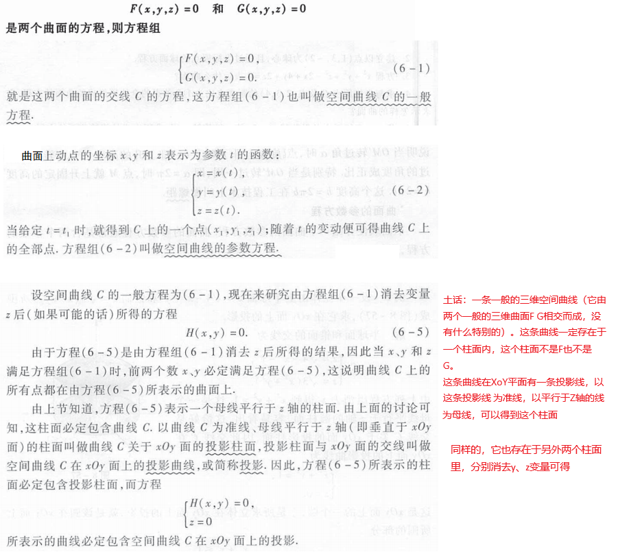
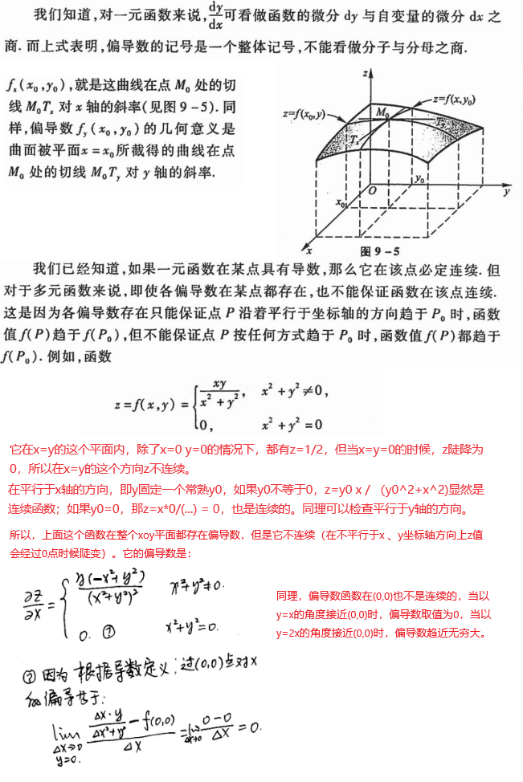

# 高数下册

## 第八章 向量代数和空间解析几何

### 8.1 向量及其线性运算

向量的加减、数乘

向量与坐标的夹角

关于向量的投影

进一步可以引申出来任意两个向量的夹角：cosθ =  (**a** · **b**) /(|**a**| * |**b**|)

### 8.2 数量积、向量积、混合积

#### 数量积

数量积，也叫内积、点积、或者叫向量的乘积。向量**a**和**b**的数量积等于各个分量相乘后相加。

它的物理意义（力在某个方向上做的功）和性质有：

数量积的灵活运用特别重要：

#### 向量积

它的物理意义（力矩）和性质有：

#### 混合积

### 8.3 平面及其方程

平面的点法式方程：

平面的一般方程：

### 8.4 空间直线及其方程

### 8.5 曲面及其方程

我觉第五第六节，要看例题和做题才好。用几个例子来说明问题吧：

旋转曲面：

柱面：

二次曲面：

### 8.6 空间曲线及其方程

## 第九章 多元函数微分法及其应用

### 9.1 多元函数基本概念

这一节内容很多，不知道该摘抄哪些，还是要通篇的看课本

### 9.2 偏导数

### 9.3 全微分

### 9.4 多元复合函数的求导法则

### 9.5 隐函数的求导公式

### 9.6 多元函数微分学的几何应用

#### 9.6.1 一元向量值函数及其导数

一元向量值函数的导数的性质和物理意义：

#### 9.6.2 空间曲线的切线和法平面

#### 9.6.3 空间曲面的切平面和法向量

