# 高数下册

## 第八章 向量代数和空间解析几何

### 8.1 向量及其线性运算

向量的加减、数乘

向量与坐标的夹角

关于向量的投影

进一步可以引申出来任意两个向量的夹角：cosθ =  (**a** · **b**) /(|**a**| * |**b**|)

### 8.2 数量积、向量积、混合积

#### 数量积

数量积，也叫内积、点积、或者叫向量的乘积。向量**a**和**b**的数量积等于各个分量相乘后相加。

它的物理意义（力在某个方向上做的功）和性质有：

数量积的灵活运用特别重要：

#### 向量积

它的物理意义（力矩）和性质有：

#### 混合积

### 8.3 平面及其方程

平面的点法式方程：

平面的一般方程：

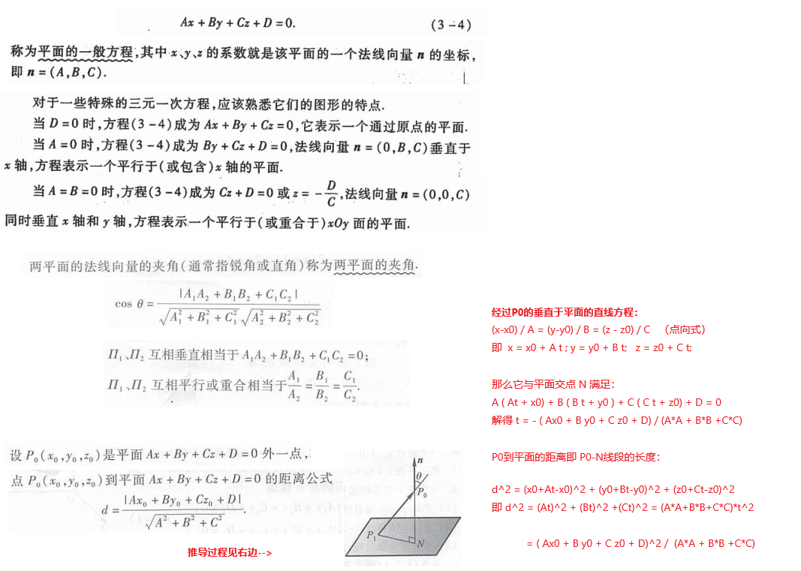

### 8.4 空间直线及其方程

### 8.5 曲面及其方程

我觉第五第六节，要看例题和做题才好。用几个例子来说明问题吧：

旋转曲面：

柱面：

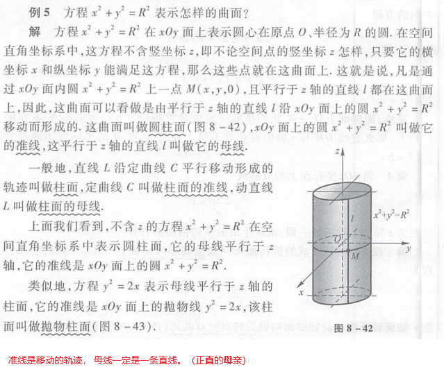

二次曲面：

### 8.6 空间曲线及其方程

## 第九章 多元函数微分法及其应用

### 9.1 多元函数基本概念

这一节内容很多，不知道该摘抄哪些，还是要通篇的看课本

### 9.2 偏导数

### 9.3 全微分

### 9.4 多元复合函数的求导法则

### 9.5 隐函数的求导公式

这里需要特别注意一下，其实上面隐函数的求导，有两个思路/方法：

1. 套用上面的公式是一个求导方法。这个时候，要把x y u v都看做F G的自变量，而不是把u和v看做x、y的函数
2. 直接对F G的两端分别对x求导，这个时候，要把u和v看做x、y的函数，x和y看做自变量，能够联立二元一次方程，解出∂u/∂x和∂v/∂x。同样的直接对F、G的等号两边分别对y求导，重复上面的过程，可以求出∂u/∂y和∂v/∂y

### 9.6 多元函数微分学的几何应用

#### 9.6.1 一元向量值函数及其导数

一元向量值函数的导数的性质和物理意义：

#### 9.6.2 空间曲线的切线和法平面

参数方程形式下的曲线：

基本方程式下的曲线：

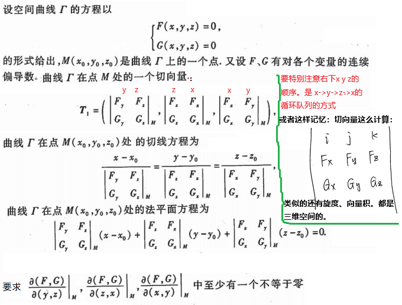

#### 9.6.3 空间曲面的切平面和法向量

### 9.7 方向导数和梯度

#### 9.7.1 方向导数

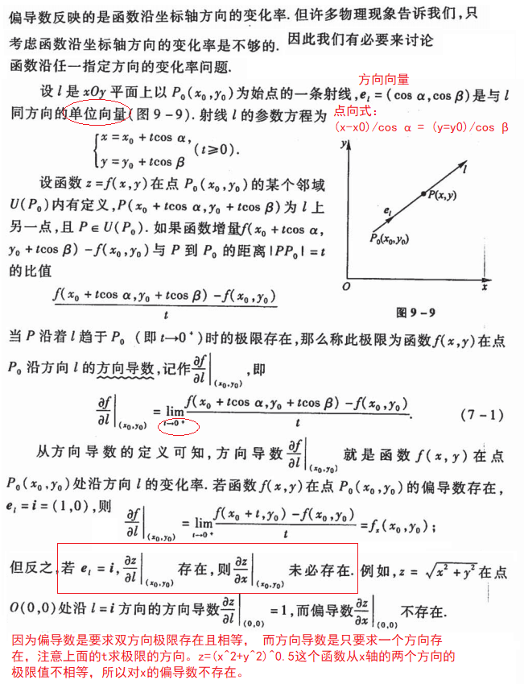

如何求方向导数：

#### 9.7.2 梯度

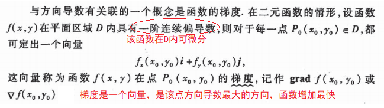

用自己的土话说说：

1. 与梯度这个向量同方向的方向导数，是该点诸多方向中最大的方向导数，是函数增加最快的方向。且这个方向导数就是梯度的模
2. 与梯度这个向量反方向的方向导数，是该点诸多方向中最小的方向导数，是函数减少最快的方向。切这个方向导数就是梯度模取反
3. 与梯度这个方向正交的方向（如果是三维或者更高维，是一个法平面，有无数个方向与梯度正交），函数变化为0

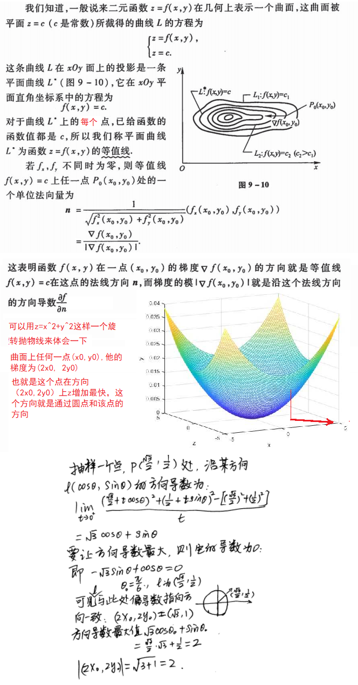

梯度的性质：

数量场和向量场：

自己的话：

1. 把向量映射到一个标量，叫做数量场
2. 把向量映射到一个向量，叫做向量场。一个数量场函数的梯度，明显是就一个向量场，他们分别叫做势函数和势场。

### 9.8多元函数的极值和求法

条件极值，也就是带有附件条件的极值：

## 第十章 （多）重积分

### 10.1 二重积分的概念、性质

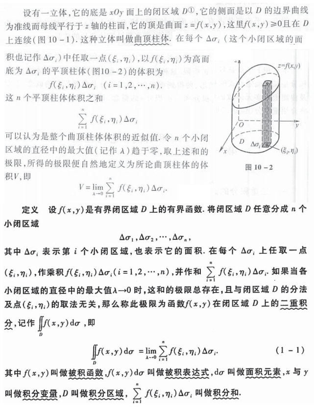

性质：

### 10.2 二重积分的计算方法

#### 10.2.1 利用直角坐标计算二重积分

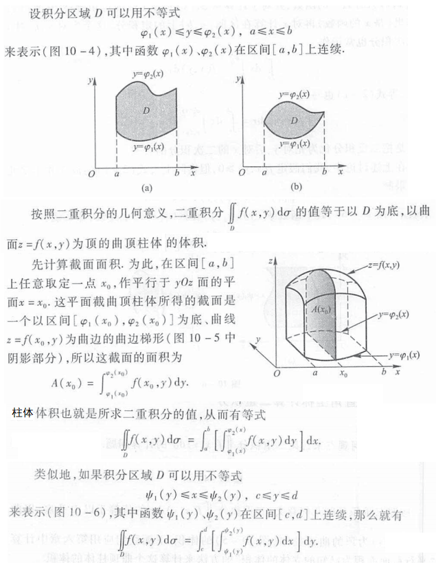

#### 10.2.2 利用极坐标计算二重积分

如果积分区域D适合用极坐标来表示范围（例如是一个圆形或者扇形），那么使用极坐标计算会更方便。

### 10.3 三重积分的计算方法

#### 10.3.1 利用直角坐标计算三重积分

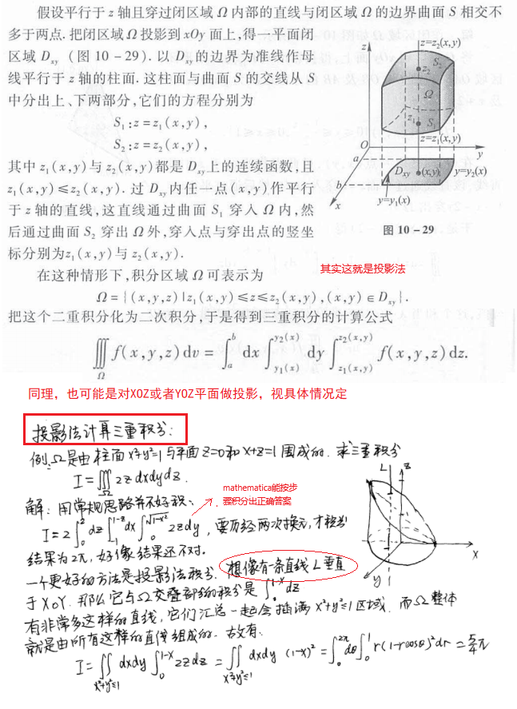

#### 10.3.2 利用柱面坐标计算三重积分

#### 10.3.3 利用球坐标计算三重积分

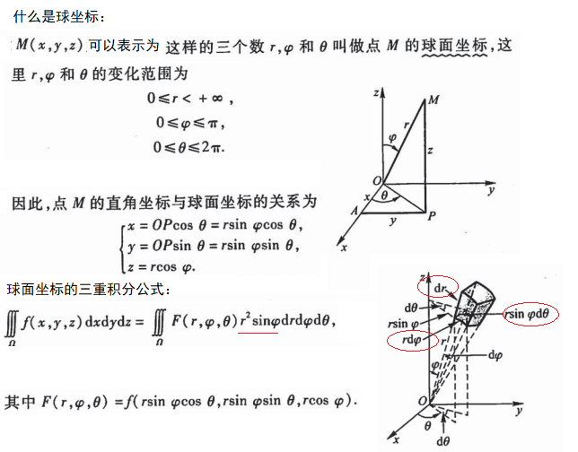

### 10.4 重积分的应用

#### 10.4.1 曲面的面积

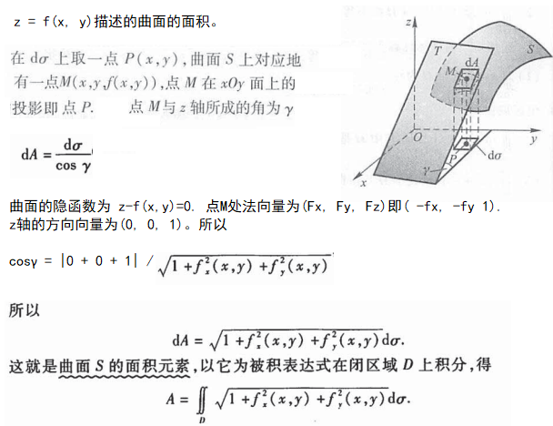

#### 10.4.2 质心

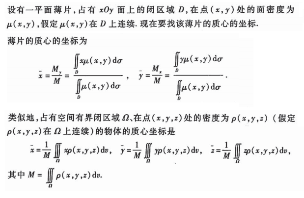

#### 10.4.3 转动惯量

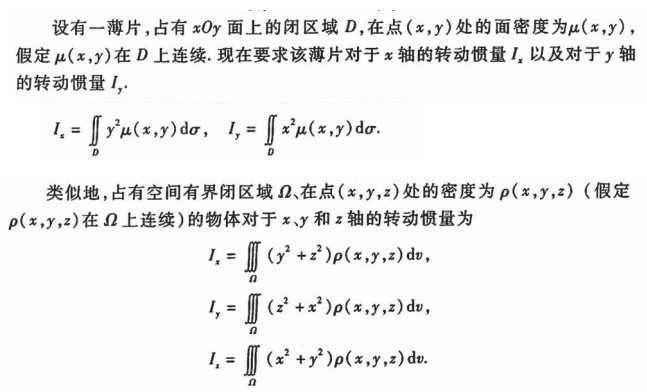

#### 10.4.4 引力

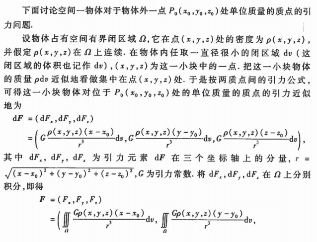

## 第十一章 曲线积分和曲面积分

### 11.1 对弧长的曲线积分(第一类曲线积分)

#### 物理意义和定义：

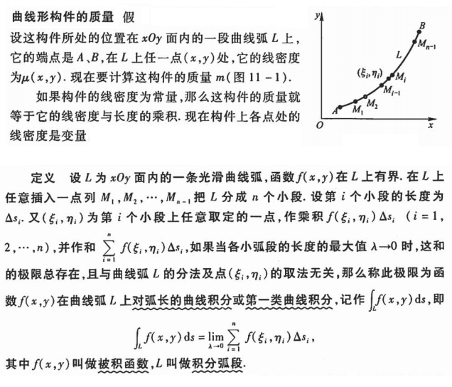

#### 性质：

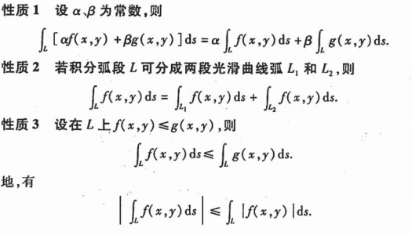

#### 计算方法：

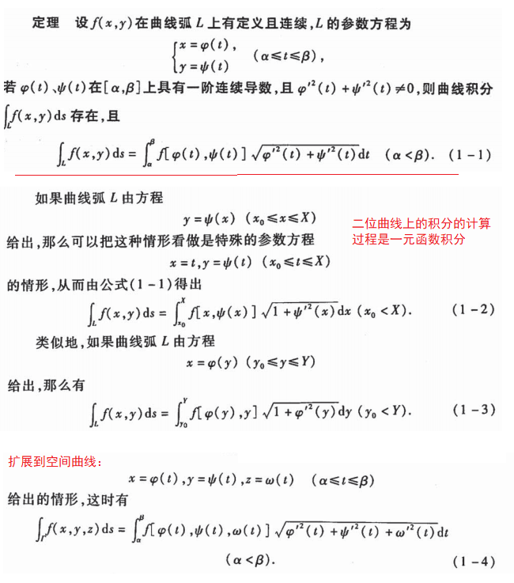

### 11.2 对坐标的曲线积分(第二类曲线积分)

#### 物理意义和定义：

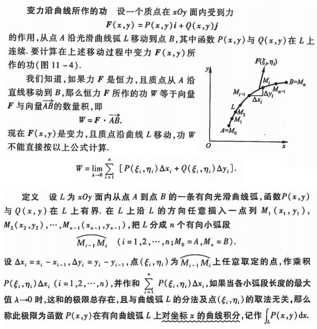

#### 性质：

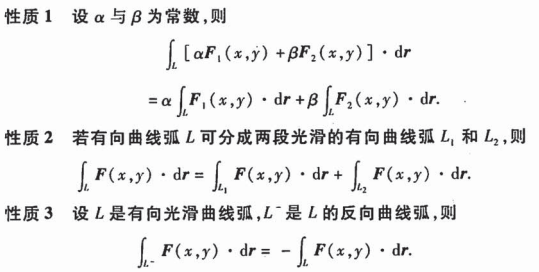

#### 计算方法：

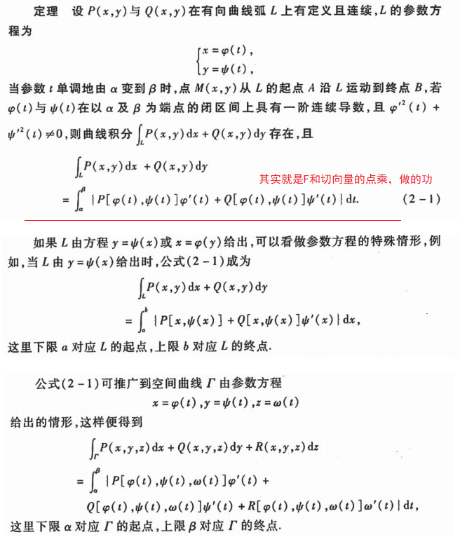

#### 两类曲线积分的联系：

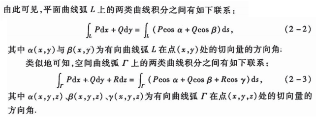

### 11.3 格林公式及其应用

#### 格林公式

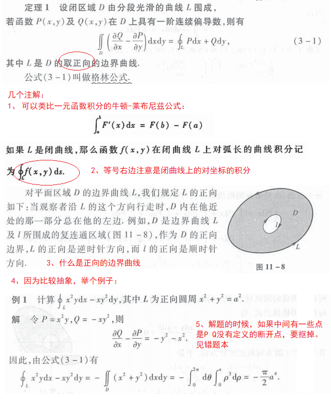

#### 曲线积分与路径无关的条件

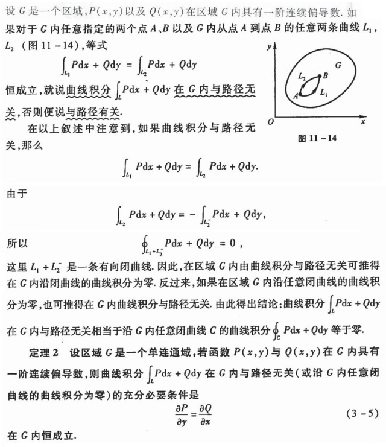

#### 二元函数的全微分求积

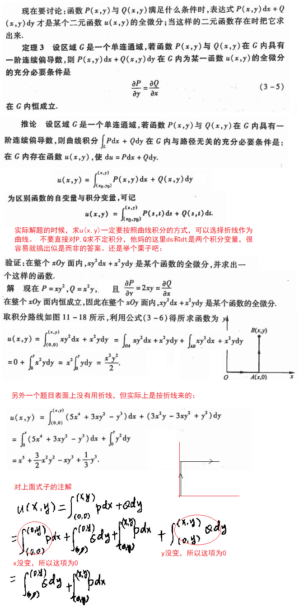

### 11.4 对面积的曲面积分

类似对弧长的曲线积分，对面积的曲面积分，是求一个曲面的质量，曲面每个点的面密度为f(x, y, z)。 

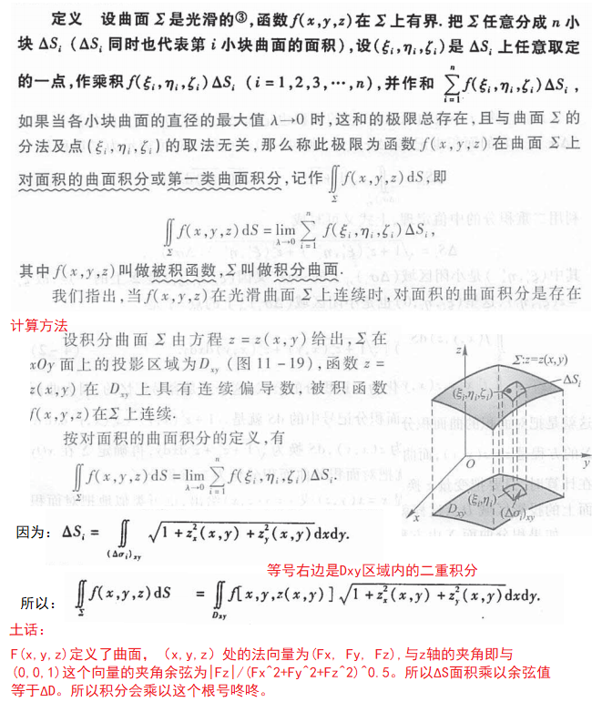